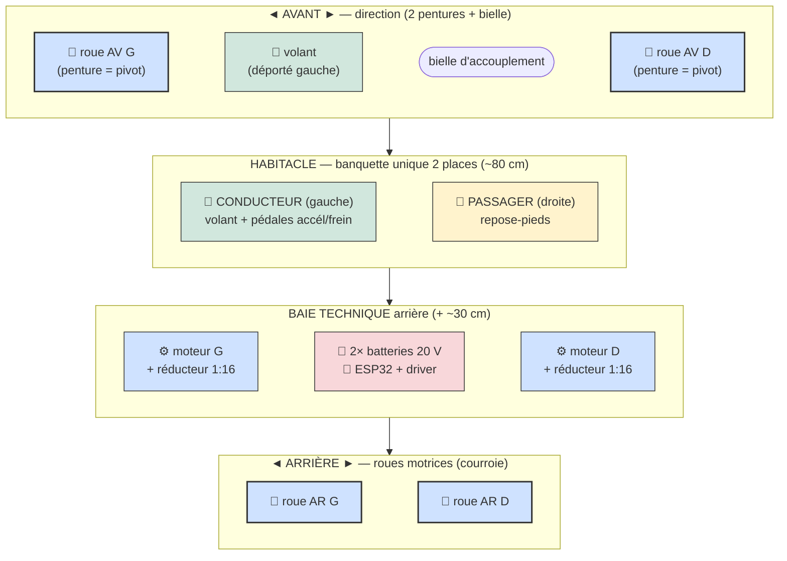
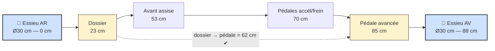
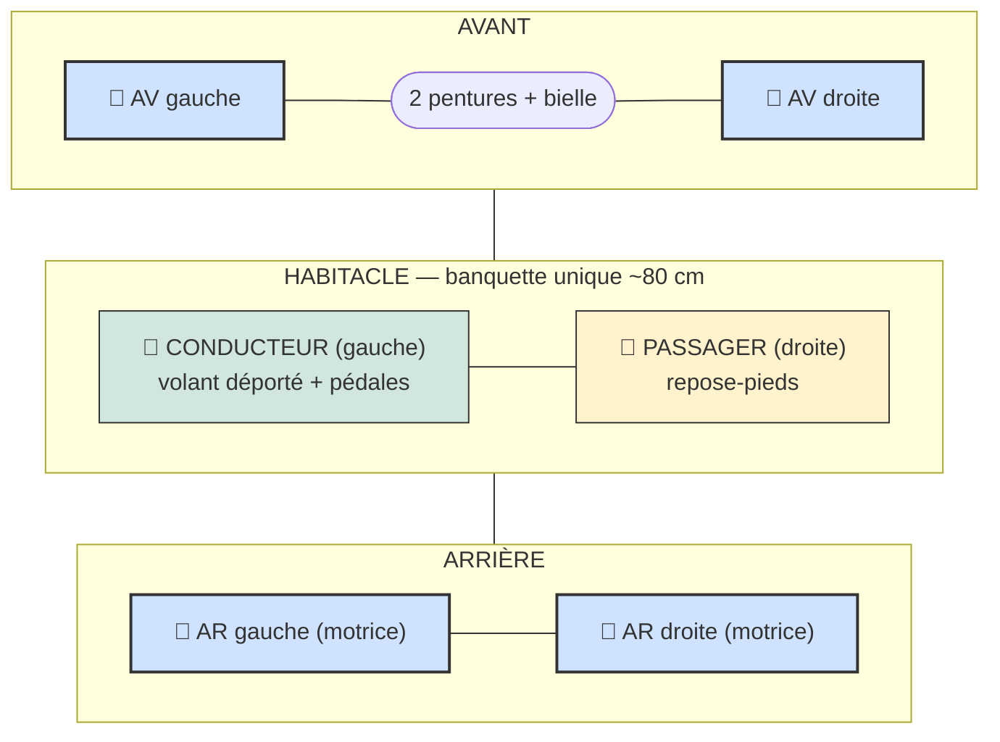
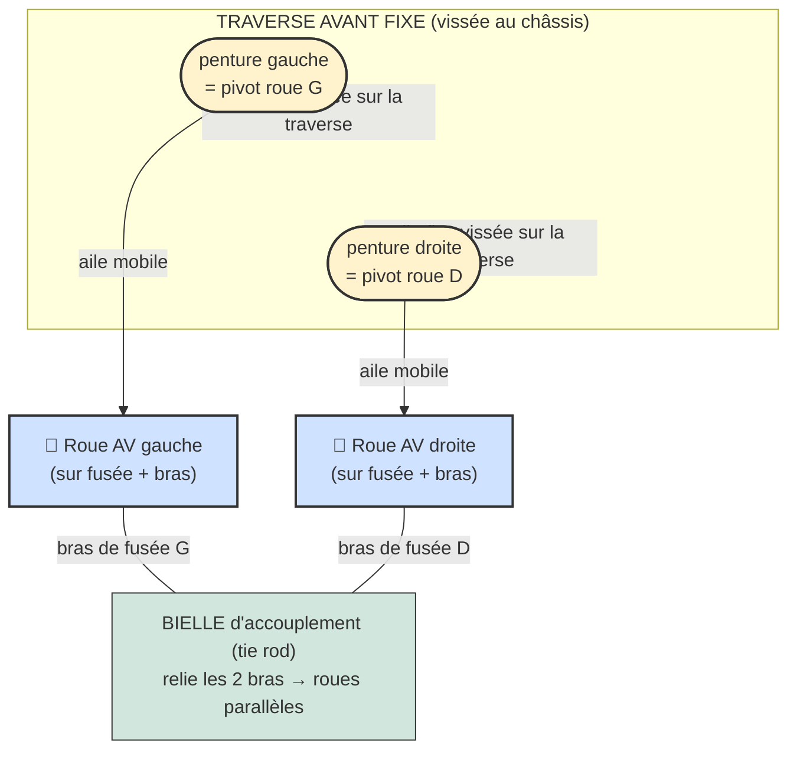
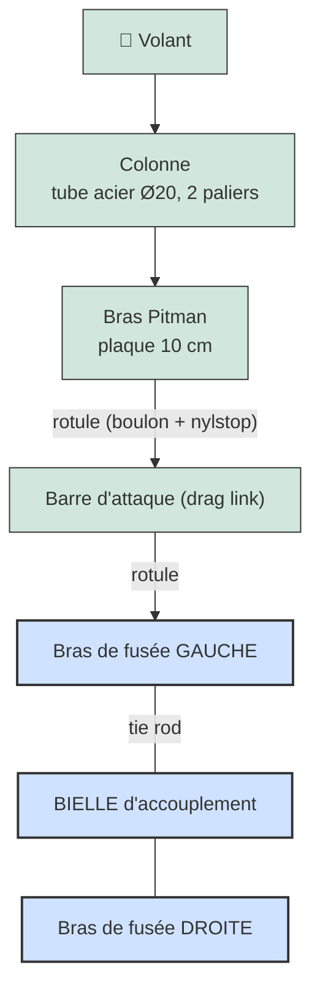
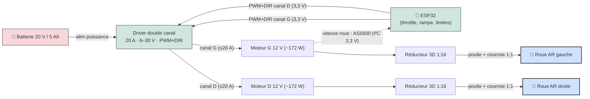
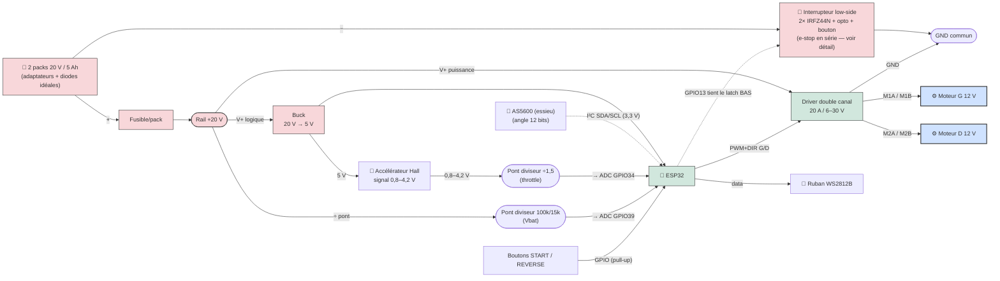
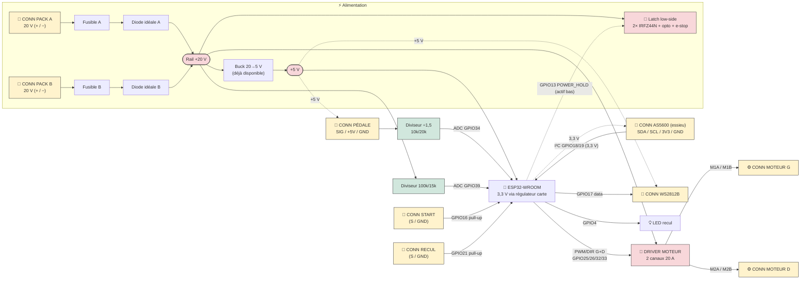
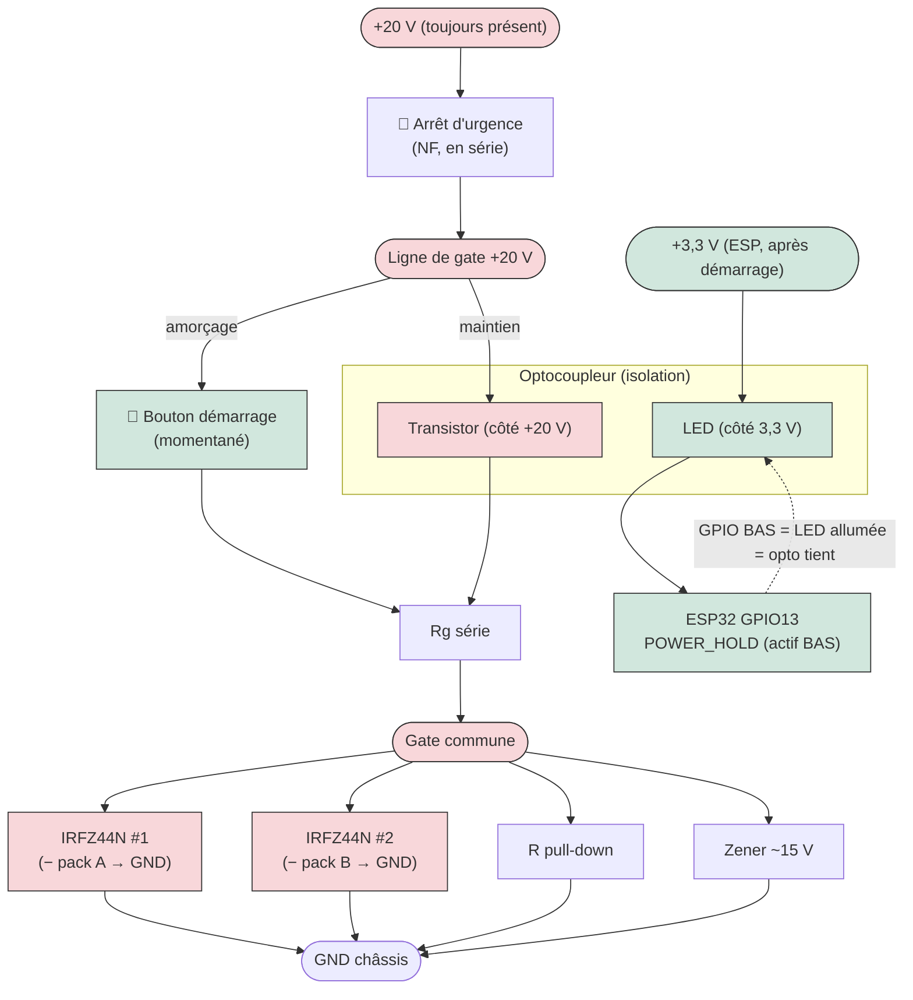

# Powered Soapbox Car — Kart électrique 2 places pour enfants

Projet de construction d'un **kart électrique biplace** pour enfants (~10 ans, 1,38–1,45 m), conçu pour être réalisable avec des **outils basiques** (perceuse, scie, clés) + une **imprimante 3D** pour les réducteurs. Chaque choix est expliqué pour pouvoir adapter selon le matériel disponible.

> **Note :** ce kart est **électrique** et **biplace** (deux enfants **côte à côte**). Le **conducteur est à gauche** ; le **volant est légèrement déporté à gauche** devant lui, et les **pédales (accél./frein) sont du côté gauche** uniquement. La place de droite est **passager** (repose-pieds, pas de commandes). Les « pédales » désignent les **commandes au pied façon voiture** : **accélérateur** (capteur → ESP32) et **frein** (électrique au relâché). La propulsion vient de **2 moteurs CC 12 V** (un par roue arrière). Il n'y a **pas** de pédalier de vélo ni de chaîne.

## Table des matières

- [Aperçu (vue de dessus)](#aperçu-vue-de-dessus)
- [En bref](#en-bref) · [Pourquoi ces choix](#pourquoi-ces-choix)
- [1. Dimensions du châssis](#1-dimensions-du-châssis)
- [2. Position siège / pédales](#2-position-siège--pédales)
- [3. Direction (2 pentures + bielle)](#3-direction-à-deux-pentures-un-pivot-par-roue--bielle)
- [4. Matériel & électronique](#4-matériel--électronique)
  - [Propulsion (2 moteurs)](#propulsion--2-moteurs-cc-12-v) · [Commande ESP32](#commande-électronique--esp32) · [Capteur AS5600](#capteur-de-vitesse-as5600-sur-i²c) · [Calibration](#calibration-de-laccélérateur)
  - [Sécurité électrique](#sécurité-électrique) · [Câblage & brochage](#schéma-de-câblage--brochage-esp32) · [Schéma système](#schéma-système-complet-tous-les-connecteurs)
  - [Mesure batterie / LVC](#mesure-de-tension-batterie--coupure-basse-tension-lvc) · [2 batteries en parallèle](#montage-2-batteries-en-parallèle) · [Interrupteur d'alimentation (latch)](#interrupteur-dalimentation--mosfet-low-side--latch--arrêt-durgence)
- [5. Points critiques de sécurité](#5-points-critiques-de-sécurité-enfant)
- [6. Siège réglable](#6-siège-réglable)
- [7. Estimation de masse](#7-estimation-de-masse)
- [8. Plan d'implémentation (montage & mise en service)](#8-plan-dimplémentation-montage--mise-en-service)
- [Firmware](#firmware) · [Limitations et risques connus](#limitations-et-risques-connus)

---

## Aperçu (vue de dessus)



**Gabarit :** longueur ~150–180 cm · largeur ~96 cm · voie ~84 cm · 4 roues Ø30 cm · assise basse 16 cm (anti-basculement).

> ⚠️ Réservé au **terrain plat, sous surveillance adulte**. Vitesse estimée ~8–13 km/h, autonomie ~10–20 min.

## En bref

| Élément | Choix |
|---|---|
| **Places** | 2, banquette unique côte à côte ; **conducteur à gauche** |
| **Direction** | **2 pentures de porte** (un pivot par roue) reliées par une **bielle d'accouplement** ; **volant déporté à gauche** |
| **Propulsion** | **2 moteurs CC 12 V (~172 W / 0,23 HP)** (un par roue arrière) — **même PWM aux deux** |
| **Transmission** | Réducteurs **imprimés 3D 1:16** + **poulies vissées sur les roues + courroies** |
| **Roues** | 4 × **Ø30 cm (12")**, jante plastique, roulement 1/2", à roulement libre |
| **Électronique** | **ESP32** → **driver double canal 20 A / 6–30 V** (PWM + DIR), **PWM bridé ~50 %** |
| **Énergie** | **2 × packs 20 V / 5 Ah en parallèle** (diode-OR) + 2 adaptateurs vers bornes de puissance |
| **Vitesse** | Mesurée par **capteur d'angle AS5600 (I²C)** ; asservissement à **500 Hz** |
| **Commandes** | Pédale **accélérateur à effet Hall** ; **frein électrique au relâché** ; bouton **armement** + bouton **marche arrière** |
| **Châssis** | **Bois** allégé : madriers **2×3** + plancher **contreplaqué 6 mm** |
| **Masse** | ~**34 kg** à vide · ~**100 kg** en charge (2 enfants) |

## Pourquoi ces choix

- **Stabilité avant tout** : assise basse (16 cm), **voie large (84 cm)**, empattement long (95 cm) → ne bascule pas, même avec 2 enfants.
- **Moteurs 12 V sur batterie 20 V** : le **PWM est plafonné à ~50 %** (≈ 10 V moyens) pour éviter la surchauffe des moteurs.
- **Roues à roulement libre** : entraînées par **courroie** (poulie vissée sur la jante), elles gardent leur roulement d'origine — pas d'essieu moteur traversant.
- **Sécurité** : arrêt d'urgence **coupe-courant général** (en série dans la gate du latch, ESP32 compris), démarrage par **bouton momentané** + latch low-side (2× MOSFET, l'ESP se maintient en vie), fusible par pack, **frein électrique au relâché**, coupure basse tension (LVC), **watchdog 5 s**, démarrage **désarmé** par défaut, carters sur courroies/poulies, ceinture, casque.

---

## 1. Dimensions du châssis

| Cote | Valeur | Pourquoi |
|---|---|---|
| Longueur totale | **150 cm** (prévoir **jusqu'à ~180 cm**) | Pédales + dossier devant ; **+ ~30 cm à l'arrière** pour loger **moteurs, driver et batteries** (baie technique) |
| Largeur hors-tout | **96 cm** | Doit loger **deux enfants côte à côte** |
| **Largeur intérieure banquette** | **~80 cm** | 2 × ~40 cm/enfant (épaules + coudes) |
| **Voie** (écartement roues, axe à axe) | **84 cm** | Voie large = **anti-basculement**, crucial avec 2 occupants |
| **Empattement** (essieu AV ↔ AR) | **95 cm** | Long = stable et droit ; encaisse mieux le surcroît de poids |
| Hauteur d'assise (sol → fond du siège) | **16 cm** | Centre de gravité **bas** = ne se renverse pas |
| Garde au sol (sous châssis) | **8 cm** | Passe les petits obstacles sans talonner |
| Hauteur de dossier (assise → haut) | **34 cm** | Soutient le dos des deux enfants |
| **Roues (×4 identiques)** | **Ø30 cm (12")**, jante plastique + pneu PVC dur | Mêmes roues partout → plan simplifié |
| Moyeu / fixation | **Roulement métal, alésage 1/2"**, moyeu large ~3,8 cm | Tourne **libre** sur un boulon à épaulement fixe (fournis) |

**Idée directrice :** assise basse + **voie très large (84 cm)** + empattement long = un engin **qui ne bascule pas** malgré deux enfants côte à côte.

---

## 2. Position siège / pédales

Repère 0 = essieu arrière ; cotes mesurées **vers l'avant**.

| Élément | Distance depuis essieu AR | Hauteur / sol |
|---|---|---|
| Essieu arrière (repère) | **0 cm** | centre à 15 cm (roue Ø30) |
| **Fond du dossier** | **23 cm** | assise à 16 cm |
| Avant de l'assise | **53 cm** | 16 cm |
| **Boîtier de pédales** (accél./frein) | **70 cm** | ~22 cm |
| **Pédale la plus avancée** | **85 cm** | — |
| Essieu avant | **88 cm** | centre à 15 cm |

➡️ **Distance dossier → pédale avancée = 62 cm** ✔ (jambe presque tendue, léger pli du genou).

### Vue de côté



> **Banquette unique 2 places** : les deux enfants côte à côte (~80 cm intérieure), même dossier. Seul le **côté gauche** reçoit le **volant déporté** et les **pédales** ; le côté droit est passager. Les cotes valent pour la **place conducteur (gauche)**.

### Vue de dessus (disposition 2 places)



---

## 3. Direction à deux pentures (un pivot par roue) + bielle

### Choix retenu : **deux pivots de roue (style fusées), chaque penture = un axe de pivot**

**Chaque roue avant pivote sur sa propre penture de porte** (la penture posée à plat = l'**axe de pivot vertical** de cette roue). Une **bielle d'accouplement (tie rod)** relie les **bras des deux roues** pour qu'elles tournent **ensemble**. La **traverse avant reste FIXE** sur le châssis (elle ne tourne pas d'un bloc) → centre de gravité et géométrie plus stables qu'un pivot central unique.



1. **Traverse avant fixe** : planche solide boulonnée au nez du châssis ; elle ne bouge pas.
2. **Une penture par roue**, posée à plat : **aile fixe** vissée sur la traverse, **aile mobile** solidaire de la **fusée** (support de roue) → la roue pivote autour de l'axe de la penture.
3. **Renfort** : un **boulon vertical (M10)** dans l'axe de chaque penture reprend les efforts verticaux (anti-arrachement).
4. **Bras de fusée** : une patte métal sur chaque fusée, vers l'arrière.
5. **Bielle d'accouplement** : barre/tige filetée reliant les **deux bras** (rotules boulon + nylstop à chaque bout) → les deux roues tournent **du même angle** (braquage parallèle ; arms légèrement inclinés = ébauche d'Ackermann).

### Liaison volant → roues



- **Colonne** (tube Ø20, 2 paliers) → **bras Pitman** en bas qui balaye gauche/droite.
- Une **barre d'attaque (drag link)** relie le bras Pitman au **bras de fusée gauche** ; la **bielle d'accouplement** transmet à la roue droite → les deux roues braquent ensemble.
- **Rotules improvisées** : boulon + écrou **nylstop** serré « juste assez » (rondelles) à chaque articulation.
- **Déport à gauche** : la colonne est montée à gauche devant le conducteur ; on attaque le **bras de fusée gauche** (le plus proche). Régler les longueurs pour **roues droites = volant centré**.

---

## 4. Matériel & électronique

> **Châssis essentiellement en bois, allégé** : grille de **madriers 2×3** (SPF ~38×64 mm) + **plancher contreplaqué 6 mm**. Renforcer aux points de charge (pivot, supports moteurs, ancrage ceinture). ⚠️ Le CP 6 mm impose une **grille 2×3 rapprochée** (traverses tous les ~25–30 cm) ; **12 mm sous la banquette**.

| Catégorie | Élément | Taille / spec |
|---|---|---|
| **Bois** | Châssis (longerons + traverses) | Madriers **2×3** (SPF ~38×64 mm), grille rapprochée |
| | Plancher | Contreplaqué **6 mm**, ~140 × 90 cm, soutenu par la grille |
| | Assise (zone chargée) | Contreplaqué **12 mm** sous la banquette |
| | Support pivot / dossier | Bloc bois dur + **platine anti-arrachement** ; dossier CP 6 mm |
| **Direction** | **2 pentures de porte** (un pivot par roue) | Acier, **lame ≥ 10 cm** |
| | 2 axes de pivot (un par penture) | **M10 × 80**, écrou nylstop, grosses rondelles |
| | 2 fusées + bras + **bielle d'accouplement** | barre/tige filetée M8, rotules boulon+nylstop |
| | Colonne | Tube acier Ø20 mm + bras Pitman + barre d'attaque |
| **Roues** | ×4 identiques | **Ø30 cm (12")**, jante plastique + pneu PVC, roulement 1/2" |
| | Boulons à épaulement | **Fournis avec les roues** (épaulement 1/2", filetage 3/8") |
| **Propulsion** | 2 moteurs CC **12 V** | ~172 W (0,23 HP), 19,6 A, 4615 tr/min ; un par roue AR |
| | 2 réducteurs 3D | Rapport **1:16**, imprimés (PETG/ABS/nylon) |
| | Poulies + courroies | Poulie **vissée sur chaque roue AR** + courroie vers le gearbox (**1:1**) |
| | **Capteur d'angle AS5600** + aimant diamétral | magnétique sans contact, **12 bits absolu I²C**, **3,3 V natif** (aucun level-shift), pull-ups 4,7 kΩ |
| **Énergie / électronique** | Batteries (**2 requises**) | **2 × packs 20 V / 5 Ah** à glissière, **en parallèle** (~40 A total) |
| | **Adaptateurs de batterie** (×2) | Support à glissière → bornes de puissance (+ / −) |
| | **Diodes idéales (diode-OR)** — requis | **2 × modules 40 A / 60 A** (un par pack) + 1 fusible/pack |
| | **Interrupteur d'alimentation (latch)** | **2× MOSFET N IRFZ44N** low-side (+ dissipateur) + **opto** + zener/pull-down + **bouton démarrage** |
| | Driver moteur | **1 carte double canal 20 A / 6–30 V** (PWM+DIR/canal), duty **bridé ~50 %** |
| | Calculateur | **Carte ESP32-WROOM** (double cœur 240 MHz, Wi-Fi/BT, 4 MB flash) |
| | **Carte d'extension (breakout)** | Borniers à vis + sorties 5 V / 3,3 V + LED d'état ; le **3,3 V** alimente l'AS5600 |
| | **Buck 20 V → 5 V** (déjà disponible) | alimente l'ESP32 (qui fabrique son 3,3 V) |
| | **Perfboard soudée** | 2 ponts diviseurs (throttle 10 k/20 k, Vbat 100 k/15 k) + 2 × 0,1 µF (⚠️ pas de breadboard — vibrations) |
| | **Boîtier électrique étanche** (ABS, couvercle transparent, ~150 × 100 × 70 mm, ≈IP65) | loge ESP32 + breakout + perfboard ; presse-étoupes pour les câbles ; protège poussière/pluie/chocs (couvercle clair = LED d'état visible) |
| | Sécurité élec. | **Arrêt d'urgence (NF) en série** dans la ligne de gate + **fusible/pack** |
| | Ruban **WS2812B** (~10 LEDs) | état : vert = en route, rouge = désarmé |
| **Commandes** | **Pédale accélérateur à effet Hall** | 3 fils (5 V / GND / **signal 0,8–4,2 V**), à rappel ; **pont diviseur ÷1,5** requis |
| | Bouton **armement** + bouton **marche arrière** + LED | momentanés ; armement = appui ~1 s |
| **Frein** | **Frein électrique au relâché** ✅ | géré par le firmware (driver en inversion) ; pas de patin |
| **Réserves futures** (câblées, non utilisées) | **2× encodeur A/B 3,3 V**, **2 boutons** | connecteurs prévus pour évolutions ; logique 3,3 V |
| **Visserie / finition** | Boulons traversants M8/M10, écrous **nylstop** | équerres, vis à bois, vernis ; arêtes arrondies |

### Propulsion — 2 moteurs CC 12 V

Chaque roue AR est entraînée par son **propre moteur CC à aimants permanents 12 V** via un **réducteur imprimé 3D au rapport 1:16**. **Système simplifié** : les **deux moteurs reçoivent exactement le même PWM** (pas de différentiel) ; **un seul capteur de vitesse** (AS5600) sert au contrôle.

| Caractéristique | Valeur |
|---|---|
| Type / modèle | CC à **aimants permanents** — RX0086 |
| Puissance | **0,23 HP (~172 W)** |
| Régime | **4615 tr/min** (à 12 V, à vide) |
| Tension / courant | **12 VDC** / **19,6 A** |
| Service | **intermittent** (loisir, pas en continu) ; TENV, classe F |

> ⚠️ **Tension :** moteurs **12 V**, batterie **20 V** → **PWM bridé à ~50 %** (≈ 10 V moyens) pour protéger les moteurs.
> ⚠️ **Courant :** **19,6 A**/moteur (driver 20 A/canal OK) ; **total ~40 A** → **2 batteries en parallèle requises** (~20 A/pack). Éviter les blocages de roue prolongés.



**Performances estimées :**

| Paramètre | Valeur |
|---|---|
| Régime à ~50 % (≈ 10 V) | ~**3850 tr/min** moteur → **~240 tr/min roue** (÷16) |
| Vitesse de pointe estimée | **~13 km/h** — limitée par firmware |
| Courant total | ~**40 A** → 2 batteries en parallèle (~20 A/pack) |
| Énergie batterie / autonomie | ~90–100 Wh → **~10–20 min** selon l'usage |

**Transmission gearbox → roue :** poulie **vissée sur la roue** (plusieurs rayons, grandes rondelles / contre-platine pour ne pas fendre le plastique), **courroie 1:1** avec réglage de tension (trous oblongs / galet), **carter fermé**. La roue tourne sur **son boulon à épaulement + roulement** ; le moteur ne fait que l'entraîner.

### Commande électronique — ESP32

- L'**ESP32** lit le throttle et envoie la **même commande PWM + DIR aux deux canaux** du driver.
- Driver : **double canal, 20 A continu / 60 A crête, 6–30 V**, entrées **PWM + DIR** compatibles **3,3 V**, PWM jusqu'à 20 kHz ; protections **surintensité / sous-tension / température**. ⚠️ **Aucune protection contre l'inversion de polarité** (VB+/VB-) → un branchement inversé **détruit la carte**.
- **Accélérateur = PWM direct** (boucle ouverte) ; au **relâché**, un **PID ramène la vitesse à 0** (lecture AS5600) — sortie signée → peut **inverser le moteur** (plugging).
- Bonnes pratiques : **PWM plafonné ~50 %**, **rampe** de montée, **limiteur de vitesse** (mesure capteur), **watchdog**, throttle **à rappel**.

### Capteur de vitesse AS5600 (sur I²C)

Capteur d'angle **AS5600** : magnétique **sans contact**, **angle absolu 12 bits** (4096 points/tour) lu en **I²C**, avec un **aimant diamétral** en bout d'arbre. **Cinématique connue** : le capteur fait **1 tour pour 16 tours moteur** (= sortie du gearbox **1:16**), et la **courroie est 1:1** jusqu'à la roue → **le capteur tourne exactement à la vitesse de la roue** ⇒ `GEAR_RATIO = 1`, **roue 12″ = 0,3048 m**. La conversion vitesse est **entièrement déterminée**. Il sert à :
- **Mesurer la vitesse** → limiteur fiable ; **frein PID** vers 0 ; **sens** (signe de Δangle, broche DIR fixe la convention) ; **sécurité** (blocage : PWM actif sans rotation > 1 s → défaut).

✅ **3,3 V natif** (VDD5V/VDD3V3 reliées) → **SDA/SCL directement sur l'ESP32, AUCUN level-shift**. Câblage : **SDA, SCL, 3,3 V, GND** (+ aimant), pull-ups **4,7 kΩ**.

Mise en œuvre : lecture I²C du registre **RAW ANGLE** (0x0C/0x0D) → **vitesse = dérivée de l'angle** (`Δcounts × fréquence`, **wrap 0↔4095**) ; **boucle 500 Hz** (FreeRTOS 1000 Hz) → aucune ambiguïté ; **adresse fixe 0x36** (un seul AS5600/bus ; 2ᵉ bus I²C réservé pour le futur) ; aimant **diamétral** centré, **entrefer 0,5–3 mm** ; bus I²C **à l'écart de la puissance**, 0,1 µF sur l'alim.

> *Alternative envisagée : un encodeur incrémental en quadrature (type AMT103-V) — écarté car il s'alimente en 5 V (sorties ~4,2 V → level-shift obligatoire) et n'apporte pas l'angle absolu.*

### Calibration de l'accélérateur

Le capteur Hall ne va jamais pile 0/3,3 V et varie d'une pièce à l'autre → on **calibre** (via l'interface web uniquement) :

1. Pédale **relâchée** → valeur **MIN** ; 2. pédale **à fond** → valeur **MAX** ; stocké en **NVS**.

```
throttle% = clamp( (brut − MIN − zone_morte) / (MAX − marge − MIN), 0 … 1 )
```

**Zone morte** en bas (relâché = 0 % garanti), **marge** en haut (100 % atteint). Sécurités : **lecture hors plage** (fil coupé) → throttle 0 ; **anti-démarrage pédale enfoncée** ; **calibration invalide** (`MAX−MIN` trop faible) → valeurs sûres / refus de rouler.

### Sécurité électrique

- **Arrêt d'urgence** bien accessible, **NF en série dans la ligne de gate** du latch : l'ouvrir retire l'alimentation de gate → les 2 MOSFET s'ouvrent → **coupe TOUT** (puissance **et** ESP32), **sans passer les 40 A dans le contact**. Au retour, système **désarmé**.
- **Démarrage par bouton momentané** (amorce le latch) ; **fusible/pack**, câblage ≥ courant des 2 moteurs.
- **Architecture batterie : 5S Li-ion** (~18,5 V nominal, 21 V pleine charge, ~15 V bas) — nombre de cellules réglable (défaut 5). Décharge profonde : **BMS du pack + LVC côté ESP32**.
- **2 batteries en parallèle (REQUISES)** : même 20 V, capacité ×2, **courant ÷2 par pack**. ⚠️ **Jamais en série**. Ne relier que des packs **au même niveau de charge** ; **diode-OR + 1 fusible/pack**.
- **Limiteur de vitesse** bas au début ; **batterie fixée/protégée** ; **carters** ; **frein électrique** + **désarmement auto 30 s** + **watchdog 5 s** + **PWM ~50 %**. Couper l'alim avant intervention.

### Schéma de câblage + brochage ESP32



**Brochage ESP32 (identique au firmware `firmware/main/pinout.hpp`) :**

| GPIO | Fonction | Sens | Note |
|---|---|---|---|
| 25 / 26 | **PWM / DIR moteur gauche** | sortie | LEDC ~18 kHz, **duty ≤ 50 %** |
| 32 / 33 | **PWM / DIR moteur droite** | sortie | idem |
| 34 | **Accélérateur** (signal Hall) | entrée ADC | pédale 0,8–4,2 V → **pont ÷1,5** |
| 39 | **Tension batterie** | entrée ADC | pont **100 k / 15 k** + 0,1 µF |
| 18 / 19 | **I²C SDA / SCL** (AS5600) | E/S | capteur d'angle 0x36, **3,3 V**, pull-ups 4,7 kΩ |
| 13 | **POWER_HOLD** (latch alim.) | sortie | **actif BAS** : maintient l'alim ; HAUT = coupe |
| 16 | **Bouton armement (START)** | entrée | pull-up, appui ~1 s |
| 21 | **Bouton marche arrière** | entrée | pull-up, momentané |
| 17 | **Ruban WS2812B** (data) | sortie | ~10 LEDs |
| 4 | **LED marche arrière** | sortie | allumée si recul actif |
| 2 | **LED d'état** (onboard) | sortie | — |
| **Réserves futures (câblées, non utilisées) — 3,3 V** | | | |
| 27 / 14 | **Encodeur 1 — A / B** | entrées | quadrature 3,3 V |
| 35 / 36 | **Encodeur 2 — A / B** | entrées seules | quadrature 3,3 V (pull-up externe si open-collector) |
| 22 / 23 | **2 boutons auxiliaires** | entrées | actifs bas, pull-up interne |

**Points clés du câblage :**
- **Masse commune** ESP32 ↔ driver ↔ accélérateur ↔ capteur I²C : indispensable.
- **Interrupteur low-side + e-stop en série** : le **+** reste toujours présent ; on coupe en ouvrant les **2 MOSFET côté masse**.
- **Pas de contact de frein** : relâcher l'accélérateur déclenche le frein électrique.
- **Puissance ~10 AWG** (cosses serties) ; **signaux fil fin**. **Fusible 30 A/pack**.
- ⚠️ **Polarité du driver (VB+/VB-)** : aucune protection inversion → **vérifier deux fois**.
- **Deux ponts diviseurs vers l'ADC** (signal > 3,3 V) : throttle ÷1,5 (GPIO34), Vbat 100 k/15 k (GPIO39), **0,1 µF** sur chaque nœud.

### Schéma système complet (tous les connecteurs)

Vue d'ensemble bloc-à-bloc montrant **chaque connecteur** (pédale, AS5600 I²C, boutons, moteurs, WS2812), le **conditionnement** (diviseurs) et l'**alimentation**.



### Schéma électrique (symboles)

Même contenu en **schéma électrique à symboles normalisés** (style ports nommés : les
**étiquettes de net de même nom sont reliées**, comme sur un schéma multi-feuilles) :


> Régénérable : `. .venv-schem/bin/activate && python doc/schematics/full_schematic.py`.
> Le détail du coupe-circuit est dans [`power_latch.png`](doc/schematics/power_latch.png).

### Mesure de tension batterie & coupure basse tension (LVC)

L'ESP32 ne lit que **0–3,3 V** alors que la batterie monte à ~**21 V** → un **pont diviseur** (100 k / 15 k) ramène Vbat sous 3,3 V sur **ADC1 (GPIO39)** → protection logicielle **en plus du BMS**.

- Rapport = 15/115 = **0,130** → à 21 V l'ADC voit **2,74 V** (✔). Reconstruction : **Vbat = V_adc × 7,67** (à calibrer).
- Fuite du pont ≈ 0,18 mA — sa masse de retour étant **commutée par le latch low-side**, **rien à l'arrêt**.
- **0,1 µF** sur le nœud ADC ; zener 3,3 V possible en sécurité.

| État | Tension pack | /cellule | Action firmware |
|---|---:|---:|---|
| Pleine charge | ~21,0 V | 4,20 V | — |
| Nominal | ~18,5 V | 3,70 V | — |
| **Avertissement** | ~16,5 V | 3,30 V | réduire la puissance + LED |
| **Coupure (LVC)** | ~15,0 V | 3,00 V | **PWM = 0**, refuse de repartir |
| Réarmement (hystérésis) | > 16,0 V | 3,20 V | autorise de nouveau |

> **Anti-sag :** moyenner + anti-rebond (~0,5 s) pour ne pas couper sur un creux momentané ; couper **avant** le seuil dur du BMS ; au retour, exiger un **réarmement** (START).

### Montage 2 batteries en parallèle


**Diode-OR :** chaque pack alimente **à travers une diode** → pas de courant d'équilibrage, on peut clipser un pack un peu déchargé sans danger. **Dimensionnement :** ~40 A partagés → ~**20 A/diode** → **modules 40 A / 60 A** (faible chute MOSFET vs ~8 W de pertes avec une Schottky). ⚠️ Sans diode-OR, un ΔV > 2 V entre packs = **pic dangereux** ; ne relier alors que des packs **à la même tension**.

### Interrupteur d'alimentation : MOSFET low-side + latch + arrêt d'urgence


Le rail **+20 V** alimente en permanence le driver ; c'est le **retour de masse (−)** des batteries qui est commuté par **2 MOSFET N en low-side**. ⚠️ Conséquence : **tant que les MOSFET sont ouverts, l'ESP (et son 3,3 V) ne sont PAS alimentés** → impossible d'amorcer depuis le 3,3 V. La solution = **deux chemins vers la gate**, tous deux pris sur le **+20 V toujours présent** :

- **Amorçage = le bouton** met le **+20 V directement sur la gate** (il ne touche jamais l'ESP).
- **Maintien = l'opto**, piloté par l'ESP une fois alimenté ; sa **LED est côté 3,3 V**, son transistor commute le +20 V → **le +20 V ne remonte jamais à l'ESP** (vraie isolation).



1. **Amorçage** : bouton → **+20 V → (e-stop) → Rg → gate** → MOSFET conduisent → masse reliée → buck → **l'ESP s'allume**.
2. **Relais** : dès `app_main`, l'ESP met **GPIO13 BAS** → LED opto (sur 3,3 V) allumée → l'opto **maintient le +20 V sur la gate** → on peut relâcher le bouton.
3. **Coupure** : GPIO13 **HAUT** → LED éteinte → gate retombe (pull-down) → MOSFET ouverts → coupure (LVC prolongée).
4. **Sécurités passives** : **pull-down** = OFF par défaut (*fail-safe*) ; **Rg + zener ~15 V** bornent Vgs (±20 V max) en gardant ≥10 V pour un Rds(on) bas ; **e-stop NF** coupe les deux chemins (faible courant, pas les 40 A) ; **isolation** opto = aucun retour +20 V vers l'ESP.

> Dissipation : ~**7 W/MOSFET** à 20 A → **dissipateur obligatoire** (ou 2 IRFZ44N en parallèle par pack). ⚠️ Ne pas confondre les **2 MOSFET interrupteur** (commutent la masse) et les **2 diodes idéales** (OR-ent les +). Schéma régénérable : `. .venv-schem/bin/activate && python doc/schematics/power_latch.py`.

---

## 5. Points critiques de sécurité (enfant)

- ⚠️ **Anti-basculement** : respecter **voie large (84 cm)** + assise basse (16 cm). Ne pas surélever le siège ; garder batterie et moteurs bas.
- ⚠️ **Butées de braquage** : deux taquets limitant le débattement des roues (~25° max/côté).
- ⚠️ **Fixation des 2 pivots** : chaque penture vissée **+ boulon M10 traversant** + nylstop + **patte anti-arrachement** ; **bielle** avec rotules nylstop bien serrées (jamais de jeu).
- ⚠️ **Axes de roue sécurisés** : nylstop + **goupille/rondelle d'arrêt**.
- ⚠️ **Carter courroies/poulies** : pas de doigts/lacets/vêtements happés.
- ⚠️ **Angles arrondis**, ponçage anti-échardes, têtes de boulons fraisées/capuchonnées côté enfant.
- ⚠️ **Ceinture ventrale** ancrée au châssis ; **casque obligatoire** ; **cale-pieds**.
- ⚠️ **Inspection avant chaque usage** : serrage pivot/axes, tension courroies + serrage poulies, e-stop, fixation batterie, test du frein électrique.
- ⚠️ **Terrain plat, sous surveillance**, loin de la circulation et des pentes.
- ⚠️ **Pneus plastique = peu d'adhérence** → vitesse modérée, virages doux, frein bien réglé.

---

## 6. Siège réglable

Pour ajuster la distance **dossier ↔ pédale entre 55 et 68 cm** :

| Méthode | Principe | Avantage |
|---|---|---|
| **A. Base coulissante à fentes** ✅ | Le siège glisse sur 2 rails à fentes, serrage **écrous papillon** | Réglage continu, sans outil |
| **B. Rangée de trous** | On reboulonne le siège dans le bon trou (tous les 3 cm) | Très solide, par crans |
| **C. Boîtier de pédales coulissant** | On déplace le bloc pédales au lieu du siège | Siège calé contre le dossier |

👉 Recommandé : **A** (base coulissante + écrous papillon) — l'enfant grandit → on recule le siège.

---

## 7. Estimation de masse

> Hypothèses : CP ~600 kg/m³, madrier 2×3 SPF ≈ 1,17 kg/m, roues ~1,0 kg/pièce.

| Poste | Masse |
|---|---:|
| Bois (plancher CP 6 mm, châssis 2×3, pivot, banquette, renforts) | ~18 kg |
| 4 roues Ø30 cm | 4,0 kg |
| Direction (colonne, volant, charnières, bielle) | 1,8 kg |
| Visserie / boulons à épaulement | 1,8 kg |
| Propulsion (2 moteurs + 2 gearbox 3D + poulies/courroies) | 3,8 kg |
| Électronique + batteries (2 packs 20 V, driver, ESP32, câblage) | 2,5 kg |
| Pédales + frein + divers (ceinture, carters, peinture) | 2,4 kg |
| **TOTAL À VIDE** | **≈ 34 kg** |
| + 2 enfants (~33 kg chacun) | +66 kg |
| **TOTAL EN ROULAGE** | **≈ 100 kg** |

**Conséquences :** le bois domine (~53 % à vide) → premier levier d'allègement. Résistance au roulement à ~100 kg ≈ **25 N** sur le plat ; force motrice ~70 N (PWM 50 %) à ~140 N (crête) → **OK sur le plat**, pente réaliste **~3–6 %**. Le freinage doit être dimensionné pour ~100 kg.

---

## 8. Plan d'implémentation (montage & mise en service)

Ordre des plus simples aux plus risqués. **Règle d'or : tout tester roues en l'air et à basse vitesse avant le sol.**


**Phase 0 — Préparation.** Rassembler matériel (§4) et outils (perceuse, scie, clés, fer à souder, multimètre, imprimante 3D). Imprimer les 2 réducteurs (1:16) + gabarit de perçage. Travailler **batteries débranchées**.

**Phase 1 — Châssis bois.** Grille 2×3 (traverses ~25–30 cm) + plancher CP 6 mm (12 mm sous banquette) + banquette ~80 cm + dossier. ✅ *S'asseoir à deux sans flexion excessive.*

**Phase 2 — Roues + essieux.** 4 roues Ø30 sur **boulons à épaulement** (perçage 3/8"), tournent **libres**. ✅ *Voie 84 cm, rien ne frotte.*

**Phase 3 — Direction.** **2 pentures** (un pivot par roue) sur traverse fixe + boulon M10 traversant chacune ; **fusées + bras + bielle d'accouplement** ; colonne déportée gauche + bras Pitman + barre d'attaque sur la fusée gauche ; **roues droites = volant centré** + butées ~25°. ✅ *Direction franche, sans jeu, les 2 roues braquent ensemble.*

**Phase 4 — Transmission.** Poulie vissée sur chaque roue AR (grandes rondelles / contre-platine) ; réducteurs 3D + moteurs sur supports renforcés ; courroies + réglage tension + carter. ✅ *Sans courant : tout tourne à la main.*

**Phase 5 — Électronique de puissance ⚠️.** 2 packs + adaptateurs ; chaque pack **fusible → diode idéale → rail +20 V** (diode-OR) ; **coupe-circuit latch low-side** (2× IRFZ44N sur la masse, gate via **bouton** + **opto**, pull-down + zener, **e-stop NF en série dans la gate** — voir `doc/schematics/power_latch.png`) ; driver (⚠️ **polarité VB+/VB-**) → moteurs ; **~10 AWG**, cosses serties. ✅ *Au multimètre AVANT branchement : polarité, ~20 V au driver, le bouton amorce et l'e-stop coupe tout.*

**Phase 6 — Électronique de commande.** ESP32 + breakout ; **buck 20→5 V** sur le rail +20 (l'ESP fabrique son 3,3 V) ; perfboard (diviseurs throttle ÷1,5 + Vbat 100k/15k + 0,1 µF) ; pédale Hall (→ GPIO34, repérer au multimètre) ; **AS5600 sur I²C (SDA 18 / SCL 19, pull-ups 4,7 kΩ)** + aimant centré ; boutons START/REVERSE (pull-up) ; LED reverse ; WS2812B. *(Réserves futures câblées non utilisées : 2× encodeur A/B 27/14 + 35/36, 2 boutons 22/23.)* ✅ *Masses communes, 3,3 V/5 V présents, AS5600 détecté (0x36).*

**Phase 7 — Firmware + réglages.** `idf.py build flash monitor` (voir [`firmware/README.md`](firmware/README.md)). Wi-Fi **Kart-Config** → `http://192.168.4.1`. **Calibrer l'accélérateur** ; ajuster **`vbat_div_ratio`** au multimètre. Conversion vitesse **déjà déterminée** (AS5600 1:16 + courroie 1:1 → `GEAR_RATIO=1`, roue 12″) → **vérifier au banc** + **affiner les PID** (défauts limiteur 0,15/0,14, frein 0,12/0,08/0,003). Régler **limite de vitesse basse** + vérifier LVC. *(Boucle 500 Hz, IPv6, page Système : automatiques.)*

**Phase 8 — Essais progressifs (roues en l'air).** Armer (START), throttle léger → sens correct (inverser M1A/M1B si besoin) ; tester **frein au relâché**, **marche arrière**, **désarmement**, **e-stop** ; provoquer les défauts (**LVC** simulée, **panne capteur** en débranchant l'AS5600) → doit refuser/couper. Puis au sol : terrain plat, vitesse mini, 1 enfant léger d'abord, limite **progressive**.

**Phase 9 — Sécurité finale.** Ceinture ancrée, casques, carters, angles arrondis, cale-pieds, axes sécurisés. **Inspection avant chaque usage**. Usage **sous surveillance adulte**.

---

## Firmware

Code ESP-IDF 6.1 (C++) dans [`firmware/`](firmware/) — détails dans [`firmware/README.md`](firmware/README.md).

- **Boucle de contrôle 500 Hz** (FreeRTOS 1000 Hz) : accélérateur = PWM direct (rampé, plafonné ~50 %), **frein PID** vers 0, **limiteur de vitesse** PID, vitesse par **AS5600** (I²C). Machine à états, armement, **LVC** anti-sag, **watchdog**, **latch d'alimentation** (POWER_HOLD).
- **Tâches FreeRTOS** (priorité / cœur / pile) : voir [`doc/firmware-tasks.md`](doc/firmware-tasks.md) ; constantes dans [`firmware/main/rtos.hpp`](firmware/main/rtos.hpp).
- **Wi-Fi AP + station**, **IPv6** (link-local + SLAAC), serveur **WebSocket** : tableau de bord (**3 graphiques gradués** — accél/PWM 10 min (%), **vitesse 1 min (km/h, 0–16)**, batterie 30 min (V) — barres, pastilles), configuration live, calibration, Wi-Fi, brochage, et **page Système** (commit firmware, uptime, MAC, IP v4/v6, heap, chip, IDF).
- Build : `cd firmware && idf.py build flash monitor`.

---

## Limitations et risques connus

Points à **traiter / valider avant tout usage réel**.

**Sécurité & accès**
- **L'arrêt d'urgence est le seul arrêt matériel garanti** (NF en série dans la gate → ouvre les 2 MOSFET → coupe tout, ESP32 compris). Le reste (LVC, désarmement, watchdog) est logiciel ; l'ESP peut aussi se couper via POWER_HOLD.
- **Web non authentifié — par choix** : seul le mot de passe de l'AP protège l'accès (le changer reste recommandé). La **calibration** est verrouillée hors état désarmé/à l'arrêt ; un appui maintenu sur START **désarme** en roulant.

**Firmware / capteurs**
- **Capteur AS5600** (I²C, angle 12 bits) : vitesse = dérivée à **500 Hz**, wrap géré, **3,3 V natif**. Cinématique **connue** → constantes hardcodées exactes (`AS5600_CPR=4096`, `GEAR_RATIO=1`, `WHEEL_DIAM_M=0,3048`). **Conversion entièrement déterminée** ; ne reste qu'à **vérifier au banc** que l'affichage colle au réel.
- **Détection de panne capteur** : PWM actif (>10 %) mais 0 rotation > 1 s → défaut (couvre blocage moteur / courroie cassée).
- **PID pré-réglés** (extrapolés du modèle : K≈13 km/h/commande, τ≈1,1 s) — limiteur 0,15/0,14, frein 0,12/0,08/0,003 ; à **affiner au banc**.
- **Seuils de défaut accélérateur fixes** (`THR_FAULT_RAW_*`) : à ajuster selon la pédale.
- **Frein = PID vers 0** (plugging) : efficace mais **génère des pics de courant** (pas de régénération) → s'appuie sur la limitation de courant du driver.

**Électrique / puissance**
- **Courant moteur 19,6 A ≈ limite 20 A/canal** : un blocage de roue prolongé déclenche la limitation/échauffement du driver. **Pas de mesure de courant** firmware.
- **Sag batterie ~40 A** → risque de brownout ESP32 : bon buck + condensateurs, les 2 batteries atténuent.
- **Driver sans protection d'inversion** (VB+/VB-) : un branchement inversé le **détruit**.
- **2 batteries en parallèle** : packs à même charge, **diodes idéales + 1 fusible/pack**.

**Mécanique**
- **Pas de différentiel** → léger ripage des pneus en virage.
- **Plastique sous contrainte** (jante, plancher CP 6 mm) → risque de fissuration ; renforcer.
- **Pneus PVC dur** → faible adhérence ; vitesse modérée.
