# Powered Soapbox Car — 2-Seat Electric Kart for Kids

Project to build a **two-seat electric kart** for kids (~10 years old, 1.38–1.45 m), designed to be buildable with **basic tools** (drill, saw, wrenches) plus a **3D printer** for the gearboxes. Every choice is explained so you can adapt it to the materials you have on hand.

> **Note:** this kart is a **differential-drive tricycle**. The **2 FRONT wheels are powered and independent** (one **12 V DC motor + gearbox + #35 chain per wheel**); **steering is done by the speed difference** between the two wheels (*differential / skid steer*) — **no steering wheel, no column, no linkage**. The **rear wheel is free**: an **unpowered pivoting caster wheel** that orients itself → **3 wheels total**. The kart is a **two-seater** (two kids **side by side**) and **driven with a Bluetooth gamepad** ("arcade" mixing: one stick to go forward/back and to turn) — **no throttle pedal and no steering wheel**. Propulsion comes from the **2 front motors**; there is **no** pedal crank and no chain.

## Table of contents

- [Overview (top view)](#overview-top-view)
- [At a glance](#at-a-glance) · [Why these choices](#why-these-choices)
- [1. Chassis dimensions](#1-chassis-dimensions)
- [2. Seat / controls position](#2-seat--controls-position)
- [3. Differential steering](#3-differential-steering-skid-steer)
- [4. Hardware & electronics](#4-hardware--electronics)
  - [Propulsion (2 front motors)](#propulsion--2-front-12-v-dc-motors) · [ESP32 control](#electronic-control--esp32) · [AS5600 sensors](#as5600-speed-sensors-2-on-ic) · [Battery measurement / ADS1115](#battery-measurement--external-ads1115-adc) · [Calibration](#gamepad-calibration)
  - [Electrical safety](#electrical-safety) · [Wiring & pinout](#wiring-diagram--esp32-pinout) · [System diagram](#full-system-diagram-all-connectors)
  - [Battery measurement / LVC](#battery-voltage-measurement--low-voltage-cutoff-lvc) · [2 batteries in parallel (dropped)](#wiring-2-batteries-in-parallel) · [Power switch (two rails, two relays)](#power-switch-two-rails-two-relays)
- [5. Critical safety points](#5-critical-safety-points-child)
- [6. Adjustable seat](#6-adjustable-seat)
- [7. Mass estimate](#7-mass-estimate)
- [8. Implementation plan (assembly & commissioning)](#8-implementation-plan-assembly--commissioning)
- [Firmware](#firmware) · [Known limitations and risks](#known-limitations-and-risks)

---

## Overview (top view)

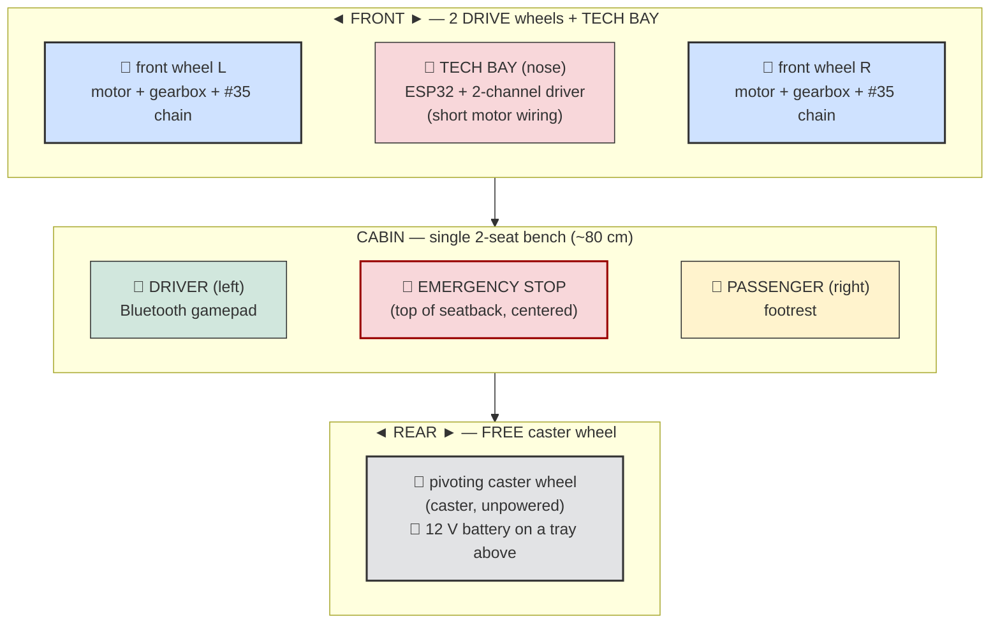

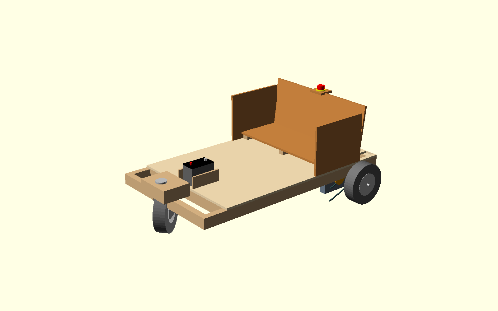

> Regenerable visual concept: [`doc/cad/kart_concept.scad`](doc/cad/kart_concept.scad) (OpenSCAD —
> 2 powered 10″ wheels at the front **with the axle set back into the body** (nose ~30 cm ahead of
> the axle → short turning radius), free 10″ caster wheel on a raised tail with the **12 V motorcycle battery in a
> retaining tray above it (REAR)**, 2-child bench, side guardrails, emergency stop at the top of
> the seatback, 2×3 frame + 1/2″ plywood).

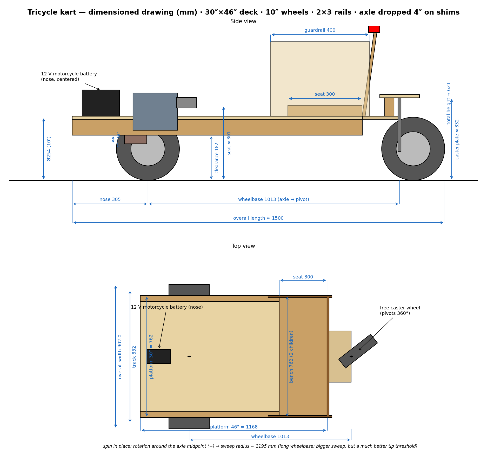

> Regenerable dimensioned drawing (mm): `python doc/schematics/kart_dimensions.py` — side and top
> views at the concept's dimensions.

**Footprint:** length ~125 cm · width ~91 cm · **front track width ~84 cm** · **wheelbase ~76 cm** (axle **set back** into the body, nose ~30 cm) · **2 front drive wheels Ø25.4 cm (10″) + tech bay in the nose** + **1 free rear caster wheel 10″** · **side guardrails** + **emergency stop at the top of the seatback (centered)** · low seat (tip-resistant).

> ⚠️ For **flat ground, under adult supervision** only. Estimated speed ~8–12 km/h (~3.3 m/s), runtime ~10–20 min. **A tricycle tips over more easily than a 4-wheeler** → software rollover protection (see §3).

## At a glance

| Item | Choice |
|---|---|
| **Seats** | 2, single bench side by side; **driver on the left** (gamepad) |
| **Steering** | **Differential (skid steer)**: speed difference between the 2 front wheels; **pivot in place** possible; **no mechanical steering parts** |
| **Propulsion** | **2× 12 V DC motors (~172 W / 0.23 HP)** at the FRONT, **independent** (one per wheel) — **PWM/DIR per wheel** |
| **Transmission** | **3D-printed gearboxes** (16→80 then 30→80 = 1:13.33, 16T/24 DP motor pinion — see [`doc/reducteur.md`](doc/reducteur.md)) + **1.28:1 sprockets (25T→32T) bolted to the front wheels + #35 chain** = **1:17 total** |
| **Wheels** | **2× front drive Ø25.4 cm (10″)** (plastic rim, 1/2" bearing) + **1 free pivoting rear caster wheel** |
| **Driving** | **Bluetooth gamepad** (stick: Y = forward/reverse, X = turn); **calibration mandatory**; analog joystick reserved (future) |
| **Electronics** | **ESP32** → **dual-channel driver 20 A / 6–30 V** (PWM + DIR / channel), **PWM capped at ≈ 12 V/Vbat** (12 V → ~100%, 24 V → ~50%); **tech bay in the nose** (near the 2 motors, short power wiring) |
| **Power** | **One 12 V motorcycle battery**, **at the REAR in a retaining tray above the caster wheel** (owner's build choice). CG re-validated in simulation (turn range capped). Single pack, no paralleling |
| **Speed** | Measured by **2 AS5600 angle sensors** (one per wheel, 1 per I²C bus); control loop at **500 Hz** |
| **Controls** | Driving with the **Bluetooth gamepad**; **arming** button (physical or gamepad START, ~1 s); **hardware emergency stop** at the **top of the seatback, centered** (opens the 40 A motor relay by breaking its COIL — thin wires, ~10-20 ms; the logic rail stays up so the kart reports WHY it stopped; reachable by both kids and by an adult behind) **+** software emergency stop = gamepad button **B**; **electric brake by default** |
| **Frame** | Lightweight **wood**: **2×3** studs + **6 mm plywood** floor |
| **Mass** | ~**32 kg** empty · ~**98 kg** loaded (2 kids) |

## Why these choices

- **Differential steering = zero mechanics**: no more steering wheel, column, kingpins, steering knuckles, tie rod or drag link → fewer parts to make, adjust and wear out; you **turn in software** (PWM difference between the 2 wheels). **Pivot in place** when forward motion ≈ 0.
- **Free rear caster wheel**: a single unpowered pivoting caster wheel orients itself → simple geometry, no rear axle.
- **Controlled stability**: a tricycle tips over faster than a 4-wheeler → low seat (16 cm), **wide front track** + **firmware rollover protection** (clamping the turn amplitude by speed **and** a slew-rate limiter on the turn).
- **Flexible battery voltage (6–30 V driver)**: the motors are 12 V; the firmware **caps PWM AUTOMATICALLY at 12 V / measured Vbat** (smoothed ~1 s): motorcycle battery **12 V → ~100%**, 20 V pack → ~60%, **24 V → ~50%**. Changing battery = adjust the Vbat measurement **voltage divider** (swap the two resistors and edit the `hw::VBAT_R_TOP`/`VBAT_R_BOTTOM` constants — deliberately NOT a web setting, a wrong ratio would silently drag the LVC along); the LVC thresholds are **hard-coded per battery type** (12/24 V, detected at startup). A **manual** cap (`duty_cap`) remains available; ⚠️ **without the Vbat sensor (ADS1115), the auto cap is inactive** → set `duty_cap` by hand if the battery exceeds 12 V.
- **Free-rolling front wheels**: driven by **#35 chain** (sprocket bolted to the rim), they keep their original bearing — no through drive axle.
- **Tech bay at the front, battery at the REAR**: the driver + ESP32 stay **near the 2 motors** (short motor wiring), while the **battery sits in a retaining tray above the caster wheel** — easier to secure and to swap. Longitudinal layout: **NOSE (electronics) → DRIVE AXLE → CABIN → REAR (caster + battery tray)**. **The axle is set back ~32 cm into the body**: pivot-in-place sweep ~0.95 m radius. The rear battery is an accepted trade: it **unloads the drive wheels a little** (traction/braking) and moves the CG rearward — the rollover protection range was **re-validated in simulation** for this CG (xcg 0.40→0.44: the old `turn_alat_vmax` max of 0.4 now tips, the range is capped at 0.3), and the battery leads run rear→front in 10 AWG (~0.3 V drop at 40 A).
- **Safety**: **central hardware emergency stop**, at the **top of the seatback** (within reach of both kids and an adult behind), **e-stop in the 40 A relay's coil loop** (the mushroom breaks 150 mA, the relay contact breaks the 40 A; the logic rail survives and the firmware raises the MOTOR-POWER fault — which doubles as the per-session welded-contact test) **and** software gamepad emergency stop (button B); start via **momentary button** priming the two-relay latch (small opto module = logic rail, 40 A relay = motor power, the ESP holds via `POWER_HOLD`), one 40 A fuse, **electric brake by default** (gamepad disconnect → immediate braking), low-voltage cutoff (LVC), **2 s watchdog (PANIC)**, **disarmed** start by default, guards over chains/sprockets, seatbelt, helmet.

---

## 1. Chassis dimensions

| Dimension | Value | Why |
|---|---|---|
| Total length | **~125 cm** (dimensioned drawing; leave margin) | **Nose** (tech bay ~30 cm **ahead of the axle**) + cabin + seatback + overhang out to the rear caster wheel |
| Overall width | **96 cm** | Must fit **two kids side by side** |
| **Bench inner width** | **~80 cm** | 2 × ~40 cm/child (shoulders + elbows) |
| **Side guardrails** (1/2″ plywood, on each side of the bench) | height **~30 cm** above the floor, length ~40 cm | Keep the child from **falling out sideways**; rounded edges |
| **Tech bay** (nose, **ahead of the axle**) | length ~**30 cm** | Houses the driver, ESP32, breakout near the 2 motors (short motor wiring). The **battery lives at the REAR** (tray above the caster) |
| **Front track** (drive-wheel spacing, center to center) | **84 cm** | Wide track = **tip resistance** AND **differential lever arm** (the wider the track, the sharper the turn for a given differential) |
| **Wheelbase** (front axle ↔ caster pivot) | **~76 cm** (axle **set back** ~32 cm into the body) | **Short turning radius**: the pivot-in-place rotates about the middle of the axle → axle close to the vehicle center = **swept radius ~0.95 m**; and more weight on the drive wheels (traction/braking) |
| Seat height (ground → seat bottom) | **16 cm** | **Low** center of gravity = limits rollover |
| Ground clearance (under frame) | **8 cm** | Clears small obstacles without bottoming out |
| Seatback height (seat → top) | **34 cm** | Supports both kids' backs |
| **Front drive wheels (×2 identical)** | **Ø25.4 cm (10″)**, plastic rim + hard PVC tire | Same wheels left/right → simpler plan |
| **Rear caster wheel (×1)** | **10″ wheel (Ø25.4 cm) on a pivoting fork**, under a **raised tail** (plate at ~33 cm), load ≥ 50 kg | Unpowered, orients freely (360°); **same wheel as the front** (shared parts); the raised tail keeps the frame **level** |
| Hub / front-wheel mounting | **Metal bearing, 1/2" bore**, wide hub ~3.8 cm | Turns **free** on a **through dead axle: 1/2″ × 36″ threaded rod** (grade **8.8/B7**, hardware-store), **locknuts + washers at each end**, spacers to fix the lateral position (chain alignment), frame supports as close as possible to the hubs (≤ 3–5 cm, flex) |

**Guiding idea:** low seat + **wide front track (84 cm)** = a machine **that stays stable** despite the tricycle format and two kids side by side. The firmware rollover protection complements the geometry.

> **Track / body decoupling**: the cabin doesn't need to be as wide as the track —
> a **T** frame: a **wide front crossmember** carrying the **axle bearings as close as possible to
> the wheels** (≤ 3–5 cm, otherwise the threaded rod flexes), narrow rails behind. The space along
> the axle between rail and wheel houses the **motor + gearbox + #35 chain** on each
> side. ⚠️ The firmware rollover protection is an **empirical** ramp (`turn_full_ms`, `turn_alat_vmax`): re-tune it on the bench if the geometry changes.

---

## 2. Seat / controls position

Reference 0 = **front** axle (drive wheels); dimensions measured **toward the rear** (negative = nose). The **tech bay** (battery + electronics) occupies the **nose, ahead of the axle**.

| Item | Distance from front axle | Height / ground |
|---|---|---|
| **Tech bay** (electronics) | **~−30–0 cm (nose)** | on the floor, low |
| Front axle (drive wheels, reference) | **0 cm** | center at 12.7 cm (Ø25.4 wheel) |
| **Footrest** | **~5 cm** | footrest just behind the axle |
| Front of the seat | **~32 cm** | ~20 cm |
| **Back of the seatback** | **~62 cm** | seat at ~20 cm |
| Rear caster pivot (free) | **~76 cm** | 10″ wheel (Ø25.4), plate at ~33 cm |
| **Battery tray** (12 V battery, retained) | **~69–84 cm (above the caster)** | plate ~33 cm + battery |

➡️ With the **Bluetooth gamepad**, there's **no more pedal box or steering wheel** to position: only seating ergonomics matter. **Seatback → footrest ≈ 57 cm** (62 − 5) ✔ leg almost straight, slight knee bend. Provide a safe place to **rest/charge the gamepad**. **Adjustable** seat (§6) to fit the child's size.

➡️ **Emergency stop at the top of the seatback (centered)**: the **hardware mushroom button** (in series with the **40 A relay's coil**) is mounted **at the top of the seatback, in the center** — reachable by **both kids** and by an **adult following the kart**. It **opens the motor relay** (~10-20 ms, thin wires only); the logic rail stays up, so the firmware disarms, names the fault (`MOTOR POWER`) and requires a deliberate re-arm — complementing the **software** emergency stop on the gamepad (button **B**). **Side guardrails** on each side of the bench (no central divider: continuous bench). **Driving stays on the Bluetooth gamepad**.

> ⚠️ **Total power off = coasting; e-stop probably still brakes.** Dynamic braking closes the
> driver's **low-side** MOSFETs, which need only gate drive — so with the two-rail wiring, an
> e-stop that kills the 40 A motor feed while the **driver logic stays on the logic rail**
> most likely keeps the electric brake (bench test: logic up, motor relay open, spin a wheel —
> see [power switch](#power-switch-two-rails-two-relays)). What loses everything is a **full**
> power drop (both rails, e.g. relay released mid-reboot): switches open, **no electric
> brake**, only the passive ×17 gearbox drag — effective on the flat, **insufficient on a
> slope**. Fail-safe remedy if ever needed: a **normally-closed-contact relay across each
> motor** (coil on the main rail) — any power loss re-closes the contacts → automatic dynamic
> braking, no electronics.

### Side view

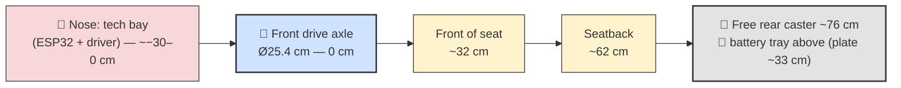

> **Single 2-seat bench**: the two kids side by side (~80 cm inner), same seatback. The **driver (left)** holds the **gamepad**; the right side is passenger. The **tech bay** (electronics) is **in the nose, ahead of the drive axle**; the battery sits at the **rear**, in its tray above the caster.

### Top view (2-seat layout)

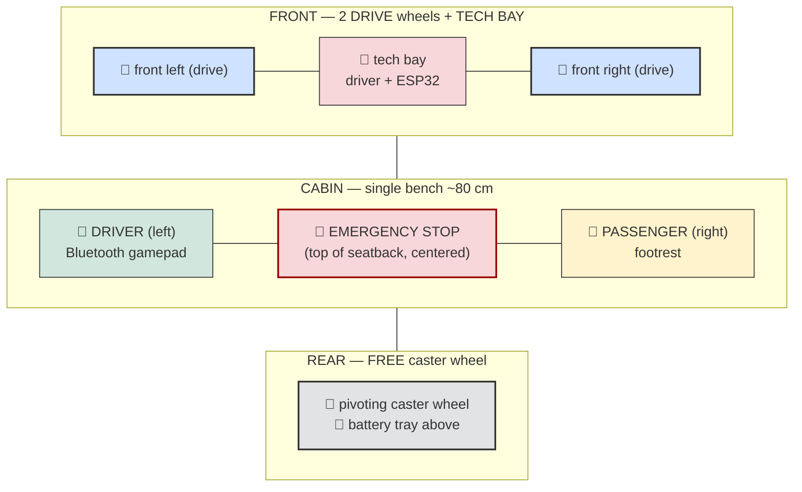

---

## 3. Differential steering (skid steer)

### Principle: **turn by speed difference between the 2 front wheels**

There are **no mechanical steering parts**: no steering wheel, no column, no wheel kingpins, no steering knuckles, no tie rod, no drag link, no Pitman arm, no steering stops. **You turn by making one front wheel roll faster than the other.** The **rear wheel is a free caster** that follows the motion.

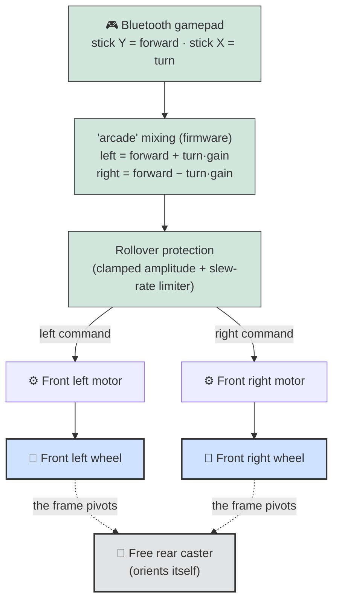

1. **"Arcade" mixing**: the firmware combines forward motion (stick Y) and turn (stick X) into two wheel commands: `left = forward + turn·gain` and `right = forward − turn·gain`. Push the stick right = left wheel faster → the kart turns right.
2. **Pivot in place**: if forward motion ≈ 0 and you push the stick sideways, the two wheels turn **in opposite directions** → the kart **spins on itself** (the rear caster pivots to follow).
3. **Rollover protection**: a tricycle tips easily, so the turn is protected on **two fronts**:
   - **Speed→turn ISO-a_lat limit (MEASURED speed)**: below `turn_full_ms` (~0.5 m/s) — and anywhere the curve allows — turning is permitted at **±100%** (full-power pivot in place, `turn_gain` default 1.0); above that, the limit decreases as **1/v** (same lateral acceleration at any speed) down to `turn_alat_vmax` (**±20% by default**) at top speed, then keeps tightening in case of runaway. Calibrated by physics simulation: the old linear ramp tipped an **offset load** (a single child on one side, adult+child) as soon as the turn gain reached 100%; the iso-a_lat curve keeps healthy margins across the whole settable range (re-validated for the rear-battery CG — the sim sweep is the authority). The faster you go, the less you can steer. **Reverse** has **its own speed limit** (`rev_speed_ms`, default 1 m/s), served by the same PID limiter as `speed_limit_ms` (target chosen by the measured direction).
   - **Slew-rate limiter**: the turn command cannot change by more than `turn_rate` per second → an abrupt stick move is **smoothed** instead of causing a violent differential. The forward command is deliberately **not** slewed: softening the throttle is the job of the **mixing curves** (`mix_type` — expo, or expo + speed-soft for a child driver) and of the speed limiter.

Web parameters: **`turn_gain`** (turn authority), **`turn_full_ms`** / **`turn_alat_vmax`** (rollover ramp), **`turn_rate`** (turn smoothness), and the **Drive feel** group (`mix_type`, `mix_expo_fwd`, `mix_expo_turn`, `mix_soft_hi` — stick-to-motor feel, from linear to child-gentle). Details in [`firmware/README.md`](firmware/README.md).

> **Consequence of skid steer:** in a tight turn, the wheels **scrub** slightly on the ground (sliding friction) — that's inherent to this type of steering. At moderate speed on flat ground, the effect stays acceptable.

---

## 4. Hardware & electronics

> **Mostly wooden, lightweight frame**: a grid of **2×3 studs** (SPF ~38×64 mm) + **6 mm plywood floor**. Reinforce at load points (front motor mounts, rear caster mounting, seatbelt anchor). ⚠️ The 6 mm plywood requires a **closely-spaced 2×3 grid** (crossmembers every ~25–30 cm); **12 mm under the bench**.

| Category | Item | Size / spec |
|---|---|---|
| **Wood** | Frame (rails + crossmembers) | **2×3** studs (SPF ~38×64 mm), closely-spaced grid |
| | Floor | **6 mm** plywood, ~140 × 90 cm, supported by the grid |
| | Seat (loaded zone) | **12 mm** plywood under the bench |
| | Front motor mounts / seatback | Hardwood block + plate; seatback in 6 mm plywood |
| **Wheels** | **2× front drive wheels** identical | **Ø25.4 cm (10″)**, plastic rim + PVC tire, 1/2" bearing |
| | **1× pivoting rear caster wheel (caster)** | **Free**, unpowered caster; **Ø ~12.5 cm (5")**, mounted height ~15 cm, **load ≥ 50 kg** |
| | Shoulder bolts (front wheels) | **Supplied with the wheels** (1/2" shoulder, 3/8" thread) |
| **Propulsion** | **2× 12 V DC motors** (one per **front** wheel) | ~172 W (0.23 HP), 19.6 A, 4615 rpm; **independent** |
| | 2 3D gearboxes | **1:13.33** (16→80 then 30→80, [design](doc/reducteur.md)) + 1.28:1 sprockets = **1:17 total**, printed (PETG/ABS/nylon) |
| | Sprockets + #35 chain | Sprocket **bolted to each front wheel** + #35 roller chain from the gearbox (**25T→32T = 1.28:1**). Chain rather than a belt: **it can be cut to any length**, so the gearbox-to-wheel centre distance is free instead of being dictated by stock belt lengths. |
| | **2× AS5600 angle sensor** + diametric magnet | one per front wheel, **1 per I²C bus**; contactless magnetic, **12-bit absolute I²C** (fixed address 0x36), **3.3 V native** (no level-shift), 4.7 kΩ pull-ups |
| **Driving** | **Bluetooth gamepad** | stick: Y = forward/reverse, X = turn; button **B** = emergency stop, button **START** = arming; **calibration mandatory** |
| | *Analog joystick* | **reserved (future, not wired)**: 2 ADS1115 channels (A1/A2) planned behind the same software abstraction |
| **Power / electronics** | Battery | **One 12 V motorcycle battery** (~40 A peak OK, PWM ~100%) **at the REAR, strapped in a retaining tray above the caster wheel**. No paralleling this phase. The driver accepts up to **30 V**, and the firmware still supports **24 V** (2×12 V in series, auto PWM ~50%) — unlikely to be used, and it would need the divider changed to 100 k/12 k (12 V/Vbat) |
| | **Battery adapters** (×2) | Slide-on holder → power terminals (+ / −) |
| | **40 A DC relay** + optocoupler + drive transistor | main power switch (see [power switch](#power-switch-two-rails-two-relays)) + 1 fuse |
| | **Power switch (latch)** | **opto-isolated relay module** (logic rail, driven by `POWER_HOLD`) + **start button** (primes; hold ~1 s at power-up) + **hidden FORCE ON toggle** (bench/flash). **No hold capacitor**: a reboot powers the kart off cleanly. Full BOM: [`doc/electronique.md`](doc/electronique.md) |
| | Motor driver | **1 dual-channel board 20 A / 6–30 V** (PWM+DIR/channel), duty **capped automatically at 12 V/measured Vbat** (+ manual cap `duty_cap`) |
| | Controller | **ESP32-WROOM board** (dual-core 240 MHz, Wi-Fi/BT, 4 MB flash) |
| | **External ADC ADS1115** | **16-bit I²C**, powered at **3.3 V**, address **0x48** on bus 0 (with the left AS5600); A0 = Vbat, A1/A2 reserved for the future joystick |
| | **Breakout board** | Screw terminals + 5 V / 3.3 V outputs + status LED; the **3.3 V** powers AS5600 + ADS1115 |
| | **Buck → 5 V** (20 V-rated unit already on hand, fed from the 12 V logic rail) | powers the ESP32 (which makes its own 3.3 V) |
| | **Soldered perfboard** | Vbat voltage divider 100 k/15 k (to A0 of the ADS1115) + decoupling capacitors (⚠️ no breadboard — vibration) |
| | **Weatherproof electrical enclosure** (ABS, clear lid, ~150 × 100 × 70 mm, ≈IP65) | **in the front tech bay**; houses ESP32 + breakout + ADS1115 + perfboard; cable glands for the cables; protects against dust/rain/impact (clear lid = status LED visible) |
| | Elec. safety | **Emergency stop (NC) in series** in the gate line (mushroom button **at the top of the seatback, centered**, within reach of both kids) + **fuse/pack** |
| | **WS2812B** strip (~10 LEDs) | status: **moving rainbow = armed & ready**, yellow = disarmed (pulsing while arming), blinking red = fault, orange = low battery, blue = calibration |
| **Controls** | **Arming** button + LED | momentary; arming = ~1 s press (physical button **or** gamepad START) |
| **Brake** | **Electric brake (default)** ✅ | handled by the firmware (plugging PID); **default state = braking**; gamepad disconnect → immediate braking; no brake pad |
| **Future reserves** (wired, unused) | **analog joystick** | joystick on A1/A2 of the ADS1115 |
| **Fasteners / finish** | M8/M10 through-bolts, **nylock** nuts | brackets, wood screws, varnish; rounded edges |

### Propulsion — 2 front 12 V DC motors

Each **front wheel** is driven by its **own 12 V permanent-magnet DC motor** through a **3D-printed 1:13.33 gearbox** (16→80, 30→80) and a **25T→32T #35 chain (1.28:1)** — total reduction **1:17.07**. The **two motors are controlled independently** (PWM + DIR per channel): it's this **command difference** that provides steering. **Each wheel has its own AS5600 sensor** for the control loop.

| Characteristic | Value |
|---|---|
| Type / model | **Permanent-magnet** DC — RX0086 |
| Power | **0.23 HP (~172 W)** |
| Speed | **4615 rpm** (at 12 V, no load) |
| Voltage / current | **12 VDC** / **19.6 A** |
| Duty | **intermittent** (leisure, not continuous); TENV, class F |

> ⚠️ **Voltage:** motors **12 V**, driver **6–30 V** → the firmware **caps PWM at 12 V/measured Vbat** to protect the motors: **12 V** battery **→ ~100%**, 20 V → ~60%, **24 V → ~50%**. Without the ADS1115: set the manual cap `duty_cap`.
> ⚠️ **Current:** **19.6 A**/motor (driver 20 A/channel OK); **total ~40 A** — carried by the **single pack**, not split across two. Size the fuse, the cable and the relay for the full 40 A, and expect the sag that goes with it (see [LVC](#battery-voltage-measurement--low-voltage-cutoff-lvc)). Avoid prolonged wheel stalls.

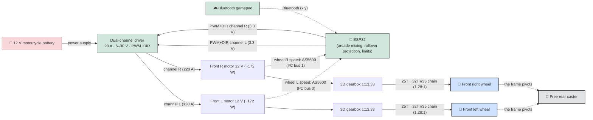

**Estimated performance:**

| Parameter | Value |
|---|---|
| Speed at ~50% (≈ 10 V) | ~**3850 rpm** motor → **~225 rpm wheel** (÷17.07) |
| Estimated top speed | **~3.3 m/s (~12 km/h)** — firmware-limited |
| Total current | ~**40 A**, all from the single 12 V pack |
| Battery energy / runtime | ~90–100 Wh → **~10–20 min** depending on use |

**Transmission gearbox → wheel:** sprocket **bolted to the inner side of the wheel** (multiple spokes, large washers / backing plate so as not to crack the plastic), **25T→32T #35 sprockets = 1.28:1** (exact tooth ratio — see [`doc/reducteur.md`](doc/reducteur.md)) with tension adjustment (slotted holes / idler), **closed guard**. The wheel turns **free on the through axle**; the motor only drives it. **Measure the hub thickness before the final cut of the rod**; **adjustable spacers** to bring the wheel-sprocket plane in line with the gearbox sprocket (chain alignment = critical adjustment: a misaligned chain climbs a sprocket flank and is thrown), gearbox mounting with slotted holes for fine adjustment.

**Where to put the gearbox output sprocket** — full reasoning and the centre-distance table in
[`doc/reducteur.md`](doc/reducteur.md#where-to-put-the-gearbox-output-sprocket):

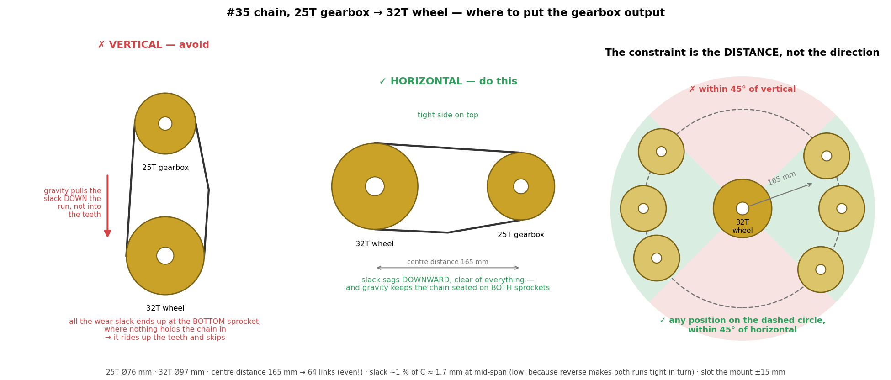

- ⚠️ **Never one sprocket directly above the other.** Gravity then pulls the slack *along* the run
  instead of into the teeth, and wear elongation all collects at the **bottom** sprocket where
  nothing keeps the chain seated — it climbs the teeth and skips. Keep the line of centres
  **within 45° of horizontal**.
- **The constraint is the DISTANCE, not the direction**: any position on a circle around the wheel
  axle works, as long as it avoids the two vertical 45° sectors. Useful freedom when a frame member
  is in the way — forward, back or diagonally up are all fine.
- **165 mm centre distance → 64 links** for this build (168.7 mm hits 64 exactly). A short centre
  distance costs almost nothing at 1.3 m/s and 10 % of working load; what it costs is **tension
  sensitivity** (1.7 mm of nominal slack), so expect to re-tension more often.
- **Even link count is mandatory** (an odd one needs a cranked link, ~20 % weaker), slack **~1 % of
  C** rather than the usual 2 % because reverse makes both runs tight in turn, and slot the mount
  **±15 mm**.

### Electronic control — ESP32

- The **ESP32** receives the **Bluetooth gamepad** axes, applies **arcade mixing** + **rollover protection**, then sends **an independent PWM + DIR to each channel** of the driver.
- Driver: **dual-channel, 20 A continuous / 60 A peak, 6–30 V**, **PWM + DIR** inputs compatible with **3.3 V**, PWM up to 20 kHz; **overcurrent / undervoltage / temperature** protections. ⚠️ **No reverse-polarity protection** (VB+/VB-) → a reversed connection **destroys the board**.
- **PID brake by default**: at a stop or with no forward command, a **PID brings each wheel to 0** (AS5600 reading) — signed output → can **reverse the motor** (plugging). This is the **default state**.
- Best practices: **PWM capped at ≈ 12 V/Vbat**, **expo mixing curves** for a gentle throttle (`mix_type`), **speed limiter** (sensor measurement), **watchdog**, **braking if the gamepad disconnects**.

### AS5600 speed sensors (×2, on I²C)

**AS5600** angle sensor: **contactless** magnetic, **12-bit absolute angle** (4096 points/turn) read over **I²C**, with a **diametric magnet** on the shaft end. There is **one AS5600 per front wheel**, **one per I²C bus** (each AS5600 having the fixed address **0x36**, they cannot coexist on the same bus). **Known kinematics** (see [`doc/reducteur.md`](doc/reducteur.md)): the magnet is on the **output of the 1:13.33 gearbox**, followed by **1.28:1 sprockets** → **the sensor makes 1.28 turns per wheel turn** ⇒ web parameter `enc_per_wheel = 1.28` (3.41 if the magnet moves to the 1:5 intermediate shaft), **10″ wheel = 0.254 m**. The **vehicle speed** (m/s) = **signed average** of the 2 wheels (pivot in place → 0 m/s). The conversion is **fully determined**. They serve to:
- **Measure each wheel's speed** → reliable limiter; **PID brake** toward 0; **direction** (sign of Δangle, the DIR pin sets the convention); **safety** (stall: PWM active with no rotation > 1 s → fault).

✅ **3.3 V native** (VDD5V/VDD3V3 tied together) → **SDA/SCL directly on the ESP32, NO level-shift**. Wiring per sensor: **SDA, SCL, 3.3 V, GND** (+ magnet), **4.7 kΩ** pull-ups per bus.

Implementation: I²C read of the **RAW ANGLE** register (0x0C/0x0D) → **speed = derivative of the angle** (`Δcounts × frequency`, **wrap 0↔4095**); **500 Hz loop** (FreeRTOS 1000 Hz) → no ambiguity; **diametric** magnet centered, **air gap 0.5–3 mm**; I²C bus **away from power**, decoupling capacitor on the supply.

> *A quadrature encoder per wheel was once held in reserve as an alternative — dropped: the AS5600 do the job.*

### Battery measurement — external ADS1115 ADC

All analog measurements go through an **ADS1115** (16-bit, I²C, PGA) **instead of the ESP32's internal ADC** — more accurate and linear, and without the ADC2/Wi-Fi conflict. The breakout connects **piggyback on I²C bus 0** (with the left AS5600: distinct addresses **0x36 / 0x48**).

- ⚠️ **Power at 3.3 V** (I²C levels compatible with the ESP32) → `AIN_max = 3.3 V`.
- **A0 = battery voltage** (via the **100 k / 15 k** voltage divider), tracked in **continuous mode**.
- **A1 / A2 = reserved** for the future X/Y joystick (single-shot read); **A3 free**.
- The driver **degrades gracefully**: ADS1115 absent or silent → the voltage reads **unknown** (never 0 — a 0 V reading once fooled the LVC into cutting power); LVC and auto PWM cap simply stand down until readings return.

### Gamepad calibration

**The kart refuses to move until the gamepad is calibrated.** Calibration is done **exclusively from the web page** (Gamepad tab), **for the Bluetooth gamepad only**:

1. **Center**: stick at rest → captures the neutral point;
2. **Extremes**: move the sticks fully → captures the amplitude per axis.

The scale (center + half-amplitude per axis) is **persisted in NVS** (namespace `pad`). ⚠️ **(Re)pairing ERASES the calibration** (new gamepad = new calibration). Until the gamepad is calibrated, connected and armed, the controller **stays braking** (default state).

### Electrical safety

- **Emergency stop** easily accessible, **in the 40 A relay's coil loop**: pressing it de-energises the coil and the **relay contact breaks the 40 A** (~10-20 ms; with no hold capacitor, nothing delays it). The mushroom itself only switches ~150 mA on signal-gauge wires — no 40 A detour to the seatback, any decent NC mushroom qualifies. The **logic rail stays up**, and the sense opto reads the **coil** (after the mushroom): the firmware sees the e-stop the instant it is pressed, disarms, **dynamic-brakes** and names the fault — **even if the relay contact is welded closed** (the driver still has VB+ and logic, so the brake actually works). The trade: welding itself becomes undetectable; the pre-drive e-stop test verifies the sense chain. (In addition, the gamepad's **button B** triggers immediate braking on the firmware side.)
- **Start via momentary button** (primes the latch); **fuse/pack**, wiring ≥ the 2 motors' current.
- **Battery: one 12 V motorcycle battery** (lead-acid — no BMS of its own). Deep discharge protection = **the firmware LVC** (thresholds hard-coded per detected type: 12 V → cut 10.5 V, 24 V → cut 21 V) + the 40 A fuse.
- **One 12 V pack, no paralleling** (this phase): it carries the whole ~40 A, so its internal resistance sets the sag under load — a motorcycle battery at ~0.05 Ω dips ~2 V at full throttle, which is why the LVC judges a smoothed voltage. ⚠️ **Never put packs in series** unless you also change the divider (24 V needs 100 k/12 k).
- **Speed limiter** low at first; **battery secured/protected**; **guards**; **electric brake** + **auto disarm** + **2 s watchdog** + PWM auto-capped at 12 V/Vbat. Cut power before servicing.

### Wiring diagram + ESP32 pinout

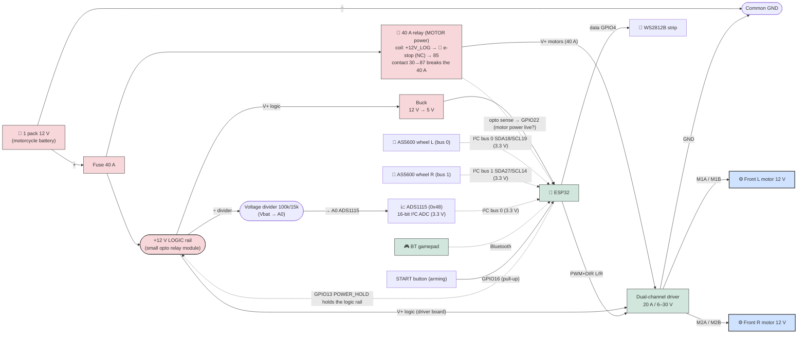

**ESP32 pinout (identical to the firmware `firmware/main/pinout.hpp`):**

| GPIO | Function | Direction | Note |
|---|---|---|---|
| 25 / 26 | **PWM / DIR FRONT left motor** | output | LEDC, **duty ≤ 50%** |
| 32 / 33 | **PWM / DIR FRONT right motor** | output | same |
| 18 / 19 | **I²C bus 0 SDA / SCL** | I/O | **AS5600 wheel L (0x36)** + **ADS1115 (0x48)**, 3.3 V, 4.7 kΩ pull-ups |
| 27 / 14 | **I²C bus 1 SDA / SCL** | I/O | **AS5600 wheel R (0x36)**, 3.3 V, 4.7 kΩ pull-ups |
| 13 | **POWER_HOLD** (power latch) | output | **active LOW**: holds the logic rail; HIGH = cuts |
| 16 | **Arming button (START)** | input | pull-up, ~1 s press (or gamepad START) |
| 22 | **MOTOR_PWR_SENSE** (opto on the 40 A relay **COIL**, after the e-stop) | input | **active LOW** = coil energized = e-stop released; idles on the **internal pull-up** (GPIO22 has one — the input-only 34-39 do NOT, which is why the pin moved), so a broken wire reads "e-stop engaged" (safe side); **50 ms firmware debounce**; ALWAYS active — bench: tie to GND |
| 4 | **WS2812B strip** (data) | output | ~10 LEDs |
| 2 | **Status LED** (onboard) | output | — |
| **Free** | | | |
| 34 / 35 / 36 / 39 | unused | inputs only | input-only pins, **no internal pulls** |
| 21 / 22 / 23 | unused | — | free |
| — | **Battery voltage** | (ADS1115 A0) | **not on a GPIO**: measured by the ADS1115 via 100 k/15 k divider |
| — | **Analog joystick** | (ADS1115 A1/A2) | reserved for future |

**Key wiring points:**
- **Common ground** ESP32 ↔ driver ↔ ADS1115 ↔ I²C sensors: essential.
- **Two rails**: the small opto relay module holds the **logic rail** (ESP32 + driver logic + divider), the **40 A relay** feeds the motors through the **e-stop in its main path**. GPIO22 reads the opto on the relay COIL, after the e-stop (active low: a broken wire reads "e-stop engaged", the safe side).
- **Brake by default**: at a stop, with no forward command, or if the gamepad disconnects, the firmware brakes.
- **Power ~10 AWG** (crimped lugs); **signals thin wire**. **40 A fuse** on the single pack.
- ⚠️ **Driver polarity (VB+/VB-)**: no reverse protection → **double-check**.
- **Vbat via the ADS1115** (not the internal ADC): 100 k/15 k divider to A0, **decoupling capacitor** on the node.

### Full system diagram (all connectors)

Block-by-block overview showing **each connector** (gamepad via the internal radio, 2× AS5600 on 2 I²C buses, ADS1115, START button, front motors, WS2812), the **conditioning** (Vbat divider) and the **power supply**.

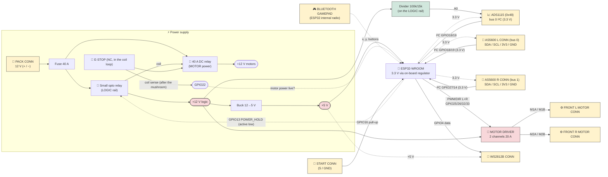

### Electrical schematic (symbols)

The same content as an **electrical schematic with standard symbols** (named-port style:
**net labels with the same name are connected**, as on a multi-sheet schematic):

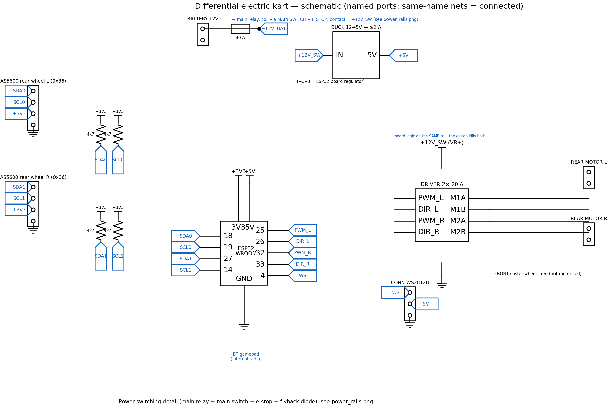

> Regenerable: `. .venv-schem/bin/activate && python doc/schematics/full_schematic.py`.
> The power-switching detail is in [`power_rails.png`](doc/schematics/power_rails.png).

### Battery voltage measurement & low-voltage cutoff (LVC)

A **voltage divider** brings Vbat below 3.3 V onto **the ADS1115's A0 input** (external 16-bit ADC,
powered at 3.3 V) → software protection **on top of the BMS**. The divider is **sized to the
chosen battery** (aim for < 3.3 V at the max voltage UNDER CHARGE); the firmware reconstructs
Vbat from the **resistor constants** `hw::VBAT_R_TOP` / `VBAT_R_BOTTOM` (`control_types.hpp`):

| Battery | Vmax (under charge) | Divider (top/bottom) | Ratio | A0 at Vmax |
|---|---|---|---|---|
| **12 V motorcycle — FITTED** (matches `hw::VBAT_R_*`) | ~14.8 V | **100 k / 15 k** | 0.130 | 1.93 V ✔ |
| *(alt. sizing, 12 V, more ADC range)* | ~14.8 V | 100 k / 27 k | 0.213 | 3.15 V ✔ |
| *(out of scope) 24 V — 2×12 V in series* | ~29 V | 100 k / 12 k | 0.107 | 3.10 V ✔ |

- Reconstruction: **Vbat = V_adc × (R_top + R_bottom) / R_bottom** — the ratio is a **compile-time constant**, deliberately NOT a web setting: a wrong value would silently misreport the battery and drag the LVC thresholds along. Swap the resistors ⇒ edit the two constants and reflash (the Documentation tab shows the live math on the divider diagram).
- **Battery type detected automatically at startup**: the voltage must be **stable for 3 s** (deviation ≤ 0.5 V), then it is classified as **12 V or 24 V** (18 V threshold: a 12 V even under charge stays ≤ ~14.8 V, a 24 V even empty stays ≥ ~21 V). The type is **frozen until restart** (you never change battery with the system on). The **LVC thresholds are hardcoded per type** (lead-acid): 12 V → warning 11.5 / cutoff 10.5 / rearm 12.0; 24 V → 23.0 / 21.0 / 24.0. Until the type is classified: no LVC (the kart starts disarmed anyway).
- Divider leakage ≈ 0.18 mA — the divider hangs on the **LOGIC rail** (downstream of the small relay, ⚠️ NOT the motor rail, which dies with the e-stop), so **nothing when off**.
- **Decoupling capacitor** on the ADC node; the ADS1115 (16-bit, PGA) gives a more stable measurement than the internal ADC.

| State (12 V lead-acid, detected) | Voltage | Firmware action |
|---|---:|---|
| Full charge (at rest) | ~13.0 V | — (top of the web gauge) |
| **Warning** | 11.5 V | orange LED strip |
| **Cutoff (LVC)** | 10.5 V | blocking fault, disarm; **power cut after 30 s** below |
| Rearm (hysteresis) | > 12.0 V | driving allowed again (re-arm on START) |

*(24 V pack: 23.0 / 21.0 / 24.0 V — same logic, thresholds hard-coded per detected type.)*

> **Anti-sag:** the LVC judges a **2 s smoothed** voltage + 0.5 s debounce — ~20 A through a
> ~0.05 Ω pack sags ~2 V for the length of an acceleration, and a healthy half-charged battery
> must not be cut mid-manoeuvre (measured in simulation: thresholding the raw voltage cut a
> 12.0 V pack 0.55 s after opening the throttle). On return, a deliberate **rearm** (START).

### Wiring 2 batteries in parallel

> ⛔ **Out of scope for this phase.** One **single 12 V pack**, no paralleling — so no
> diode-OR, no ideal-diode modules, nothing to arbitrate between sources. Kept below because
> the sizing holds if a second pack is ever added. *(The firmware still supports a 24 V pack;
> the 12/24 V detection stays in place, it is just unlikely to be exercised.)*

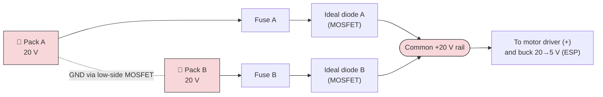

**Diode-OR:** each pack supplies **through a diode** → no balancing current, you can clip on a slightly discharged pack safely. **Sizing:** ~40 A shared → ~**20 A/diode** → **40 A / 60 A modules** (low MOSFET drop vs ~8 W of losses with a Schottky). ⚠️ Without diode-OR, a ΔV > 2 V between packs = **dangerous spike**; in that case only connect packs **at the same voltage**.

### Power switch (two rails, two relays)

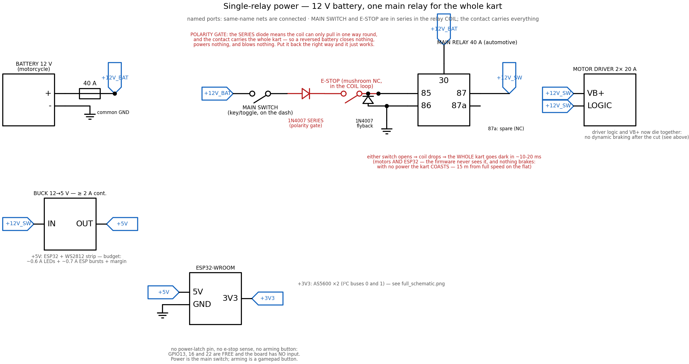

> Full design rationale, BOM and the terminal-by-terminal wiring guide:
> **[`doc/electronique.md`](doc/electronique.md)**. Regenerable:
> `. .venv-schem/bin/activate && python doc/schematics/power_rails.py`.

> 🔁 **This phase: two rails, two relays.** The low-side MOSFET pair is replaced by
> - a **small opto-isolated relay module** (ready-made, opto and flyback diode on board) that
>   holds the **LOGIC rail** — ESP32 + motor-controller board — driven from `POWER_HOLD`;
> - a **40 A DC relay** that carries the **MOTOR power**, energised through the small one.
>
> The ESP never sees pack voltage, and an unenergised coil draws nothing, so the kart at rest
> consumes zero. Prime with the button, hold from the ESP, as before.
>
> **The emergency stop only needs to cut the motor relay.** That is the point of splitting the
> rails: the logic survives, so the kart can *say* what happened instead of going dark. A
> **feedback opto** on the 40 A relay's **coil** (after the mushroom) tells the firmware the
> instant the e-stop is engaged (`pins::MOTOR_PWR_SENSE`, GPIO22, active low so a broken wire reads "e-stop engaged").
> Wiring: the opto's input LED from the **coil node (pin 85, after the e-stop)** through its
> 4.7 kΩ resistor to ground; output transistor between **GPIO22** and GND. Sensing the COIL
> rather than the output means a **welded contact cannot defeat the e-stop**: the firmware
> sees the command and dynamic-brakes (it keeps VB+ and logic to do it). The cost — welding
> becomes undetectable — was accepted over a dual-opto variant. The pin
> idles on the ESP32's **internal pull-up** (that is why it is GPIO22 and not one of the
> pull-less input-only 34-39), and the firmware **debounces 50 ms** so a spike coupled from
> the neighbouring 40 A cabling can never fake an emergency stop.
> The firmware watches this input **unconditionally** (the software bypass was removed; a
> bench without the opto ties GPIO22 to GND) and raises **`fb::NO_MOTOR_PWR`**, disarms, names the fault on
> the page, and requires a deliberate re-arm on START — releasing the mushroom button never
> resumes drive on its own.
>
> **The e-stop may still BRAKE, not freewheel — and that is a bonus of splitting the rails.**
> Dynamic braking is `motorsBrake()`: duty 0 + DIR low, which drives both bridge outputs low,
> i.e. turns on both **low-side** MOSFETs and shorts the windings to ground. Low-side FETs are
> referenced to ground and need only **gate drive** — they do not need VB+. So with the driver
> board's logic alive on the logic rail and its 40 A supply cut, the firmware sees
> `fb::NO_MOTOR_PWR`, disarms, and the disarm path already commands the brake. The chain works
> end to end without a second pole on the mushroom button.
>
> ⚠️ **It hinges entirely on the driver board keeping its gate drive without VB+.** Boards with
> a separate logic VCC generally do. Boards built around half-bridge ICs that take their own
> supply from B+ (BTS7960 and friends) do **not** — cut B+ and the chip is simply off, outputs
> floating. **Test it on the bench**, which the two-rail wiring makes trivial: logic up, 40 A
> relay open, spin a wheel by hand and feel whether it resists. Thirty seconds, and it decides
> whether the emergency stop stops the kart or merely stops driving it.
>
> If it turns out not to brake, freewheel is still acceptable *on the flat*: the 1:17 gearbox
> is not meaningfully back-drivable — the wheel would have to spin the motor seventeen times
> faster than itself through printed spur gears — so it coasts to a stop rather than rolling
> away. That argument expires on a slope (`coupure_pente*`), where the fix is a second pole on
> the mushroom button shorting the windings mechanically.
>
> ⚠️ **Put the voltage divider on the LOGIC rail**, not the motor rail. On the motor rail it
> would read 0 V the moment the e-stop is pressed, and the kart would report a dead battery
> instead of an emergency stop.
>
> ⚠️ **A reboot does NOT hold through — by decision.** After a watchdog reset the ESP32
> spends ~700 ms in the bootloader with `POWER_HOLD` undriven; a relay coil draws real
> current (unlike the old MOSFET gate), so without help the logic rail drops and the kart
> powers off cleanly. **That is the accepted behavior**: a reboot becomes one press of
> START, the motors are unpowered throughout (safe), and the event log records the boot
> and its reason instead of a capacitor papering over it.
>
> **Parts actually used**
>
> | | part | coil | contacts |
> |---|---|---|---|
> | logic rail | **TONGLING JQC-3FF-S-Z** module, opto in, high/low trigger | 12 V, ~400 Ω, **30 mA** | 10 A 30 VDC |
> | motor power | **YONGCHUAN YCL-12V-C**, automotive SPDT (85/86 coil, 30/87/87a) | 12 V, ~80 Ω, **150 mA** | **40 A** on 87 (NO), 30 A on 87a |
>
> Feed the motors from **87 (NO)** — that is the contact carrying the 40 A rating, and it also
> means an unpowered relay is an unpowered kart. **87a (NC) is spare**: it cannot short the
> windings *and* switch the supply at the same time (one pole, one job), but it is there for an
> indicator or a future second relay. The module's 10 A contacts drive the 150 mA coil with a
> factor of 66 in hand.
>
> **Decision (2026-08-02 review): NO hold capacitor.** The ~1500 µF ride-through was
> designed, sized (RC decay, release at 10–30 % of nominal) and then **rejected**: it adds a
> part whose only job is to hide reboots, and anything holding a relay up is a liability in
> the same circuit as an emergency stop. What replaces it:
>
> - **Hold START ~1 s at power-up** — covers the boot, where the ESP does not exist yet to
>   hold anything (~700 ms to `app_main`).
> - **A hidden FORCE ON toggle inside the electronics enclosure**, in parallel with the
>   button: forces the logic rail permanently on for bench work, flashing and diagnosis.
>   Unreachable from the driver's seat. If left on by mistake, the idle power-off fires,
>   the rail stays up, and the firmware stays alive with the countdown parked at 0 — the
>   designed behavior for power that refuses to die.
> - **The e-stop sits in the 40 A relay's coil loop**: with no capacitor anywhere, nothing
>   holds the relay against it — drop-out is the relay's own ~10-20 ms, the mushroom only
>   ever switches ~150 mA, and the 40 A run stays in the nose.
>
> **The relay's two historical problems are both answered**: the reboot hold is *deliberately
> not provided* (reboot = clean power-off + START), and the e-stop lives in the coil loop,
> where a plain NC mushroom on thin wires does the whole job. ⚠️ The relay-specific risk to watch is **contact welding
> on inrush**: closing 40 A onto the driver's bulk capacitors is a hard surge, and a welded
> contact fails ON. If it welds, add a pre-charge resistor across the contact. Its coil gets
> a **1N4007 flyback** (the module's contacts must never break an arcing inductive load).
>
> *(Also considered: a self-holding relay — auxiliary contact feeding its own coil. Rejected
> for the same reason as the capacitor: power that survives a reboot is power the firmware no
> longer controls; the FORCE ON switch gives that mode explicitly when a human wants it.)*
>
> Why any of this matters: if the relay releases on a reboot the driver loses power, the windings
> go open and the kart **freewheels**. On a slope that is the `coupure_pente*` simulation result —
> 4.4 m/s eight seconds after the cut at 8 %, 12 m/s at 16 %.

---

## 5. Critical safety points (child)

- ⚠️ **Rollover protection**: a tricycle tips over more easily than a 4-wheeler. Keep the **wide front track (84 cm)** + low seat (16 cm); don't raise the seat; keep masses low — the rear battery tray is the one accepted exception, and the rollover range was re-validated in simulation for it. **Never disable the firmware rollover protection** (clamped turn amplitude + slew-rate limiter); start with low `turn_gain`/`speed_limit_ms`.
- ⚠️ **Mounting of the 2 front drives**: motor mounts solidly bolted/reinforced; chains tensioned, lubricated and guards closed (never any slack — a slack chain climbs the sprocket and is thrown).
- ⚠️ **Rear caster wheel**: axle and pivot well tightened (nylock / threadlocker); check that it pivots freely with no binding.
- ⚠️ **Front wheel axles secured**: nylock + **cotter pin/retaining washer**.
- ⚠️ **Chain/sprocket guard**: no fingers/laces/clothing caught.
- ⚠️ **Rounded corners**, sanding against splinters, bolt heads countersunk/capped on the child side.
- ⚠️ **Lap belt** anchored to the frame; **helmet mandatory**; **footrest**.
- ⚠️ **Central hardware emergency stop**: at the **top of the seatback, centered**, **easily reachable by both kids** (and by an adult behind); it **opens the 40 A motor relay** (coil-loop break, ~10-20 ms) — the primary removal of drive power, complementing the **software** emergency stop on the gamepad (button **B**). A **welded relay contact** is covered in software: the coil-side sense still sees the e-stop and the firmware disarms + dynamic-brakes (VB+ being present is what makes that brake bite). The logic rail stays up so the kart reports the fault; whether the driver still *brakes* dynamically with its 40 A supply cut depends on the driver board keeping gate drive — **test it on the bench** (spin a wheel with the motor relay open). Check that the button is neither hidden nor blocked, and that the kids know how to use it.
- ⚠️ **Gamepad**: calibrated before each session; check that **button B (software emergency stop)** brakes, and that a **disconnect** (gamepad off / out of range) triggers braking.
- ⚠️ **Inspection before each use**: motor mounts, chain tension + lubrication + sprocket tightness, rear caster wheel, **central hardware e-stop** + gamepad e-stop, tech bay mounting (batteries at the front), electric brake test.
- ⚠️ **Flat ground, supervised**, away from traffic and slopes.
- ⚠️ **Plastic tires = little grip** → moderate speed, gentle turns, and **skid-steer scrub** in tight turns (see §3).

---

## 6. Adjustable seat

To adjust the **seatback ↔ front-of-seat** distance to the child's size:

| Method | Principle | Advantage |
|---|---|---|
| **A. Slotted sliding base** ✅ | The seat slides on 2 slotted rails, clamped with **wing nuts** | Continuous adjustment, no tools |
| **B. Row of holes** | Rebolt the seat in the right hole (every 3 cm) | Very solid, in steps |
| **C. Adjustable footrest** | Move the footrest instead of the seat | Seat fixed against the seatback |

👉 Recommended: **A** (sliding base + wing nuts) — as the child grows → slide the seat back. (No more pedal box to move: driving is on the gamepad.)

---

## 7. Mass estimate

> Assumptions: plywood ~600 kg/m³, 2×3 SPF stud ≈ 1.17 kg/m, drive wheel ~1.0 kg each, caster ~0.5 kg.

| Item | Mass |
|---|---:|
| Wood (6 mm plywood floor, 2×3 frame, mounts, bench, reinforcements) | ~18 kg |
| 2 front drive wheels Ø25.4 cm + 1 rear caster | ~2.2 kg |
| Fasteners / shoulder bolts | 1.6 kg |
| Propulsion (2 front motors + 2 3D gearboxes + sprockets/#35 chains) | 3.8 kg |
| Electronics + battery (12 V motorcycle battery, driver, ESP32, ADS1115, relays, wiring) | 2.5 kg (⚠️ optimistic: a motorcycle battery alone is ~3–5 kg — re-weigh and update) |
| Brake/misc (seatbelt, guards, paint, gamepad) | 2.0 kg |
| **EMPTY TOTAL** | **≈ 32 kg** |
| + 2 kids (~33 kg each) | +66 kg |
| **LOADED TOTAL** | **≈ 98 kg** |

**Consequences:** wood dominates (~56% empty) → the first lever for weight saving. Removing the steering parts (steering wheel, column, tie rod, steering knuckles) **saves weight** versus the 4-wheeler; the electronics stay at the **front** near the motors, while the **battery now loads the rear caster** (tray above it) — no more nose-lift worry, but it **removes a little load from the drive wheels** (traction/braking) and moves the CG rearward: the rollover range was **re-validated in simulation** for this CG (`turn_alat_vmax` capped at 0.3; the sim's `xcg_m` went 0.40→0.44). Rolling resistance at ~100 kg ≈ **25 N** on the flat; the combined drive force of the 2 front wheels is more than enough → **OK on the flat**, realistic grade **~3–6%**. Electric braking must be sized for ~100 kg.

---

## 8. Implementation plan (assembly & commissioning)

Order from simplest to riskiest. **Golden rule: test everything with the wheels in the air and at low speed before going on the ground.**

**Phase 0 — Preparation.** Gather hardware (§4) and tools (drill, saw, wrenches, soldering iron, multimeter, 3D printer). Print the 2 gearboxes (1:17) + drilling template. Work with **batteries disconnected**.

**Phase 1 — Wooden frame.** 2×3 grid (crossmembers ~25–30 cm) + 6 mm plywood floor (12 mm under the bench) + **tech bay at the front** (~30 cm, between the drive axle and the bench) + **continuous** ~80 cm bench (no divider) + **side guardrails** (1/2″ plywood, ~30 cm) + seatback. ✅ *Two people can sit without excessive flex; the guardrails hold a child who slides sideways well.*

**Phase 2 — Front wheels + rear caster.** 2 Ø30 wheels on **shoulder bolts** (3/8" drilling), turn **free**; **pivoting caster** mounted at the rear, pivot tight but free. ✅ *Front track 84 cm, nothing rubs; the caster orients itself when you push the frame.*

**Phase 3 — Front drives (replaces the old "steering").** On **each front wheel**: bolted sprocket (large washers / backing plate) + 3D gearbox + motor on a reinforced mount + #35 chain cut to length + tension adjustment + guard. **No linkage**: steering is differential, so nothing to adjust on the steering-wheel/tie-rod side. ✅ *With no power: each front wheel turns by hand, chain tensioned and lubricated.*

**Phase 4 — Power electronics ⚠️ (at the front).** The **single 12 V pack at the REAR, strapped in its retaining tray above the caster** (build the tray first: plywood plate + rims on the caster platform); **fuse 40 A AT the battery → 10 AWG pair to the nose → 40 A DC relay → +12 V rail**; the relay coil driven by an **opto-isolated relay module** from `POWER_HOLD`, primed by the **button**, **hold START ~1 s** at power-up (the ESP needs ~700 ms to reach `app_main`); **NO hold capacitor** — a reboot drops the rail and powers the kart off cleanly (re-prime with START); a **hidden FORCE ON toggle inside the enclosure** forces the logic rail for bench/flash work; the **e-stop (NC mushroom) goes in the 40 A relay's COIL loop** (+12V_LOG → mushroom → 85; thin wires to the seatback, the relay contact breaks the 40 A); **1N4007 flyback across the 40 A coil** (cathode to 85/+). See [`doc/electronique.md`](doc/electronique.md) for the full wiring guide and [`doc/schematics/power_rails.png`](doc/schematics/power_rails.png) for the schematic; **mount the emergency-stop mushroom button at the top of the seatback, centered** (within reach of both kids and an adult behind); driver (⚠️ **VB+/VB- polarity**) → 2 front motors; **~10 AWG**, crimped lugs. ✅ *With a multimeter BEFORE connecting: polarity, ~12 V at the driver, the button primes, and **the central e-stop kills the motor rail while the logic stays up** (the page must show the MOTOR POWER fault, GPIO22). Then check the reboot case: force a reset while powered — the relay MUST drop (clean power-off) and START must bring it back. Finally the 30-second brake test: logic up, motor relay open, spin a wheel by hand — if it resists, the e-stop brakes; if not, it freewheels (flat ground only).*

**Phase 5 — Control electronics.** ESP32 + breakout; **buck → 5 V on the 12 V LOGIC rail** (the ESP makes its own 3.3 V); **e-stop coil-sense opto → GPIO22**; **ADS1115** (3.3 V) on bus 0, Vbat divider 100 k/15 k → A0 + capacitor; **2× AS5600**: wheel L on **bus 0 (SDA18/SCL19)**, wheel R on **bus 1 (SDA27/SCL14)**, 4.7 kΩ pull-ups per bus + centered magnets; START button (GPIO16, pull-up); WS2812B (GPIO4). *(Future reserve wired but unused: joystick on A1/A2 of the ADS1115.)* ✅ *Common grounds, 3.3 V/5 V present, AS5600 detected (0x36 on each bus) + ADS1115 (0x48).*

**Phase 6 — Firmware + settings.** `idf.py build flash monitor` (see [`firmware/README.md`](firmware/README.md)). Wi-Fi **Kart-Config** → `http://kart.local` (or `http://192.168.4.1`). **Pair then calibrate the gamepad** (mandatory to drive); check the measured Vbat against a multimeter (the divider ratio is fixed by the resistor constants — see the Documentation tab). Speed conversion **already determined** (AS5600 at the output of the 1:13.33 gearbox + 1.28:1 sprockets → `enc_per_wheel=1.28`, 10″ wheel, **vehicle speed in m/s**) → **verify on the bench** (both rpm signs POSITIVE pushing forward; fix with `enc_inv_l/r`) + **fine-tune the PIDs** (limiter ≈ 0.54/0.50, brake ≈ 0.43/0.29/0.011 — in m/s). Set a **low speed limit** (`speed_limit_ms`) + **rollover protection** (`turn_gain`, `turn_full_ms`, `turn_alat_vmax`, `turn_rate`) + a child-friendly **mixing** (`mix_type` 1 or 2) + check LVC. *(500 Hz loop, IPv6, System page with persistent event log: automatic.)*

**Phase 7 — Progressive tests (wheels in the air).** Arm (physical or gamepad START), light forward → correct direction of **each wheel** (swap M1A/M1B if needed); push the stick right → turns right; test **default brake**, **pivot in place**, **disarm**, **gamepad emergency stop (B)** and **gamepad disconnect → braking**, **central hardware e-stop** (motor rail dies, the page shows the MOTOR POWER fault, re-arm required); trigger the faults (simulated **LVC**, **sensor failure** by unplugging an AS5600) → must refuse/cut. Then on the ground: flat terrain, minimum speed, rollover protection active, 1 light child first, **progressive** limit.

**Phase 8 — Final safety.** Seatbelt anchored, helmets, guards, rounded corners, footrest, secured axles, tightened caster, **front tech bay secured**, **battery strapped in its rear tray**, **central emergency stop clear and tested** (motor feed broken, fault reported). **Inspection before each use**. Use **under adult supervision**.

---

## Firmware

ESP-IDF 6.1 (C++) code in [`firmware/`](firmware/) — details in [`firmware/README.md`](firmware/README.md).

- **500 Hz control loop** (FreeRTOS 1000 Hz): **gamepad** read (pluggable mixing: linear / expo / expo+speed-soft) + **rollover protection** (iso-a_lat clamp + turn slew-rate), **2 wheel speeds** via **AS5600** (I²C, one per bus), **braking PID** + **speed-limiter PID** per wheel, **independent PWM + DIR**. State machine, arming (physical or gamepad START), anti-sag **LVC** (via ADS1115), **watchdog**, **power latch** (POWER_HOLD). **Brake by default** from boot and if the gamepad disconnects.
- **FreeRTOS tasks** (priority / core / stack): see [`doc/firmware-tasks.md`](doc/firmware-tasks.md); constants in [`firmware/main/rtos.hpp`](firmware/main/rtos.hpp).
- **Bluetooth (gamepad) + Wi-Fi** in coexistence; **Wi-Fi AP + station**, **IPv6**, **mDNS** (`http://kart.local` on both interfaces — no IP to remember; Android excepted), **WebSocket** server: dashboard (scaled Chart.js graphs — forward/PWM + speed per wheel, speed, battery), live configuration, **Gamepad tab** (pairing, calibration, stick visualization), Wi-Fi, pinout, and a **System page** with the **persistent event log** (why did it disarm — survives reboots and power cuts). Settings that write flash are refused while armed.
- Build: `cd firmware && idf.py build flash monitor`.

---

## Known limitations and risks

Points to **address / validate before any real use**.

**Safety & access**
- **The central hardware emergency stop removes drive power by opening the 40 A relay** (mushroom in the relay's **coil loop**, at the top of the seatback, within reach of both kids; ~10-20 ms). A **welded relay contact** no longer defeats it: the sense reads the coil, so the firmware still disarms and dynamic-brakes. The logic rail deliberately survives — the kart disarms, reports `MOTOR POWER`, and requires a re-arm. The rest (gamepad emergency stop, LVC, disarm, watchdog, braking on disconnect) is software; the ESP can also cut itself via POWER_HOLD.
- **Unauthenticated web — by choice**: only the AP password protects access (changing it is still recommended). **Gamepad calibration** is locked outside the disarmed/stopped state.
- **Gamepad dependency**: if the gamepad disconnects, the kart **brakes** (safety), but the driver loses directional control until reconnection → drive within Bluetooth range, gamepad charged.

**Firmware / sensors**
- **2 AS5600 sensors** (I²C, 12-bit angle, one per bus): speed = derivative at **500 Hz**, wrap handled, **3.3 V native**. **Known** kinematics → hardcoded constants (`AS5600_CPR=4096`, `WHEEL_DIAM_M=0.254`) + the mount-dependent web parameter `enc_per_wheel` (1.28 at the gearbox output). **Fully determined conversion**; still to **verify on the bench**.
- **Sensor failure detection**: PWM active (>10%) but 0 rotation > 1 s → fault (covers motor stall / thrown or broken chain). The **reversed-wiring watchdog** is optional (`enc_rev_chk`, default on) — an owner who verifies the rpm signs at commissioning can disable it to avoid its downhill-plugging false trip.
- **Pre-tuned PIDs** (validated in simulation) — limiter 0.54/0.50, brake 0.43/0.29/0.011 (m/s); to **fine-tune on the bench**.
- **Rollover protection to tune empirically**: `turn_gain`, `turn_full_ms`, `turn_alat_vmax`, `turn_rate` depend on the actual track, the CG height and grip → start cautious. NB: the ramp relies on the **measured** speed → with `use_encoders=0`, no turn limiting.
- **Brake = PID toward 0** (plugging): effective but **generates current spikes** (no regeneration) → relies on the driver's current limiting.

**Electrical / power**
- **Motor current 19.6 A ≈ 20 A/channel limit**: a prolonged wheel stall triggers the driver's limiting/heating. **No current measurement** in firmware.
- **Battery sag ~40 A** → risk of ESP32 brownout: good buck + capacitors — and the ESP32 sits on the **logic rail**, so motor-side sag reaches it already filtered.
- **Driver without reverse protection** (VB+/VB-): a reversed connection **destroys** it.
- **Single 12 V pack**: no paralleling, no diode-OR. It carries the full ~40 A — fuse, cable and relay sized accordingly.

**Mechanical**
- **Skid steer = scrub in tight turns**: the tires slide sideways when you turn hard (friction, wear, energy loss). Pivot in place = maximum scrub; avoid on abrasive surfaces. There is indeed a **command differential** between the 2 wheels, but **no mechanical differential** on the axle side.
- **Tricycle = lower stability** than a 4-wheeler: the firmware rollover protection is **essential**; don't raise the CG.
- **Plastic under stress** (rim, 6 mm plywood floor) → risk of cracking; reinforce.
- **Hard PVC tires** → low grip; moderate speed.

---

## License

Project code and documentation under the **0BSD license** (see [`LICENSE`](LICENSE)): free to use,
copy, modify and redistribute, **for any purpose, with no conditions whatsoever**.

Exception: the **vendored third-party components** keep their own license —
[`firmware/components/`](firmware/components/README.md) (bluepad32: Apache-2.0; **btstack:
BlueKitchen license**, commercial use subject to their terms) and `firmware/main/assets/chart.min.js`
(Chart.js: MIT).
