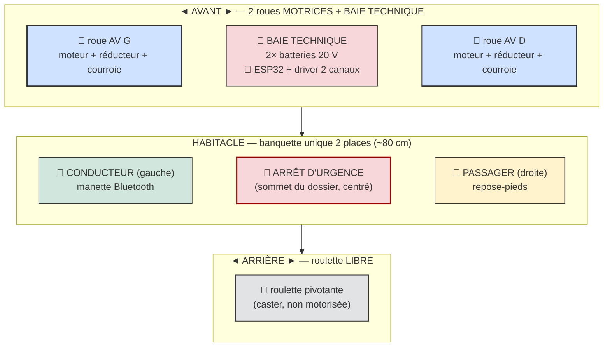
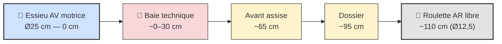
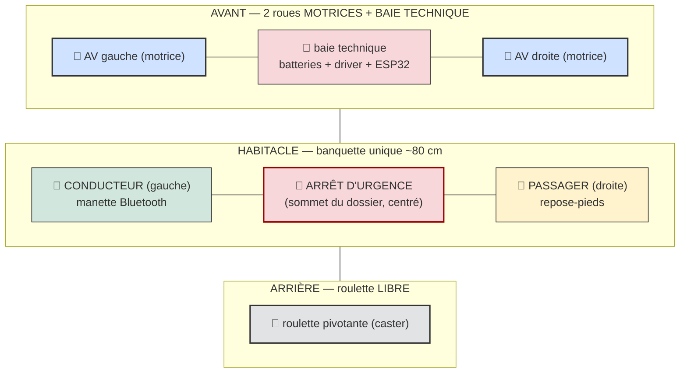
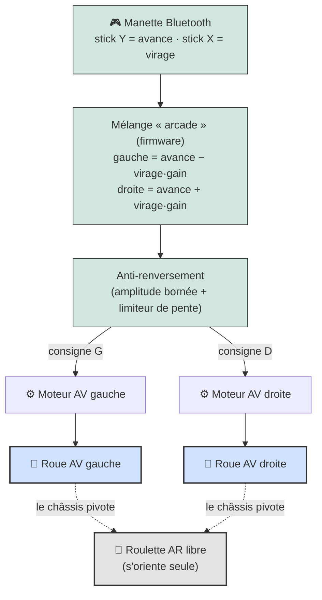
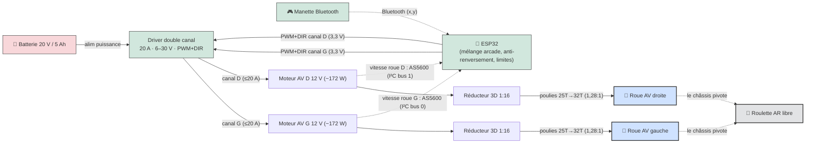
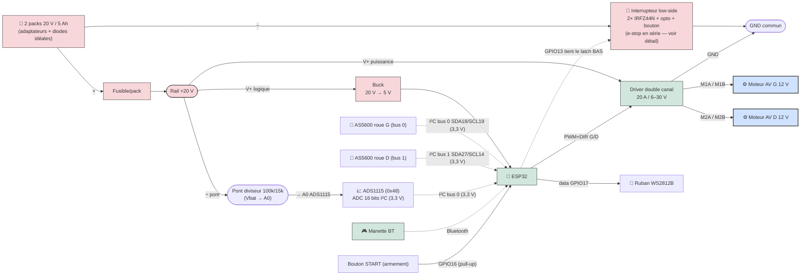
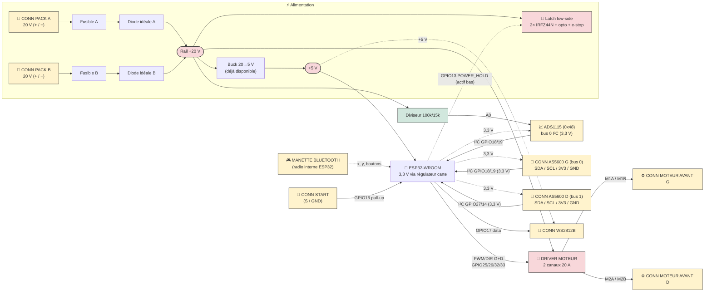

# Powered Soapbox Car — Kart électrique 2 places pour enfants

Projet de construction d'un **kart électrique biplace** pour enfants (~10 ans, 1,38–1,45 m), conçu pour être réalisable avec des **outils basiques** (perceuse, scie, clés) + une **imprimante 3D** pour les réducteurs. Chaque choix est expliqué pour pouvoir adapter selon le matériel disponible.

> **Note :** ce kart est un **tricycle à entraînement différentiel**. Les **2 roues AVANT sont motrices et indépendantes** (un **moteur CC 12 V + réducteur + courroie par roue**) ; la **direction se fait par différence de vitesse** entre les deux roues (*differential / skid steer*) — **pas de volant, pas de colonne, pas de tringlerie**. La **roue arrière est libre** : une **roulette pivotante (caster) non motorisée** qui s'oriente toute seule → **3 roues au total**. Le kart est **biplace** (deux enfants **côte à côte**) et **piloté à la manette Bluetooth** (mélange « arcade » : un stick pour avancer/reculer et tourner) — **pas de pédale accélérateur ni de volant**. La propulsion vient des **2 moteurs avant** ; il n'y a **pas** de pédalier ni de chaîne.

## Table des matières

- [Aperçu (vue de dessus)](#aperçu-vue-de-dessus)
- [En bref](#en-bref) · [Pourquoi ces choix](#pourquoi-ces-choix)
- [1. Dimensions du châssis](#1-dimensions-du-châssis)
- [2. Position siège / commandes](#2-position-siège--commandes)
- [3. Direction différentielle](#3-direction-différentielle-skid-steer)
- [4. Matériel & électronique](#4-matériel--électronique)
  - [Propulsion (2 moteurs avant)](#propulsion--2-moteurs-cc-12-v-avant) · [Commande ESP32](#commande-électronique--esp32) · [Capteurs AS5600](#capteurs-de-vitesse-as5600-2-sur-i²c) · [Mesure batterie / ADS1115](#mesure-batterie--adc-externe-ads1115) · [Calibration](#calibration-de-la-manette)
  - [Sécurité électrique](#sécurité-électrique) · [Câblage & brochage](#schéma-de-câblage--brochage-esp32) · [Schéma système](#schéma-système-complet-tous-les-connecteurs)
  - [Mesure batterie / LVC](#mesure-de-tension-batterie--coupure-basse-tension-lvc) · [2 batteries en parallèle](#montage-2-batteries-en-parallèle) · [Interrupteur d'alimentation (latch)](#interrupteur-dalimentation--mosfet-low-side--latch--arrêt-durgence)
- [5. Points critiques de sécurité](#5-points-critiques-de-sécurité-enfant)
- [6. Siège réglable](#6-siège-réglable)
- [7. Estimation de masse](#7-estimation-de-masse)
- [8. Plan d'implémentation (montage & mise en service)](#8-plan-dimplémentation-montage--mise-en-service)
- [Firmware](#firmware) · [Limitations et risques connus](#limitations-et-risques-connus)

---

## Aperçu (vue de dessus)

> Concept visuel régénérable : [`doc/cad/kart_concept.scad`](doc/cad/kart_concept.scad) (OpenSCAD —
> 2 roues 10″ motorisées à l'avant, roulette 10″ folle sur queue surélevée, banquette 2 enfants,
> garde-corps latéraux, arrêt d'urgence au sommet du dossier, châssis 2×3 + contreplaqué 1/2″).

**Gabarit :** longueur ~150–180 cm · largeur ~96 cm · **voie avant ~84 cm** · **2 roues motrices avant Ø25,4 cm (10″) + baie technique à l'avant** + **1 roulette arrière libre** · **garde-corps latéraux** + **arrêt d'urgence au sommet du dossier (centré)** · assise basse 16 cm (anti-basculement).

> ⚠️ Réservé au **terrain plat, sous surveillance adulte**. Vitesse estimée ~8–11,5 km/h (~3,2 m/s), autonomie ~10–20 min. **Un tricycle bascule plus facilement qu'un 4 roues** → anti-renversement logiciel (voir §3).

## En bref

| Élément | Choix |
|---|---|
| **Places** | 2, banquette unique côte à côte ; **conducteur à gauche** (manette) |
| **Direction** | **Différentielle (skid steer)** : différence de vitesse entre les 2 roues avant ; **pivot sur place** possible ; **aucune pièce de direction mécanique** |
| **Propulsion** | **2 moteurs CC 12 V (~172 W / 0,23 HP)** AVANT **indépendants** (un par roue) — **PWM/DIR par roue** |
| **Transmission** | Réducteurs **imprimés 3D 1:16** (2 étages 4:1, pignon moteur 16T/24 DP — voir [`doc/reducteur.md`](doc/reducteur.md)) + **poulies vissées sur les roues avant + courroies** |
| **Roues** | **2 × motrices avant Ø25,4 cm (10″)** (jante plastique, roulement 1/2") + **1 roulette arrière pivotante libre** |
| **Pilotage** | **Manette Bluetooth** (stick : Y = avance/recul, X = virage) ; **calibration obligatoire** ; joystick analogique réservé (futur) |
| **Électronique** | **ESP32** → **driver double canal 20 A / 6–30 V** (PWM + DIR / canal), **PWM bridé ~50 %** ; **baie technique à l'AVANT** (près des 2 moteurs, câblage de puissance court) |
| **Énergie** | **2 × packs 20 V / 5 Ah en parallèle** (diode-OR) + 2 adaptateurs vers bornes de puissance ; **logés à l'AVANT** dans la baie technique |
| **Vitesse** | Mesurée par **2 capteurs d'angle AS5600** (un par roue, 1 par bus I²C) ; asservissement à **500 Hz** |
| **Commandes** | Pilotage à la **manette Bluetooth** ; bouton **armement** (physique ou START de la manette, ~1 s) ; **arrêt d'urgence matériel** au **sommet du dossier, centré** (coupe tout, accessible aux 2 enfants et à un adulte derrière) **+** arrêt d'urgence logiciel = bouton **B** de la manette ; **frein électrique par défaut** |
| **Châssis** | **Bois** allégé : madriers **2×3** + plancher **contreplaqué 6 mm** |
| **Masse** | ~**32 kg** à vide · ~**98 kg** en charge (2 enfants) |

## Pourquoi ces choix

- **Direction différentielle = mécanique nulle** : plus de volant, colonne, pivots, fusées, bielle ni barre d'attaque → moins de pièces à fabriquer, à régler et à user ; on **tourne en logiciel** (différence de PWM entre les 2 roues). **Pivot sur place** quand l'avance ≈ 0.
- **Roulette arrière libre** : une seule roulette pivotante non motorisée s'oriente d'elle-même → géométrie simple, pas d'essieu arrière.
- **Stabilité maîtrisée** : un tricycle bascule plus vite qu'un 4 roues → assise basse (16 cm), **voie avant large** + **anti-renversement firmware** (bornage de l'amplitude de virage selon la vitesse **et** limiteur de pente sur le virage).
- **Moteurs 12 V sur batterie 20 V** : le **PWM est plafonné à ~50 %** (≈ 10 V moyens) pour éviter la surchauffe des moteurs.
- **Roues avant à roulement libre** : entraînées par **courroie** (poulie vissée sur la jante), elles gardent leur roulement d'origine — pas d'essieu moteur traversant.
- **Baie technique à l'avant** : batteries + driver + ESP32 sont regroupés **à l'avant, près des 2 moteurs** → **câblage de puissance court** (moins de pertes, moins de fils ~10 AWG à tirer), masse motrice et énergie concentrées sur l'essieu moteur. Disposition longitudinale : **AVANT (2 roues motrices + baie technique) → HABITACLE → ARRIÈRE (roulette libre)**.
- **Sécurité** : **arrêt d'urgence matériel central**, au **sommet du dossier** (à portée des deux enfants et d'un adulte derrière), **coupe-courant général** (en série dans la gate du latch, ESP32 compris) **et** arrêt d'urgence logiciel manette (bouton B) ; démarrage par **bouton momentané** + latch low-side (2× MOSFET, l'ESP se maintient en vie), fusible par pack, **frein électrique par défaut** (déconnexion manette → freinage immédiat), coupure basse tension (LVC), **watchdog 5 s**, démarrage **désarmé** par défaut, carters sur courroies/poulies, ceinture, casque.

---

## 1. Dimensions du châssis

| Cote | Valeur | Pourquoi |
|---|---|---|
| Longueur totale | **150 cm** (prévoir **jusqu'à ~180 cm**) | **Baie technique à l'avant** (batteries, driver, électronique, ~30 cm près des 2 moteurs) + habitacle + dossier + porte-à-faux jusqu'à la roulette arrière |
| Largeur hors-tout | **96 cm** | Doit loger **deux enfants côte à côte** |
| **Largeur intérieure banquette** | **~80 cm** | 2 × ~40 cm/enfant (épaules + coudes) |
| **Garde-corps latéraux** (CP 1/2″, de chaque côté de la banquette) | hauteur **~30 cm** au-dessus du plancher, longueur ~40 cm | Empêchent l'enfant de **tomber sur le côté** ; arêtes arrondies |
| **Baie technique** (avant) | longueur ~**30 cm** (0–30 cm depuis l'essieu avant) | Loge **2 packs 20 V, driver, ESP32, breakout** près des 2 moteurs (câblage court) |
| **Voie avant** (écartement roues motrices, axe à axe) | **84 cm** | Voie large = **anti-basculement** ET **bras de levier du différentiel** (plus la voie est large, plus le virage est franc à différentiel donné) |
| **Empattement** (essieu AV ↔ roulette AR) | **~110 cm** | Assez long pour la stabilité (les 2 enfants restent entre l'essieu moteur et la roulette) ; la roulette ne fait que suivre, le pivot se fait sur l'essieu avant |
| Hauteur d'assise (sol → fond du siège) | **16 cm** | Centre de gravité **bas** = limite le renversement |
| Garde au sol (sous châssis) | **8 cm** | Passe les petits obstacles sans talonner |
| Hauteur de dossier (assise → haut) | **34 cm** | Soutient le dos des deux enfants |
| **Roues motrices avant (×2 identiques)** | **Ø25,4 cm (10″)**, jante plastique + pneu PVC dur | Mêmes roues à gauche/droite → plan simplifié |
| **Roulette arrière (×1)** | **Roulette pivotante (caster) Ø ~12,5 cm (5")**, hauteur montée ~15 cm, charge ≥ 50 kg | Non motorisée, s'oriente librement ; hauteur de montage choisie pour garder le châssis **de niveau** avec l'essieu avant (centre à 15 cm) |
| Moyeu / fixation roues avant | **Roulement métal, alésage 1/2"**, moyeu large ~3,8 cm | Tourne **libre** sur un **essieu mort traversant : tige filetée 1/2″ × 36″** (grade **8.8/B7**, pas de la quincaillerie), **locknuts + rondelles à chaque bout**, entretoises pour figer la position latérale (alignement courroie), supports châssis au plus près des moyeux (≤ 3–5 cm, flexion) |

**Idée directrice :** assise basse + **voie avant large (84 cm)** = un engin **qui reste stable** malgré le format tricycle et deux enfants côte à côte. L'anti-renversement firmware complète la géométrie.

> **Découplage voie / caisse** : l'habitacle n'a pas besoin d'être aussi large que la voie —
> châssis en **T** : **traverse avant large** portant les **paliers d'essieu au plus près des
> roues** (≤ 3–5 cm, sinon la tige filetée fléchit), longerons étroits derrière. L'espace le
> long de l'essieu entre longeron et roue loge le **moteur + réducteur + courroie** de chaque
> côté. ⚠️ Si la voie change, mettre à jour `hw::TRACK_M` dans le firmware (anti-renversement).

---

## 2. Position siège / commandes

Repère 0 = essieu **avant** (roues motrices) ; cotes mesurées **vers l'arrière**. La **baie technique** (batteries + électronique) occupe l'avant, **entre l'essieu moteur et la banquette**.

| Élément | Distance depuis essieu AV | Hauteur / sol |
|---|---|---|
| Essieu avant (roues motrices, repère) | **0 cm** | centre à 15 cm (roue Ø30) |
| **Baie technique** (batteries + électronique) | **~0–30 cm** | dans le châssis, bas |
| **Cale-pieds** | **~35 cm** | repose-pieds au-dessus/derrière la baie |
| Avant de l'assise | **~65 cm** | 16 cm |
| **Fond du dossier** | **~95 cm** | assise à 16 cm |
| Roulette arrière (libre) | **~110 cm** | centre selon Ø ~12,5 cm |

➡️ Avec la **manette Bluetooth**, il n'y a **plus de boîtier de pédales ni de volant** à positionner : seule compte l'ergonomie d'assise. **Dossier → cale-pieds ≈ 60 cm** (95 − 35) ✔ jambe presque tendue, léger pli du genou. Prévoir un endroit sûr pour **poser/charger la manette**. Siège **réglable** (§6) pour s'adapter à la taille de l'enfant.

➡️ **Arrêt d'urgence au sommet du dossier (centré)** : le **champignon matériel** (coupe-circuit en série dans la gate du latch) est monté **en haut du dossier, au centre** — accessible aux **deux enfants** et à un **adulte qui suit le kart**. Il **coupe tout** (puissance **et** ESP32), en complément de l'arrêt d'urgence **logiciel** de la manette (bouton **B**). **Garde-corps latéraux** de chaque côté de la banquette (pas de séparation centrale : banquette continue). Le **pilotage reste à la manette Bluetooth**.

### Vue de côté

> **Banquette unique 2 places** : les deux enfants côte à côte (~80 cm intérieure), même dossier. Le **conducteur (gauche)** tient la **manette** ; le côté droit est passager. La **baie technique** (batteries + électronique) est **à l'avant**, entre l'essieu moteur et l'assise.

### Vue de dessus (disposition 2 places)

---

## 3. Direction différentielle (skid steer)

### Principe : **tourner par différence de vitesse entre les 2 roues avant**

Il n'y a **aucune pièce de direction mécanique** : pas de volant, pas de colonne, pas de pivots de roue, pas de fusées, pas de bielle d'accouplement (tie rod), pas de barre d'attaque (drag link), pas de bras Pitman, pas de butées de braquage. **On tourne en faisant rouler une roue avant plus vite que l'autre.** La **roue arrière est une roulette libre** qui suit le mouvement.

1. **Mélange « arcade »** : le firmware combine l'avance (stick Y) et le virage (stick X) en deux consignes de roue : `gauche = avance − virage·gain` et `droite = avance + virage·gain`. Tourner le stick à droite = roue gauche plus rapide → le kart vire à droite.
2. **Pivot sur place** : si l'avance ≈ 0 et qu'on pousse le stick latéralement, les deux roues tournent **en sens opposés** → le kart **tourne sur lui-même** (la roulette arrière pivote pour suivre).
3. **Anti-renversement** : un tricycle bascule facilement, donc le virage est protégé sur **deux plans** :
   - **Rampe vitesse→virage (vitesse MESURÉE)** : sous `turn_full_ms` (~0,5 m/s, pivot sur place inclus), virage autorisé **±100 %** ; au-delà, la limite décroît **linéairement** jusqu'à `turn_hi` (±50 % par défaut) à la vitesse max. Plus on roule vite, moins on peut braquer fort. La **marche arrière est bridée** à `rev_limit` (50 % par défaut).
   - **Limiteur de pente (slew-rate)** : la consigne de virage ne peut pas varier de plus de `turn_rate` par seconde → un coup de manche brusque est **lissé** au lieu de provoquer un différentiel violent. L'avance est lissée de même (`thr_ramp_per_s`).

Paramètres web : **`turn_gain`** (autorité de virage), **`turn_full_ms`** / **`turn_hi`** (rampe anti-renversement), **`rev_limit`** (recul bridé), **`turn_rate`** (douceur du virage), **`thr_ramp_per_s`** (douceur de l'avance). Détails dans [`firmware/README.md`](firmware/README.md).

> **Conséquence du skid steer :** en virage serré, les roues **ripent** légèrement sur le sol (frottement de glissement) — c'est inhérent à ce type de direction. À vitesse modérée sur terrain plat, l'effet reste acceptable.

---

## 4. Matériel & électronique

> **Châssis essentiellement en bois, allégé** : grille de **madriers 2×3** (SPF ~38×64 mm) + **plancher contreplaqué 6 mm**. Renforcer aux points de charge (supports moteurs avant, fixation roulette arrière, ancrage ceinture). ⚠️ Le CP 6 mm impose une **grille 2×3 rapprochée** (traverses tous les ~25–30 cm) ; **12 mm sous la banquette**.

| Catégorie | Élément | Taille / spec |
|---|---|---|
| **Bois** | Châssis (longerons + traverses) | Madriers **2×3** (SPF ~38×64 mm), grille rapprochée |
| | Plancher | Contreplaqué **6 mm**, ~140 × 90 cm, soutenu par la grille |
| | Assise (zone chargée) | Contreplaqué **12 mm** sous la banquette |
| | Supports moteurs avant / dossier | Bloc bois dur + platine ; dossier CP 6 mm |
| **Roues** | **2 × roues motrices avant** identiques | **Ø25,4 cm (10″)**, jante plastique + pneu PVC, roulement 1/2" |
| | **1 × roulette arrière pivotante (caster)** | Roulette **libre**, non motorisée ; **Ø ~12,5 cm (5")**, hauteur montée ~15 cm, **charge ≥ 50 kg** |
| | Boulons à épaulement (roues avant) | **Fournis avec les roues** (épaulement 1/2", filetage 3/8") |
| **Propulsion** | **2 moteurs CC 12 V** (un par roue **avant**) | ~172 W (0,23 HP), 19,6 A, 4615 tr/min ; **indépendants** |
| | 2 réducteurs 3D | Rapport **1:16** (2 étages 4:1, [conception](doc/reducteur.md)), imprimés (PETG/ABS/nylon) |
| | Poulies + courroies | Poulie **vissée sur chaque roue avant** + courroie vers le gearbox (**1:1**) |
| | **2 × capteur d'angle AS5600** + aimant diamétral | un par roue avant, **1 par bus I²C** ; magnétique sans contact, **12 bits absolu I²C** (adresse fixe 0x36), **3,3 V natif** (aucun level-shift), pull-ups 4,7 kΩ |
| **Pilotage** | **Manette Bluetooth** | stick : Y = avance/recul, X = virage ; bouton **B** = arrêt d'urgence, bouton **START** = armement ; **calibration obligatoire** |
| | *Joystick analogique* | **réservé (futur, non câblé)** : 2 voies de l'ADS1115 (A1/A2) prévues derrière la même abstraction logicielle |
| **Énergie / électronique** | Batteries (**2 requises**) | **2 × packs 20 V / 5 Ah** à glissière, **en parallèle** (~40 A total) ; **logées à l'AVANT** (baie technique, près des moteurs) |
| | **Adaptateurs de batterie** (×2) | Support à glissière → bornes de puissance (+ / −) |
| | **Diodes idéales (diode-OR)** — requis | **2 × modules 40 A / 60 A** (un par pack) + 1 fusible/pack |
| | **Interrupteur d'alimentation (latch)** | **2× MOSFET N IRFZ44N** low-side (+ dissipateur) + **opto** + zener/pull-down + **bouton démarrage** |
| | Driver moteur | **1 carte double canal 20 A / 6–30 V** (PWM+DIR/canal), duty **bridé ~50 %** |
| | Calculateur | **Carte ESP32-WROOM** (double cœur 240 MHz, Wi-Fi/BT, 4 MB flash) |
| | **ADC externe ADS1115** | **16 bits I²C**, alimenté **3,3 V**, adresse **0x48** sur le bus 0 (avec l'AS5600 gauche) ; A0 = Vbat, A1/A2 réservés joystick futur |
| | **Carte d'extension (breakout)** | Borniers à vis + sorties 5 V / 3,3 V + LED d'état ; le **3,3 V** alimente AS5600 + ADS1115 |
| | **Buck 20 V → 5 V** (déjà disponible) | alimente l'ESP32 (qui fabrique son 3,3 V) |
| | **Perfboard soudée** | pont diviseur Vbat 100 k/15 k (vers A0 de l'ADS1115) + condensateurs de découplage (⚠️ pas de breadboard — vibrations) |
| | **Boîtier électrique étanche** (ABS, couvercle transparent, ~150 × 100 × 70 mm, ≈IP65) | **dans la baie technique avant** ; loge ESP32 + breakout + ADS1115 + perfboard ; presse-étoupes pour les câbles ; protège poussière/pluie/chocs (couvercle clair = LED d'état visible) |
| | Sécurité élec. | **Arrêt d'urgence (NF) en série** dans la ligne de gate (champignon **au sommet du dossier, centré**, à portée des deux enfants) + **fusible/pack** |
| | Ruban **WS2812B** (~10 LEDs) | état : vert = en route, rouge = désarmé |
| **Commandes** | Bouton **armement** + LED | momentané ; armement = appui ~1 s (bouton physique **ou** START de la manette) |
| **Frein** | **Frein électrique (par défaut)** ✅ | géré par le firmware (PID de plugging) ; **état par défaut = freinage** ; déconnexion manette → freinage immédiat ; pas de patin |
| **Réserves futures** (câblées, non utilisées) | **2× encodeur incrémental quadrature AMT103-V** (un par roue avant), **joystick analogique** | connecteurs prévus pour évolutions ; A/B sur GPIO 34/35 (G) et 36/39 (D) ; joystick sur A1/A2 de l'ADS1115 |
| **Visserie / finition** | Boulons traversants M8/M10, écrous **nylstop** | équerres, vis à bois, vernis ; arêtes arrondies |

### Propulsion — 2 moteurs CC 12 V (avant)

Chaque **roue avant** est entraînée par son **propre moteur CC à aimants permanents 12 V** via un **réducteur imprimé 3D 1:12,5** (16→80, 32→80) et des **poulies 25T→32T (1,28:1)** — réduction totale **1:16,0**. Les **deux moteurs sont commandés indépendamment** (PWM + DIR par canal) : c'est cette **différence de commande** qui assure la direction. **Chaque roue a son propre capteur AS5600** pour l'asservissement.

| Caractéristique | Valeur |
|---|---|
| Type / modèle | CC à **aimants permanents** — RX0086 |
| Puissance | **0,23 HP (~172 W)** |
| Régime | **4615 tr/min** (à 12 V, à vide) |
| Tension / courant | **12 VDC** / **19,6 A** |
| Service | **intermittent** (loisir, pas en continu) ; TENV, classe F |

> ⚠️ **Tension :** moteurs **12 V**, batterie **20 V** → **PWM bridé à ~50 %** (≈ 10 V moyens) pour protéger les moteurs.
> ⚠️ **Courant :** **19,6 A**/moteur (driver 20 A/canal OK) ; **total ~40 A** → **2 batteries en parallèle requises** (~20 A/pack). Éviter les blocages de roue prolongés.

**Performances estimées :**

| Paramètre | Valeur |
|---|---|
| Régime à ~50 % (≈ 10 V) | ~**3850 tr/min** moteur → **~240 tr/min roue** (÷16) |
| Vitesse de pointe estimée | **~3,2 m/s (11,5 km/h)** — limitée par firmware |
| Courant total | ~**40 A** → 2 batteries en parallèle (~20 A/pack) |
| Énergie batterie / autonomie | ~90–100 Wh → **~10–20 min** selon l'usage |

**Transmission gearbox → roue :** poulie **vissée côté intérieur de la roue** (plusieurs rayons, grandes rondelles / contre-platine pour ne pas fendre le plastique), **poulies 25T→32T = 1,28:1** (rapport de dents exact — voir [`doc/reducteur.md`](doc/reducteur.md)) avec réglage de tension (trous oblongs / galet), **carter fermé**. La roue tourne **libre sur l'essieu traversant** ; le moteur ne fait que l'entraîner. **Épaisseur de moyeu à mesurer avant la coupe finale de la tige** ; **entretoises ajustables** pour amener le plan de la poulie de roue en face de la poulie de boîte (alignement courroie = réglage critique), fixation de la boîte à trous oblongs pour le réglage fin.

### Commande électronique — ESP32

- L'**ESP32** reçoit les axes de la **manette Bluetooth**, applique le **mélange arcade** + **anti-renversement**, puis envoie **un PWM + DIR indépendant à chaque canal** du driver.
- Driver : **double canal, 20 A continu / 60 A crête, 6–30 V**, entrées **PWM + DIR** compatibles **3,3 V**, PWM jusqu'à 20 kHz ; protections **surintensité / sous-tension / température**. ⚠️ **Aucune protection contre l'inversion de polarité** (VB+/VB-) → un branchement inversé **détruit la carte**.
- **Frein PID par défaut** : à l'arrêt ou sans avance, un **PID ramène chaque roue à 0** (lecture AS5600) — sortie signée → peut **inverser le moteur** (plugging). C'est l'**état par défaut**.
- Bonnes pratiques : **PWM plafonné ~50 %**, **rampe** d'avance, **limiteur de vitesse** (mesure capteur), **watchdog**, **freinage si la manette se déconnecte**.

### Capteurs de vitesse AS5600 (×2, sur I²C)

Capteur d'angle **AS5600** : magnétique **sans contact**, **angle absolu 12 bits** (4096 points/tour) lu en **I²C**, avec un **aimant diamétral** en bout d'arbre. Il y a **un AS5600 par roue avant**, **un par bus I²C** (chaque AS5600 ayant l'adresse fixe **0x36**, ils ne peuvent pas cohabiter sur le même bus). **Cinématique connue** (voir [`doc/reducteur.md`](doc/reducteur.md)) : l'aimant est sur la **sortie de la boîte 1:12,5**, suivie de **poulies 1,28:1** → **le capteur fait 1,28 tour par tour de roue** ⇒ `GEAR_RATIO = 1,28`, **roue 10″ = 0,254 m**. La **vitesse véhicule** (m/s) = **moyenne signée** des 2 roues (pivot sur place → 0 m/s). La conversion est **entièrement déterminée**. Ils servent à :
- **Mesurer la vitesse de chaque roue** → limiteur fiable ; **frein PID** vers 0 ; **sens** (signe de Δangle, broche DIR fixe la convention) ; **sécurité** (blocage : PWM actif sans rotation > 1 s → défaut).

✅ **3,3 V natif** (VDD5V/VDD3V3 reliées) → **SDA/SCL directement sur l'ESP32, AUCUN level-shift**. Câblage par capteur : **SDA, SCL, 3,3 V, GND** (+ aimant), pull-ups **4,7 kΩ** par bus.

Mise en œuvre : lecture I²C du registre **RAW ANGLE** (0x0C/0x0D) → **vitesse = dérivée de l'angle** (`Δcounts × fréquence`, **wrap 0↔4095**) ; **boucle 500 Hz** (FreeRTOS 1000 Hz) → aucune ambiguïté ; aimant **diamétral** centré, **entrefer 0,5–3 mm** ; bus I²C **à l'écart de la puissance**, condensateur de découplage sur l'alim.

> *Alternative réservée : un encodeur incrémental en quadrature (type AMT103-V) par roue — non câblé pour l'instant ; broches input-only prévues (voir brochage), décodage PCNT possible plus tard.*

### Mesure batterie — ADC externe ADS1115

Toutes les mesures analogiques passent par un **ADS1115** (16 bits, I²C, PGA) **au lieu de l'ADC interne de l'ESP32** — plus précis et linéaire, et sans le conflit ADC2/Wi-Fi. Le breakout se branche **en piggyback sur le bus I²C 0** (avec l'AS5600 gauche : adresses distinctes **0x36 / 0x48**).

- ⚠️ **Alimenter en 3,3 V** (niveaux I²C compatibles ESP32) → `AIN_max = 3,3 V`.
- **A0 = tension batterie** (via le pont diviseur **100 k / 15 k**), suivie en **mode continu**.
- **A1 / A2 = réservés** au futur joystick X/Y (lecture single-shot) ; **A3 libre**.
- Le driver **dégrade proprement** : ADS1115 absent → la mesure Vbat renvoie 0, aucun crash.

### Calibration de la manette

**Le kart refuse de rouler tant que la manette n'est pas calibrée.** La calibration se fait **exclusivement depuis la page web** (onglet Manette), **pour la manette Bluetooth uniquement** :

1. **Centre** : manche au repos → capture le point neutre ;
2. **Extrêmes** : bouger les sticks à fond → capture l'amplitude par axe.

L'échelle (centre + demi-amplitude par axe) est **persistée en NVS** (namespace `pad`). ⚠️ **Un (ré)appairage EFFACE la calibration** (nouvelle manette = nouvelle calibration). Tant que la manette n'est pas calibrée, connectée et armée, le contrôleur **reste au frein** (état par défaut).

### Sécurité électrique

- **Arrêt d'urgence** bien accessible, **NF en série dans la ligne de gate** du latch : l'ouvrir retire l'alimentation de gate → les 2 MOSFET s'ouvrent → **coupe TOUT** (puissance **et** ESP32), **sans passer les 40 A dans le contact**. Au retour, système **désarmé**. (En complément, le **bouton B de la manette** déclenche un freinage immédiat côté firmware.)
- **Démarrage par bouton momentané** (amorce le latch) ; **fusible/pack**, câblage ≥ courant des 2 moteurs.
- **Architecture batterie : 5S Li-ion** (~18,5 V nominal, 21 V pleine charge, ~15 V bas) — nombre de cellules réglable (défaut 5). Décharge profonde : **BMS du pack + LVC côté ESP32**.
- **2 batteries en parallèle (REQUISES)** : même 20 V, capacité ×2, **courant ÷2 par pack**. ⚠️ **Jamais en série**. Ne relier que des packs **au même niveau de charge** ; **diode-OR + 1 fusible/pack**.
- **Limiteur de vitesse** bas au début ; **batterie fixée/protégée** ; **carters** ; **frein électrique** + **désarmement auto** + **watchdog 5 s** + **PWM ~50 %**. Couper l'alim avant intervention.

### Schéma de câblage + brochage ESP32

**Brochage ESP32 (identique au firmware `firmware/main/pinout.hpp`) :**

| GPIO | Fonction | Sens | Note |
|---|---|---|---|
| 25 / 26 | **PWM / DIR moteur AVANT gauche** | sortie | LEDC, **duty ≤ 50 %** |
| 32 / 33 | **PWM / DIR moteur AVANT droite** | sortie | idem |
| 18 / 19 | **I²C bus 0 SDA / SCL** | E/S | **AS5600 roue G (0x36)** + **ADS1115 (0x48)**, 3,3 V, pull-ups 4,7 kΩ |
| 27 / 14 | **I²C bus 1 SDA / SCL** | E/S | **AS5600 roue D (0x36)**, 3,3 V, pull-ups 4,7 kΩ |
| 13 | **POWER_HOLD** (latch alim.) | sortie | **actif BAS** : maintient l'alim ; HAUT = coupe |
| 16 | **Bouton armement (START)** | entrée | pull-up, appui ~1 s (ou START de la manette) |
| 17 | **Ruban WS2812B** (data) | sortie | ~10 LEDs |
| 2 | **LED d'état** (onboard) | sortie | — |
| **Réserves futures (câblées, non utilisées) — 3,3 V** | | | |
| 34 / 35 | **Encodeur roue GAUCHE — A / B** (AMT103-V) | entrées seules | quadrature 3,3 V (broches input-only) |
| 36 / 39 | **Encodeur roue DROITE — A / B** (AMT103-V) | entrées seules | quadrature 3,3 V (broches input-only) |
| 22 / 23 | **Index encodeur / 2 entrées aux.** | entrées | libres (index X optionnel) |
| 4 / 21 | **GPIO libres** | — | non affectés |
| — | **Tension batterie** | (ADS1115 A0) | **pas sur un GPIO** : mesurée par l'ADS1115 via pont 100 k/15 k |
| — | **Joystick analogique** | (ADS1115 A1/A2) | réservé futur |

**Points clés du câblage :**
- **Masse commune** ESP32 ↔ driver ↔ ADS1115 ↔ capteurs I²C : indispensable.
- **Interrupteur low-side + e-stop en série** : le **+** reste toujours présent ; on coupe en ouvrant les **2 MOSFET côté masse**.
- **Frein par défaut** : à l'arrêt, sans avance ou si la manette se déconnecte, le firmware freine.
- **Puissance ~10 AWG** (cosses serties) ; **signaux fil fin**. **Fusible 30 A/pack**.
- ⚠️ **Polarité du driver (VB+/VB-)** : aucune protection inversion → **vérifier deux fois**.
- **Vbat via l'ADS1115** (pas l'ADC interne) : pont 100 k/15 k vers A0, **condensateur de découplage** sur le nœud.

### Schéma système complet (tous les connecteurs)

Vue d'ensemble bloc-à-bloc montrant **chaque connecteur** (manette via la radio interne, 2× AS5600 sur 2 bus I²C, ADS1115, bouton START, moteurs avant, WS2812), le **conditionnement** (diviseur Vbat) et l'**alimentation**.

### Schéma électrique (symboles)

Même contenu en **schéma électrique à symboles normalisés** (style ports nommés : les
**étiquettes de net de même nom sont reliées**, comme sur un schéma multi-feuilles) :

> Régénérable : `. .venv-schem/bin/activate && python doc/schematics/full_schematic.py`.
> Le détail du coupe-circuit est dans [`power_latch.png`](doc/schematics/power_latch.png).

### Mesure de tension batterie & coupure basse tension (LVC)

La batterie monte à ~**21 V** → un **pont diviseur** (100 k / 15 k) ramène Vbat sous 3,3 V sur **l'entrée A0 de l'ADS1115** (ADC externe 16 bits, alimenté 3,3 V) → protection logicielle **en plus du BMS**.

- Rapport = 15/115 = **0,130** → à 21 V l'entrée voit **2,74 V** (✔). Reconstruction : **Vbat = V_adc × 7,67** (à calibrer via `vbat_div_ratio`).
- Fuite du pont ≈ 0,18 mA — sa masse de retour étant **commutée par le latch low-side**, **rien à l'arrêt**.
- **Condensateur de découplage** sur le nœud ADC ; l'ADS1115 (16 bits, PGA) donne une mesure plus stable que l'ADC interne.

| État | Tension pack | /cellule | Action firmware |
|---|---:|---:|---|
| Pleine charge | ~21,0 V | 4,20 V | — |
| Nominal | ~18,5 V | 3,70 V | — |
| **Avertissement** | ~16,5 V | 3,30 V | réduire la puissance + LED |
| **Coupure (LVC)** | ~15,0 V | 3,00 V | **PWM = 0**, refuse de repartir |
| Réarmement (hystérésis) | > 16,0 V | 3,20 V | autorise de nouveau |

> **Anti-sag :** moyenner + anti-rebond (~0,5 s) pour ne pas couper sur un creux momentané ; couper **avant** le seuil dur du BMS ; au retour, exiger un **réarmement** (START).

### Montage 2 batteries en parallèle

**Diode-OR :** chaque pack alimente **à travers une diode** → pas de courant d'équilibrage, on peut clipser un pack un peu déchargé sans danger. **Dimensionnement :** ~40 A partagés → ~**20 A/diode** → **modules 40 A / 60 A** (faible chute MOSFET vs ~8 W de pertes avec une Schottky). ⚠️ Sans diode-OR, un ΔV > 2 V entre packs = **pic dangereux** ; ne relier alors que des packs **à la même tension**.

### Interrupteur d'alimentation : MOSFET low-side + latch + arrêt d'urgence

Le rail **+20 V** alimente en permanence le driver ; c'est le **retour de masse (−)** des batteries qui est commuté par **2 MOSFET N en low-side**. ⚠️ Conséquence : **tant que les MOSFET sont ouverts, l'ESP (et son 3,3 V) ne sont PAS alimentés** → impossible d'amorcer depuis le 3,3 V. La solution = **deux chemins vers la gate**, tous deux pris sur le **+20 V toujours présent** :

- **Amorçage = le bouton** met le **+20 V directement sur la gate** (il ne touche jamais l'ESP).
- **Maintien = l'opto**, piloté par l'ESP une fois alimenté ; sa **LED est côté 3,3 V**, son transistor commute le +20 V → **le +20 V ne remonte jamais à l'ESP** (vraie isolation).

1. **Amorçage** : bouton → **+20 V → (e-stop) → Rg → gate** → MOSFET conduisent → masse reliée → buck → **l'ESP s'allume**.
2. **Relais** : dès `app_main`, l'ESP met **GPIO13 BAS** → LED opto (sur 3,3 V) allumée → l'opto **maintient le +20 V sur la gate** → on peut relâcher le bouton.
3. **Coupure** : GPIO13 **HAUT** → LED éteinte → gate retombe (pull-down) → MOSFET ouverts → coupure (LVC prolongée).
4. **Sécurités passives** : **pull-down** = OFF par défaut (*fail-safe*) ; **Rg + zener ~15 V** bornent Vgs (±20 V max) en gardant ≥10 V pour un Rds(on) bas ; **e-stop NF** coupe les deux chemins (faible courant, pas les 40 A) ; **isolation** opto = aucun retour +20 V vers l'ESP.

> Dissipation : ~**7 W/MOSFET** à 20 A → **dissipateur obligatoire** (ou 2 IRFZ44N en parallèle par pack). ⚠️ Ne pas confondre les **2 MOSFET interrupteur** (commutent la masse) et les **2 diodes idéales** (OR-ent les +). Schéma régénérable : `. .venv-schem/bin/activate && python doc/schematics/power_latch.py`.

---

## 5. Points critiques de sécurité (enfant)

- ⚠️ **Anti-renversement** : un tricycle bascule plus facilement qu'un 4 roues. Garder la **voie avant large (84 cm)** + assise basse (16 cm) ; ne pas surélever le siège ; garder batterie et moteurs bas. **Ne jamais désactiver l'anti-renversement firmware** (amplitude de virage bornée + limiteur de pente) ; commencer avec `turn_gain`/`speed_limit_kmh` bas.
- ⚠️ **Fixation des 2 motorisations avant** : supports moteurs solidement vissés/renforcés ; courroies tendues et carters fermés (jamais de jeu).
- ⚠️ **Roulette arrière** : axe et pivot bien serrés (nylstop / freinfilet) ; vérifier qu'elle pivote librement sans point dur.
- ⚠️ **Axes de roue avant sécurisés** : nylstop + **goupille/rondelle d'arrêt**.
- ⚠️ **Carter courroies/poulies** : pas de doigts/lacets/vêtements happés.
- ⚠️ **Angles arrondis**, ponçage anti-échardes, têtes de boulons fraisées/capuchonnées côté enfant.
- ⚠️ **Ceinture ventrale** ancrée au châssis ; **casque obligatoire** ; **cale-pieds**.
- ⚠️ **Arrêt d'urgence matériel central** : au **sommet du dossier, centré**, **facilement accessible aux deux enfants** (et à un adulte derrière) ; il **coupe tout** (puissance **et** ESP32, via l'ouverture de la gate du latch). C'est l'arrêt **garanti**, en complément de l'arrêt d'urgence **logiciel** de la manette (bouton **B**). Vérifier qu'il n'est ni masqué ni bloqué, et que les enfants savent l'actionner.
- ⚠️ **Manette** : calibrée avant chaque session ; vérifier que le **bouton B (arrêt d'urgence logiciel)** freine, et que la **déconnexion** (manette éteinte / hors de portée) déclenche le freinage.
- ⚠️ **Inspection avant chaque usage** : supports moteurs, tension courroies + serrage poulies, roulette arrière, **e-stop matériel central** + e-stop manette, fixation de la baie technique (batteries à l'avant), test du frein électrique.
- ⚠️ **Terrain plat, sous surveillance**, loin de la circulation et des pentes.
- ⚠️ **Pneus plastique = peu d'adhérence** → vitesse modérée, virages doux, et **ripage du skid-steer** en virage serré (voir §3).

---

## 6. Siège réglable

Pour ajuster la distance **dossier ↔ avant d'assise** au gabarit de l'enfant :

| Méthode | Principe | Avantage |
|---|---|---|
| **A. Base coulissante à fentes** ✅ | Le siège glisse sur 2 rails à fentes, serrage **écrous papillon** | Réglage continu, sans outil |
| **B. Rangée de trous** | On reboulonne le siège dans le bon trou (tous les 3 cm) | Très solide, par crans |
| **C. Repose-pieds réglable** | On déplace le cale-pieds au lieu du siège | Siège calé contre le dossier |

👉 Recommandé : **A** (base coulissante + écrous papillon) — l'enfant grandit → on recule le siège. (Plus de boîtier de pédales à déplacer : le pilotage est à la manette.)

---

## 7. Estimation de masse

> Hypothèses : CP ~600 kg/m³, madrier 2×3 SPF ≈ 1,17 kg/m, roue motrice ~1,0 kg/pièce, roulette ~0,5 kg.

| Poste | Masse |
|---|---:|
| Bois (plancher CP 6 mm, châssis 2×3, supports, banquette, renforts) | ~18 kg |
| 2 roues motrices avant Ø25,4 cm + 1 roulette arrière | ~2,2 kg |
| Visserie / boulons à épaulement | 1,6 kg |
| Propulsion (2 moteurs avant + 2 gearbox 3D + poulies/courroies) | 3,8 kg |
| Électronique + batteries (2 packs 20 V, driver, ESP32, ADS1115, câblage) | 2,5 kg |
| Frein/divers (ceinture, carters, peinture, manette) | 2,0 kg |
| **TOTAL À VIDE** | **≈ 32 kg** |
| + 2 enfants (~33 kg chacun) | +66 kg |
| **TOTAL EN ROULAGE** | **≈ 98 kg** |

**Conséquences :** le bois domine (~56 % à vide) → premier levier d'allègement. La suppression des pièces de direction (volant, colonne, bielle, fusées) **allège** par rapport au 4 roues ; en revanche le 2ᵉ moteur **et la baie technique (batteries + électronique)** concentrent la masse à l'**avant** (sur l'essieu moteur) → **report de charge sur les 2 roues motrices** (bon pour l'adhérence et la traction ; vérifier que la roulette arrière reste chargée pour ne pas cabrer). Résistance au roulement à ~100 kg ≈ **25 N** sur le plat ; force motrice cumulée des 2 roues avant largement suffisante → **OK sur le plat**, pente réaliste **~3–6 %**. Le freinage électrique doit être dimensionné pour ~100 kg.

---

## 8. Plan d'implémentation (montage & mise en service)

Ordre des plus simples aux plus risqués. **Règle d'or : tout tester roues en l'air et à basse vitesse avant le sol.**

**Phase 0 — Préparation.** Rassembler matériel (§4) et outils (perceuse, scie, clés, fer à souder, multimètre, imprimante 3D). Imprimer les 2 réducteurs (1:16) + gabarit de perçage. Travailler **batteries débranchées**.

**Phase 1 — Châssis bois.** Grille 2×3 (traverses ~25–30 cm) + plancher CP 6 mm (12 mm sous banquette) + **baie technique à l'avant** (~30 cm, entre l'essieu moteur et la banquette) + banquette ~80 cm **continue** (pas de séparation) + **garde-corps latéraux** (CP 1/2″, ~30 cm) + dossier. ✅ *S'asseoir à deux sans flexion excessive ; les garde-corps retiennent bien un enfant qui glisse sur le côté.*

**Phase 2 — Roues avant + roulette arrière.** 2 roues Ø30 sur **boulons à épaulement** (perçage 3/8"), tournent **libres** ; **roulette pivotante** fixée à l'arrière, pivot serré mais libre. ✅ *Voie avant 84 cm, rien ne frotte ; la roulette s'oriente seule en poussant le châssis.*

**Phase 3 — Motorisations avant (remplace l'ancienne « direction »).** Sur **chaque roue avant** : poulie vissée (grandes rondelles / contre-platine) + réducteur 3D + moteur sur support renforcé + courroie + réglage tension + carter. **Pas de tringlerie** : la direction est différentielle, donc rien à régler côté volant/bielle. ✅ *Sans courant : chaque roue avant tourne à la main, courroie tendue.*

**Phase 4 — Électronique de puissance ⚠️ (à l'avant).** 2 packs + adaptateurs **logés dans la baie technique avant** (câblage de puissance court vers les 2 moteurs) ; chaque pack **fusible → diode idéale → rail +20 V** (diode-OR) ; **coupe-circuit latch low-side** (2× IRFZ44N sur la masse, gate via **bouton** + **opto**, pull-down + zener, **e-stop NF en série dans la gate** — voir `doc/schematics/power_latch.png`) ; **monter le champignon d'arrêt d'urgence au sommet du dossier, centré** (à portée des deux enfants et d'un adulte derrière) ; driver (⚠️ **polarité VB+/VB-**) → 2 moteurs avant ; **~10 AWG**, cosses serties. ✅ *Au multimètre AVANT branchement : polarité, ~20 V au driver, le bouton amorce et **l'e-stop central coupe tout** (puissance + ESP32).*

**Phase 5 — Électronique de commande.** ESP32 + breakout ; **buck 20→5 V** sur le rail +20 (l'ESP fabrique son 3,3 V) ; **ADS1115** (3,3 V) sur le bus 0, pont Vbat 100 k/15 k → A0 + condensateur ; **2× AS5600** : roue G sur **bus 0 (SDA18/SCL19)**, roue D sur **bus 1 (SDA27/SCL14)**, pull-ups 4,7 kΩ par bus + aimants centrés ; bouton START (GPIO16, pull-up) ; WS2812B (GPIO17). *(Réserves futures câblées non utilisées : 2× encodeur A/B 34/35 + 36/39 ; joystick sur A1/A2 de l'ADS1115.)* ✅ *Masses communes, 3,3 V/5 V présents, AS5600 détectés (0x36 sur chaque bus) + ADS1115 (0x48).*

**Phase 6 — Firmware + réglages.** `idf.py build flash monitor` (voir [`firmware/README.md`](firmware/README.md)). Wi-Fi **Kart-Config** → `http://192.168.4.1`. **Appairer puis calibrer la manette** (obligatoire pour rouler) ; ajuster **`vbat_div_ratio`** au multimètre. Conversion vitesse **déjà déterminée** (AS5600 en sortie de boîte 1:12,5 + poulies 1,28:1 → `GEAR_RATIO=1,28`, roue 10″, **vitesse véhicule en m/s**) → **vérifier au banc** + **affiner les PID** par roue (limiteur ≈ 0,54/0,50, frein ≈ 0,43/0,29/0,011 — en m/s). Régler **limite de vitesse basse** (`speed_limit_ms`) + **anti-renversement** (`turn_gain`, `turn_full_ms`, `turn_hi`, `rev_limit`, `turn_rate`, `thr_ramp_per_s`) + vérifier LVC. *(Boucle 500 Hz, IPv6, page Système : automatiques.)*

**Phase 7 — Essais progressifs (roues en l'air).** Armer (START physique ou manette), avance légère → sens correct de **chaque roue** (inverser M1A/M1B si besoin) ; pousser le stick à droite → vire à droite ; tester **frein par défaut**, **pivot sur place**, **désarmement**, **arrêt d'urgence manette (B)** et **déconnexion manette → freinage**, **e-stop matériel central** (coupe tout) ; provoquer les défauts (**LVC** simulée, **panne capteur** en débranchant un AS5600) → doit refuser/couper. Puis au sol : terrain plat, vitesse mini, anti-renversement actif, 1 enfant léger d'abord, limite **progressive**.

**Phase 8 — Sécurité finale.** Ceinture ancrée, casques, carters, angles arrondis, cale-pieds, axes sécurisés, roulette serrée, **baie technique avant fixée** (batteries calées), **arrêt d'urgence central dégagé et testé** (coupe tout). **Inspection avant chaque usage**. Usage **sous surveillance adulte**.

---

## Firmware

Code ESP-IDF 6.1 (C++) dans [`firmware/`](firmware/) — détails dans [`firmware/README.md`](firmware/README.md).

- **Boucle de contrôle 500 Hz** (FreeRTOS 1000 Hz) : lecture **manette** (mélange arcade) + **anti-renversement** (amplitude bornée + limiteur de pente), **2 vitesses de roue** par **AS5600** (I²C, un par bus), **PID de freinage** + **PID limiteur de vitesse** par roue, **PWM + DIR indépendants**. Machine à états, armement (START physique ou manette), **LVC** anti-sag (via ADS1115), **watchdog**, **latch d'alimentation** (POWER_HOLD). **Frein par défaut** dès le boot et si la manette se déconnecte.
- **Tâches FreeRTOS** (priorité / cœur / pile) : voir [`doc/firmware-tasks.md`](doc/firmware-tasks.md) ; constantes dans [`firmware/main/rtos.hpp`](firmware/main/rtos.hpp).
- **Bluetooth (manette) + Wi-Fi** en coexistence ; **Wi-Fi AP + station**, **IPv6**, serveur **WebSocket** : tableau de bord (graphiques Chart.js gradués — avance/PWM + régime par roue, vitesse, batterie), configuration live, **onglet Manette** (appairage, calibration, visualisation du stick), Wi-Fi, brochage, et **page Système**.
- Build : `cd firmware && idf.py build flash monitor`.

---

## Limitations et risques connus

Points à **traiter / valider avant tout usage réel**.

**Sécurité & accès**
- **L'arrêt d'urgence matériel central est le seul arrêt garanti** (champignon **au sommet du dossier, centré**, à portée des deux enfants ; NF en série dans la gate → ouvre les 2 MOSFET → coupe tout, ESP32 compris). Le reste (arrêt d'urgence manette, LVC, désarmement, watchdog, freinage sur déconnexion) est logiciel ; l'ESP peut aussi se couper via POWER_HOLD.
- **Web non authentifié — par choix** : seul le mot de passe de l'AP protège l'accès (le changer reste recommandé). La **calibration manette** est verrouillée hors état désarmé/à l'arrêt.
- **Dépendance à la manette** : si la manette se déconnecte, le kart **freine** (sécurité), mais le pilote perd le contrôle directionnel jusqu'à reconnexion → rouler à portée Bluetooth, manette chargée.

**Firmware / capteurs**
- **2 capteurs AS5600** (I²C, angle 12 bits, un par bus) : vitesse = dérivée à **500 Hz**, wrap géré, **3,3 V natif**. Cinématique **connue** → constantes hardcodées exactes (`AS5600_CPR=4096`, `GEAR_RATIO=1,28`, `WHEEL_DIAM_M=0,254`). **Conversion entièrement déterminée** ; reste à **vérifier au banc**.
- **Détection de panne capteur** : PWM actif (>10 %) mais 0 rotation > 1 s → défaut (couvre blocage moteur / courroie cassée), par roue.
- **PID pré-réglés** (extrapolés du modèle) — limiteur 0,15/0,14, frein 0,12/0,08/0,003 ; à **affiner au banc**, par roue.
- **Anti-renversement à régler empiriquement** : `turn_gain`, `turn_full_ms`, `turn_hi`, `rev_limit`, `turn_rate`, `thr_ramp_per_s` dépendent de la voie réelle, de la hauteur du CG et de l'adhérence → commencer prudent. NB : la rampe s'appuie sur la vitesse **mesurée** → avec `use_encoders=0`, pas de bridage de virage.
- **Frein = PID vers 0** (plugging) : efficace mais **génère des pics de courant** (pas de régénération) → s'appuie sur la limitation de courant du driver.

**Électrique / puissance**
- **Courant moteur 19,6 A ≈ limite 20 A/canal** : un blocage de roue prolongé déclenche la limitation/échauffement du driver. **Pas de mesure de courant** firmware.
- **Sag batterie ~40 A** → risque de brownout ESP32 : bon buck + condensateurs, les 2 batteries atténuent.
- **Driver sans protection d'inversion** (VB+/VB-) : un branchement inversé le **détruit**.
- **2 batteries en parallèle** : packs à même charge, **diodes idéales + 1 fusible/pack**.

**Mécanique**
- **Skid steer = ripage en virage serré** : les pneus glissent latéralement quand on tourne fort (frottement, usure, perte d'énergie). Pivot sur place = ripage maximal ; à éviter sur surface abrasive. Il existe bien un **différentiel de commande** entre les 2 roues, mais **pas de différentiel mécanique** côté essieu.
- **Tricycle = stabilité plus faible** qu'un 4 roues : l'anti-renversement firmware est **indispensable** ; ne pas surélever le CG.
- **Plastique sous contrainte** (jante, plancher CP 6 mm) → risque de fissuration ; renforcer.
- **Pneus PVC dur** → faible adhérence ; vitesse modérée.
</content>
</invoke>

---

## Licence

Code et documentation du projet sous **licence 0BSD** (voir [`LICENSE`](LICENSE)) : utilisation,
copie, modification et redistribution libres, **pour tout usage, sans aucune condition**.

Exception : les **composants tiers vendorés** conservent leur propre licence —
[`firmware/components/`](firmware/components/README.md) (bluepad32 : Apache-2.0 ; **btstack :
licence BlueKitchen**, usage commercial soumis à leurs conditions) et `firmware/main/assets/chart.min.js`
(Chart.js : MIT).
