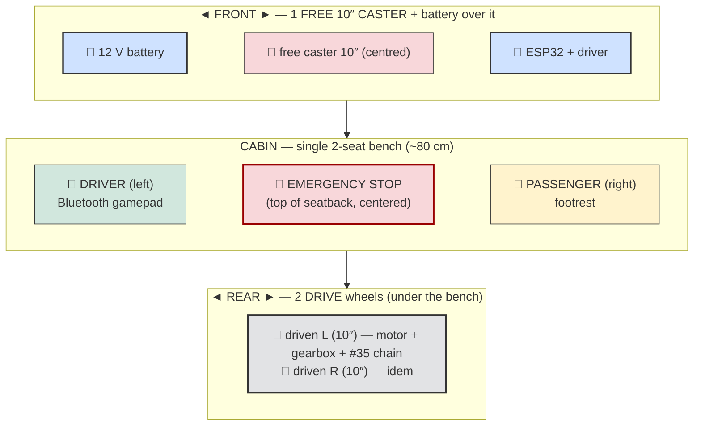
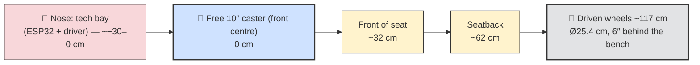
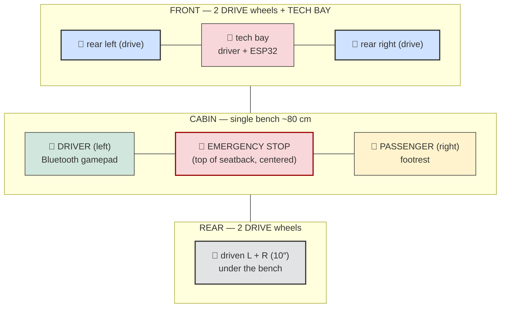
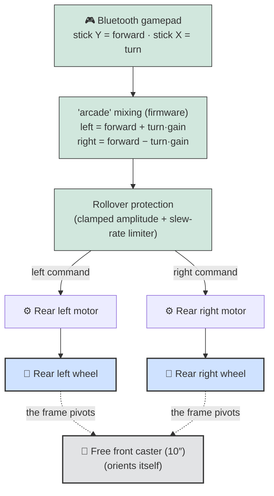
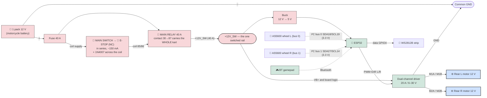
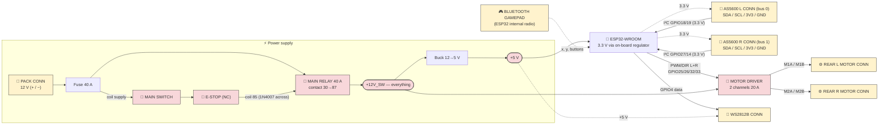
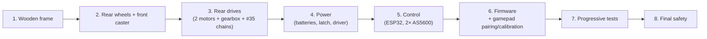

# Powered Soapbox Car — 2-Seat Electric Kart for Kids

Project to build a **two-seat electric kart** for kids (~10 years old, 1.38–1.45 m), designed to be buildable with **basic tools** (drill, saw, wrenches) plus a **3D printer** for the gearboxes. Every choice is explained so you can adapt it to the materials you have on hand.

> **Note:** this kart is a **REVERSED tricycle**. The **2 REAR wheels are powered and independent** (one **12 V DC motor + gearbox + #35 chain per wheel**), sitting **under the bench**; **steering is done by the speed difference** between them (*differential / skid steer*) — **no steering wheel, no column, no linkage**. At the **front centre**, **one free 10″ caster** orients itself, with the battery in the nose over it → **3 wheels total**. ⚠️ The first version had this backwards (driven wheels at the front, caster at the rear, bench far from the driven axle) and it was **too unstable — 0.39 g**, held upright by the software turn limiter alone. A tricycle tips about the line from the **single** wheel to one of the **paired** wheels, so the usable half-track is `(distance CG→single wheel)/wheelbase`: putting the mass near the **paired axle** takes that from 45 % to 80 %. ⚠️ On **2026-08-10** the bench moved **6″ forward** and the axle **6″ back** — 12″ of separation — which gave back 78 mm of that: **61 %, a_tip 0.53 g**. That is still 1.4× the original tricycle, but it is no longer enough on its own: **with the turn limiter off the simulation now rolls the kart over**, where the bench-over-the-axle version stayed planted. The limiter is safety, not comfort. The kart is a **two-seater** (two kids **side by side**) and **driven with a Bluetooth gamepad** ("arcade" mixing: one stick to go forward/back and to turn) — **no throttle pedal and no steering wheel**. Propulsion comes from the **2 rear motors**; there is **no** pedal crank and no chain.

## Table of contents

- [Overview (top view)](#overview-top-view)
- [At a glance](#at-a-glance) · [Why these choices](#why-these-choices)
- [1. Chassis dimensions](#1-chassis-dimensions)
- [2. Seat / controls position](#2-seat--controls-position)
- [3. Differential steering](#3-differential-steering-skid-steer)
- [4. Hardware & electronics](#4-hardware--electronics)
  - [Propulsion (2 rear motors)](#propulsion--2-rear-12-v-dc-motors) · [ESP32 control](#electronic-control--esp32) · [AS5600 sensors](#as5600-speed-sensors-2-on-ic) · [Calibration](#gamepad-calibration)
  - [Electrical safety](#electrical-safety) · [Wiring & pinout](#wiring-diagram--esp32-pinout) · [System diagram](#full-system-diagram-all-connectors)
  - [The battery, unmeasured](#the-battery-unmeasured) · [2 batteries in parallel (dropped)](#wiring-2-batteries-in-parallel) · [Power switch (one main relay)](#power-switch-one-main-relay)
- [5. Critical safety points](#5-critical-safety-points-child)
- [6. Adjustable seat](#6-adjustable-seat)
- [7. Mass estimate](#7-mass-estimate)
- [8. Implementation plan (assembly & commissioning)](#8-implementation-plan-assembly--commissioning)
- [Firmware](#firmware) · [Known limitations and risks](#known-limitations-and-risks)

---

## Overview (top view)

> Regenerable visual concept: [`doc/cad/kart_concept.scad`](doc/cad/kart_concept.scad) (OpenSCAD —
> the render command is in the file header). **Reversed tricycle, as built**: the free 10″ caster
> leads at the **front centre**, on a beam ~15 cm ahead of the deck, with the **12 V motorcycle
> battery in a retaining tray right above it** (the counterweight that keeps that single wheel
> planted); the **2 powered 10″ wheels are at the REAR**, each on its own motor + printed gearbox
> + #35 chain, axle 6″ behind the bench; 2-child bench, side guardrails, emergency stop at the
> top of the seatback, 2×3 frame + 1/2″ plywood.

> Regenerable dimensioned drawing (mm): `python doc/schematics/kart_dimensions.py` — side and top
> views at the concept's dimensions.

**Footprint:** length ~145 cm · width ~90 cm · **track ~83 cm** · **wheelbase ~117 cm** · **2 rear drive wheels Ø25.4 cm (10″), 6″ behind the bench** + **1 free 10″ front caster (centred)** + battery and electronics in the nose · **side guardrails** + **emergency stop at the top of the seatback (centered)** · **a_tip ≈ 0.53 g**.

> ⚠️ For **flat ground, under adult supervision** only. Estimated speed ~8–12 km/h (~3.3 m/s), runtime ~10–20 min. **a_tip ≈ 0.53 g**. ⚠️ The software rollover protection (§3) is **load-bearing safety on this chassis, not a second layer**: with it disabled the simulation rolls the kart over in a full-speed turn. Never drive a child with `turn_limit_en` at 0.

## At a glance

| Item | Choice |
|---|---|
| **Seats** | 2, single bench side by side; **driver on the left** (gamepad) |
| **Steering** | **Differential (skid steer)**: speed difference between the 2 REAR driven wheels; **pivot in place** possible; **no mechanical steering parts** |
| **Propulsion** | **2× 12 V DC motors (~172 W / 0.23 HP)** at the REAR, **independent** (one per wheel) — **PWM/DIR per wheel** |
| **Transmission** | **3D-printed gearboxes** (16→80 then 30→80 = 1:13.33, 16T/24 DP motor pinion — see [`doc/reducteur.md`](doc/reducteur.md)) + **1.28:1 sprockets (25T→32T) bolted to the rear wheels + #35 chain** = **1:17 total** |
| **Wheels** | **2× rear drive Ø25.4 cm (10″)** (plastic rim, 1/2" bearing) + **1 free 10″ caster at the front centre** |
| **Driving** | **Bluetooth gamepad** (stick: Y = forward/reverse, X = turn); **calibration mandatory**; analog joystick reserved (future) |
| **Electronics** | **ESP32** → **dual-channel driver 20 A / 6–30 V** (PWM + DIR / channel), PWM bounded by the manual `duty_cap` (the pack is always 12 V — the motors' nominal — so nothing is measured or capped automatically); **tech bay in the nose** (near the 2 motors, short power wiring) |
| **Power** | **One 12 V motorcycle battery**, **in the NOSE over the caster** — it keeps that single wheel planted (~20 % of the load). Single pack, no paralleling |
| **Speed** | Measured by **2 AS5600 angle sensors** (one per wheel, 1 per I²C bus); control loop at **500 Hz** |
| **Controls** | Driving with the **Bluetooth gamepad**; **arming** by holding its **START/Options** button ~1 s (no button on the kart); **main switch** (dash) powers the kart; **hardware emergency stop** at the **top of the seatback, centered** (breaks the main relay's COIL — thin wires, ~10-20 ms — and cuts the whole kart, so it does **not** brake: the kart coasts; reachable by both kids and by an adult behind) **+** software emergency stop = gamepad button **B** (this one brakes); **electric brake by default** |
| **Frame** | Lightweight **wood**: **2×3** studs + **6 mm plywood** floor |
| **Mass** | ~**32 kg** empty · ~**98 kg** loaded (2 kids) |
| **Rollover** | **a_tip ≈ 0.53 g** — the bench sits 6″ ahead of the paired (driven) axle, which keeps 61 % of the half-track in the tip triangle (it was 80 % when the two were coincident). ⚠️ With the turn limiter off the simulation **rolls over** (−0.60 m/s²); with it on, the same run keeps +2.75 |

## Why these choices

- **Differential steering = zero mechanics**: no more steering wheel, column, kingpins, steering knuckles, tie rod or drag link → fewer parts to make, adjust and wear out; you **turn in software** (PWM difference between the 2 wheels). **Pivot in place** when forward motion ≈ 0.
- **One free caster at the front centre, mass toward the rear axle**: the caster orients itself → no steering geometry, and the layout puts the CG **61 % of the way back from the single wheel**, which is what keeps the tip triangle usable. ⚠️ This is the whole design: **never move mass toward the caster**. The first version had the bench far from the driven axle and reached only 0.39 g; putting it *on* the axle gave 0.69 g; the 6″/6″ split of 2026-08-10 gave back a quarter of that, to 0.53 g. There is no margin left to spend. A three-point frame also never rocks on uneven ground, which a four-wheel version would. *(Wondering what putting the drive back at the front would cost? The numbers are in [`doc/motrices-avant.md`](doc/motrices-avant.md): the bench would have to move **24 cm forward just to break even**, which lands the children's feet in the drivetrain.)*
- **Stability now depends on the firmware**: **a_tip ≈ 0.53 g** (a car is ~1.0 g). The **firmware rollover protection** (turn amplitude clamped by speed + a slew-rate limiter) is what keeps the kart upright: disabled, the simulation **rolls over** on the reference manoeuvre (−0.60 m/s²); enabled, the same run keeps +2.75. `turn_alat_vmax` is capped at **0.2 — its own default**, because 0.3 lifts a wheel with one child off-centre (−0.27) and 0.25 leaves only +0.31.
- **One battery voltage, and it is 12 V** (2026-09-20 simplification): the motors are 12 V, the pack is 12 V, and **nothing measures it** — no ADS1115, no divider, no low-voltage cutoff, no automatic `12 V / Vbat` cap. The driver would accept 6–30 V, but running anything above 12 V would now need that cap back, so **do not**. The only power ceiling left is the manual **`duty_cap`** on the config page, which doubles as the "make it gentler for a small child" knob. The trade, stated: a flat pack is no longer reported, warned about or protected against — it just makes the kart slower. Charge it on a schedule and watch its own indicator.
- **Independently-mounted rear wheels**: driven by **#35 chain** (sprocket bolted to the rim), each keeps its original bearing on its own shoulder bolt — no through drive axle.
- **Battery and electronics in the nose, drive at the rear**: longitudinal layout **CASTER + BATTERY + ESP32 + driver (nose) → CABIN → BENCH → DRIVEN AXLE 6″ behind it**. The children sit just ahead of the driven wheels, which puts **~61 % of the load on them** — traction and electric braking both act there, and weight transfer on a slope works with you. It was 79 % before the 6″/6″ move; that 18 points is the same thing the rollover margin lost. The battery in the nose keeps the caster planted. Power runs nose→rear in 10 AWG (~0.3 V at 40 A).
- **Safety**: **central hardware emergency stop**, at the **top of the seatback** (within reach of both kids and an adult behind), **in the MAIN RELAY's coil loop together with the main switch** — the mushroom breaks ~150 mA, the relay contact breaks the 40 A, and **the whole kart goes dark, ESP32 included**. ⚠️ That means **no braking after the cut**: the kart coasts (~15 m from full speed on the flat, measured in simulation — do not use the mushroom as a brake, and never rely on it downhill). The **brake** is releasing the stick; the **software** emergency stop (gamepad button B) brakes properly because the firmware is still alive. Plus: one 40 A fuse, **two 1N4007 on the relay coil** — one **in series** (the coil energizes in one polarity only, so the relay is a **polarity gate** in front of the whole kart) and one **across** it (flyback for the two switches), **electric brake by default** (gamepad disconnect → immediate braking), **2 s watchdog (PANIC)**, **disarmed** start by default, guards over chains/sprockets, seatbelt, helmet.

---

## 1. Chassis dimensions

| Dimension | Value | Why |
|---|---|---|
| Total length | **~145 cm** | **30″ × 46″ platform** (762 × 1168 mm) + a **150 mm caster beam** ahead of its front edge. Unchanged by the 6″/6″ move — the deck never moved, only the axle and the bench inside it |
| Overall width | **~90 cm** (deck 30″ = 762 mm + the wheels) | The **30″ deck** sets everything: two kids side by side, and the track |
| **Bench inner width** | **76 cm** (the deck's width) | 2 × ~38 cm/child — the 30″ cut's cost, still workable |
| **Side guardrails** (1/2″ plywood, on each side of the bench) | height **~30 cm** above the floor, length ~40 cm | Keep the child from **falling out sideways**; rounded edges |
| **Tech bay** (nose, **over the caster**) | length ~**30 cm** | Houses the **battery** (strapped, in a tray over the caster), the driver, the ESP32 and the breakout. Motor wiring runs nose→rear in 10 AWG |
| **Track** (driven-wheel spacing, center to center) | **83.2 cm** = deck width + wheel width | The driven wheels sit in **notches cut in the deck** and bear laterally on the two **inboard 2×3 rails**, so the deck sets the track. This is the raw material of the rollover margin — the layout then decides how much of it survives |
| **Wheelbase** (caster axle ↔ driven axle) | **116.5 cm** (the axle moved back 6″ on 2026-08-10; the deck did not move) | Enters the rollover criterion directly: `w_eff = (track/2)·(1 − x_cg/wheelbase)` with **x_cg measured from the driven axle**. Here x_cg ≈ 46 cm → **61 %** of the half-track survives (254 mm of 416). It also sets the pivot envelope and the load split (≈61 % on the driven wheels) |
| Seat height (ground → seat bottom) | **~26 cm** | The deck rides **4″ above the driven axle on shims** and the 10″ wheels poke up through side notches beside it. Height is the other half of `a_tip ∝ 1/h_cg` — don't add cushions or a raised bench |
| Ground clearance (under frame) | **18 cm** | Consequence of the 4″ axle drop (underside of the 2×3 rails) |
| Seatback height (seat → top) | **34 cm** | Supports both kids' backs |
| **Rear drive wheels (×2 identical)** | **Ø25.4 cm (10″)**, plastic rim + hard PVC tire | Same wheels left/right, and the same 10″ as the caster → one wheel type for the whole kart |
| **Front caster wheel (×1)** | **10″ (Ø25.4 cm) on a pivoting fork**, centred, mounting plate at ~33 cm, load ≥ 50 kg | Unpowered, orients freely (360°). Carries only ~20 % of the load — the battery sits over it to keep it planted. Its plate needs **332 mm**, i.e. a short **73 mm pad** over the deck |
| **Axle length budget** | **85 mm of rod per wheel** (hub + washers + lock-nut), measured | One **1/2″ × 36″** rod (914 mm) covers both: 832 track leaves 41 mm of overhang per side for the 35 mm of hardware — ~6 mm of thread past the nylock |
| Hub / front-wheel mounting | **Metal bearing, 1/2" bore**, wide hub ~3.8 cm | Turns **free** on a **through dead axle: 1/2″ × 36″ threaded rod** (grade **8.8/B7**, hardware-store), **locknuts + washers at each end**, spacers to fix the lateral position (chain alignment), frame supports as close as possible to the hubs (≤ 3–5 cm, flex) |

**Guiding idea:** the mass goes **toward the paired axle**, and the single wheel goes at the far end carrying as little as possible. That rule took the same three wheels from 0.39 g to 0.69 g — and the 6″/6″ move of 2026-08-10 spent a quarter of it back, down to 0.53 g. Everything else still follows from it: battery in the nose over the caster, deck as low as the wheels allow, nothing heavy forward of the bench. `turn_alat_vmax` is now capped at **0.2, its own default** — measured, the binding case being one child sitting off-centre.

> **Track / body decoupling**: the cabin doesn't need to be as wide as the track —
> a **T** frame: a **wide front crossmember** carrying the **axle bearings as close as possible to
> the wheels** (≤ 3–5 cm, otherwise the threaded rod flexes), narrow rails behind. The space along
> the axle between rail and wheel houses the **motor + gearbox + #35 chain** on each
> side. ⚠️ The firmware rollover protection is an **empirical** ramp (`turn_full_ms`, `turn_alat_vmax`): re-tune it on the bench if the geometry changes.

---

## 2. Seat / controls position

Reference 0 = **caster axle** (front centre); dimensions measured **toward the rear**. The **tech bay** (battery + electronics) occupies the **nose, over the caster** — the one place where mass costs nothing, since it is the far end of the tip triangle.

| Item | Distance from the caster | Height / ground |
|---|---|---|
| Caster axle (reference) | **0 cm** | center at 12.7 cm (Ø25.4 caster) |
| **Battery + tech bay** | **~2–33 cm** | on the deck, low, strapped down |
| Deck front edge | **15 cm** | the caster hangs on a 15 cm beam ahead of it |
| **Footrest** | **~30 cm** | on the deck |
| Front of the seat | **~87 cm** | seat at ~29 cm |
| **Back of the seatback** | **~115 cm** | 6″ ahead of the driven axle |
| **Driven axle** | **116.5 cm** | 10″ wheels (Ø25.4), **4″ shims**; they sit in notches **behind** the bench, so the seatback clears them |

➡️ With the **Bluetooth gamepad**, there's **no more pedal box or steering wheel** to position: only seating ergonomics matter. **Seatback → footrest ≈ 57 cm** ✔ leg almost straight, slight knee bend. ⚠️ The bench sits **6″ ahead of the driven axle** and the deck has ~15 cm of free length behind it: that space is the wheels' and the drive stack's, and moving the bench any further forward costs rollover margin directly (`w_eff ∝ 1 − x_cg/wheelbase`). Provide a safe place to **rest/charge the gamepad**. **Adjustable** seat (§6) to fit the child's size.

➡️ **Emergency stop at the top of the seatback (centered)**: the **hardware mushroom button** (in series with the **main relay's coil**, together with the main switch) is mounted **at the top of the seatback, in the center** — reachable by **both kids** and by an **adult following the kart**. It **opens the main relay** (~10-20 ms, thin wires only) and **everything stops being powered: motors and ESP32 together**. ⚠️ Nothing brakes afterwards — the kart **coasts** (~15 m from full speed on the flat, and it does not stop at all on a slope). The **software** emergency stop on the gamepad (button **B**) is the one that brakes, because the firmware survives it; the mushroom is the last resort for "make it all stop being powered, now". Power returns on the main switch and the kart boots **disarmed**. **Side guardrails** on each side of the bench (no central divider: continuous bench). **Driving stays on the Bluetooth gamepad**.

> ⚠️ **Power off = coasting, and that now includes the e-stop.** Dynamic braking works by
> closing the driver's **low-side** MOSFETs, which needs gate drive — i.e. power. The old
> two-rail wiring kept the driver's logic alive through an e-stop so the brake probably
> survived it; with a single relay it does not. Cutting power (main switch, mushroom, blown
> fuse, or a relay released mid-reboot) opens every switch: **no electric brake**, only the
> passive ×17 gearbox drag — effective on the flat (the kart coasts ~15 m from full speed and
> stops), **insufficient on a slope** (the `coupure_pente8/16` scenarios reach 4.4 and
> 12 m/s eight seconds after the cut). That is the price of the single-relay simplification,
> and it is why the mushroom is documented as a last resort rather than a brake.
> Fail-safe remedy if ever needed: a **normally-closed-contact relay across each motor**
> (coil on the switched rail) — any power loss re-closes the contacts → automatic dynamic
> braking, no electronics.

### Side view

> **Single 2-seat bench**: the two kids side by side (~80 cm inner), same seatback. The **driver (left)** holds the **gamepad**; the right side is passenger. The **tech bay** (electronics) is **in the nose**; the battery sits there too, in its tray above the caster.

### Top view (2-seat layout)

---

## 3. Differential steering (skid steer)

### Principle: **turn by speed difference between the 2 rear wheels**

There are **no mechanical steering parts**: no steering wheel, no column, no wheel kingpins, no steering knuckles, no tie rod, no drag link, no Pitman arm, no steering stops. **You turn by making one rear wheel roll faster than the other.** The **front wheel is a free caster** that follows the motion.

1. **"Arcade" mixing**: the firmware combines forward motion (stick Y) and turn (stick X) into two wheel commands: `left = forward + turn·gain` and `right = forward − turn·gain`. Push the stick right = left wheel faster → the kart turns right.
2. **Pivot in place**: if forward motion ≈ 0 and you push the stick sideways, the two wheels turn **in opposite directions** → the kart **spins on itself** (the front caster swivels to follow).
3. **Rollover protection** (a real second layer — the geometry does most, not all): the turn is shaped on **two fronts**:
   - **Speed→turn ISO-a_lat limit (MEASURED speed)**: below `turn_full_ms` (~0.5 m/s) — and anywhere the curve allows — turning is permitted at **±100%** (full-power pivot in place, `turn_gain` default 1.0); above that, the limit decreases as **1/v** (same lateral acceleration at any speed) down to `turn_alat_vmax` (**±20%, which is now also its maximum**) at top speed, then keeps tightening in case of runaway. Calibrated by physics simulation: the old linear ramp tipped an **offset load** (a single child on one side, adult+child) as soon as the turn gain reached 100%; the iso-a_lat curve keeps ≥ +0.91 m/s² across the whole settable range (re-validated after the 6″/6″ move — the sim sweep is the authority). The faster you go, the less you can steer. **Reverse** has **its own speed limit** (`rev_speed_ms`, default 1 m/s), served by the same PID limiter as `speed_limit_ms` (target chosen by the measured direction).
   - **Slew-rate limiter**: the turn command cannot change by more than `turn_rate` per second → an abrupt stick move is **smoothed** instead of causing a violent differential. The forward command is deliberately **not** slewed: softening the throttle is the job of the **mixing curves** (`mix_type` — expo, or expo + speed-soft for a child driver) and of the speed limiter.

Web parameters: **`turn_gain`** (turn authority), **`turn_full_ms`** / **`turn_alat_vmax`** (rollover ramp), **`turn_rate`** (turn smoothness), and the **Drive feel** group (`mix_type`, `mix_expo_fwd`, `mix_expo_turn`, `mix_soft_hi` — stick-to-motor feel, from linear to child-gentle). Details in [`firmware/README.md`](firmware/README.md).

> **Consequence of skid steer:** in a tight turn, the wheels **scrub** slightly on the ground (sliding friction) — that's inherent to this type of steering. At moderate speed on flat ground, the effect stays acceptable. The beyond-the-limit failure mode is now a sideways **slide**, not a rollover.

---

## 4. Hardware & electronics

> **Mostly wooden, lightweight frame**: a grid of **2×3 studs** (SPF ~38×64 mm) + **6 mm plywood floor**. Reinforce at load points (rear motor mounts, front caster pad, seatbelt anchor). ⚠️ The 6 mm plywood requires a **closely-spaced 2×3 grid** (crossmembers every ~25–30 cm); **12 mm under the bench**.

| Category | Item | Size / spec |
|---|---|---|
| **Wood** | Frame (rails + crossmembers) | **2×3** studs (SPF ~38×64 mm), closely-spaced grid |
| | Floor | **6 mm** plywood, ~140 × 90 cm, supported by the grid |
| | Seat (loaded zone) | **12 mm** plywood under the bench |
| | Rear motor mounts / seatback | Hardwood block + plate; seatback in 6 mm plywood |
| **Wheels** | **2× rear drive wheels** identical | **Ø25.4 cm (10″)**, plastic rim + PVC tire, 1/2" bearing |
| | **1× pivoting FRONT caster wheel** | **Free**, unpowered; **Ø 25.4 cm (10")**, plate at ~33 cm, **load ≥ 50 kg** |
| | Shoulder bolts (driven wheels) | **Supplied with the wheels** (1/2" shoulder, 3/8" thread) |
| **Propulsion** | **2× 12 V DC motors** (one per **front** wheel) | ~172 W (0.23 HP), 19.6 A, 4615 rpm; **independent** |
| | 2 3D gearboxes | **1:13.33** (16→80 then 30→80, [design](doc/reducteur.md)) + 1.28:1 sprockets = **1:17 total**, printed (PETG/ABS/nylon) |
| | Sprockets + #35 chain | Sprocket **bolted to each rear (driven) wheel** + #35 roller chain from the gearbox (**25T→32T = 1.28:1**). Chain rather than a belt: **it can be cut to any length**, so the gearbox-to-wheel centre distance is free instead of being dictated by stock belt lengths. |
| | **2× AS5600 angle sensor** + diametric magnet | one per driven (rear) wheel, **1 per I²C bus**; contactless magnetic, **12-bit absolute I²C** (fixed address 0x36), **3.3 V native** (no level-shift), 4.7 kΩ pull-ups |
| **Driving** | **Bluetooth gamepad** | stick: Y = forward/reverse, X = turn; button **B** = emergency stop, button **START** = arming; **calibration mandatory** |
| | *Analog joystick* | **possible future**, behind the same software abstraction — but it would now need an ADC of its own (the ADS1115 and its two reserved channels are gone) |
| **Power / electronics** | Battery | **One 12 V motorcycle battery** (~40 A peak OK, PWM ~100%) **in the NOSE, strapped in a retaining tray above the front caster** — it is the counterweight that keeps that single wheel planted. No paralleling this phase. **12 V is now a design constant**: nothing measures the pack, so nothing could cap the duty for a higher-voltage one — the 24 V option went away with the ADC |
| | **Battery adapters** (×2) | Slide-on holder → power terminals (+ / −) |
| | **40 A automotive relay** + **2× 1N4007** on its coil | **the** main power switch: contact 30→87 carries the whole kart (see [power switch](#power-switch-one-main-relay)) + 1 fuse. One diode **in series** in the coil loop makes the relay a **polarity gate** (reversed battery ⇒ the coil never pulls in ⇒ nothing downstream is powered); the other, **across** the coil, is the flyback for the two switches |
| | **Main switch + e-stop mushroom** | both **in series in the relay's coil** (~150 mA, thin wire): the main switch on the dash is the kart's on/off, the mushroom at the top of the seatback is the emergency cut. No latch, no priming button, no FORCE ON toggle, no hold capacitor. Full BOM: [`doc/electronique.md`](doc/electronique.md) |
| | Motor driver | **1 dual-channel board 20 A / 6–30 V** (PWM+DIR/channel), duty bounded by the manual cap `duty_cap` |
| | Controller | **ESP32-WROOM board** (dual-core 240 MHz, Wi-Fi/BT, 4 MB flash) |
| | **Breakout board** | Screw terminals + 5 V / 3.3 V outputs + status LED; the **3.3 V** powers the two AS5600 |
| | **Buck → 5 V** (20 V-rated unit already on hand, fed from the switched 12 V rail) | powers the ESP32 (which makes its own 3.3 V) |
| | **Soldered perfboard** | I²C pull-ups and connectors (⚠️ no breadboard — vibration). The Vbat divider that used to live here is gone |
| | **Weatherproof electrical enclosure** (ABS, clear lid, ~150 × 100 × 70 mm, ≈IP65) | **in the front tech bay**; houses ESP32 + breakout + perfboard; cable glands for the cables; protects against dust/rain/impact (clear lid = status LED visible) |
| | Elec. safety | **Emergency stop (NC) in series in the relay coil** (mushroom button **at the top of the seatback, centered**, within reach of both kids) + **main switch** in the same loop + **fuse** |
| | **WS2812B** strip (~10 LEDs) | status: **moving rainbow = armed & ready**, yellow = disarmed (pulsing while arming), blinking red = fault, blue = calibration |
| **Controls** | **Arming** | ~1 s press on the **gamepad's START/Options** button, stick centered — no button on the kart itself |
| **Brake** | **Electric brake (default)** ✅ | handled by the firmware (plugging PID); **default state = braking**; gamepad disconnect → immediate braking; no brake pad |
| **Future reserves** | **analog joystick** | would need its own ADC now, plus 2 free GPIOs — 13, 21, 22 and 23 are available |
| **Fasteners / finish** | M8/M10 through-bolts, **nylock** nuts | brackets, wood screws, varnish; rounded edges |

### Propulsion — 2 rear 12 V DC motors

Each **rear wheel** is driven by its **own 12 V permanent-magnet DC motor** through a **3D-printed 1:13.33 gearbox** (16→80, 30→80) and a **25T→32T #35 chain (1.28:1)** — total reduction **1:17.07**. The **two motors are controlled independently** (PWM + DIR per channel): it's this **command difference** that provides steering. **Each wheel has its own AS5600 sensor** for the control loop.

| Characteristic | Value |
|---|---|
| Type / model | **Permanent-magnet** DC — RX0086 |
| Power | **0.23 HP (~172 W)** |
| Speed | **4615 rpm** (at 12 V, no load) |
| Voltage / current | **12 VDC** / **19.6 A** |
| Duty | **intermittent** (leisure, not continuous); TENV, class F |

> ⚠️ **Voltage:** motors **12 V**, driver **6–30 V**, pack **12 V and only 12 V** — the two match, so there is nothing to cap automatically and nothing measures the battery. The manual `duty_cap` is the ceiling; a higher-voltage pack would cook the motors and is not an option any more.
> ⚠️ **Current:** **19.6 A**/motor (driver 20 A/channel OK); **total ~40 A** — carried by the **single pack**, not split across two. Size the fuse, the cable and the relay for the full 40 A, and expect the sag that goes with it (see [the battery](#the-battery-unmeasured)). Avoid prolonged wheel stalls.

**Estimated performance:**

| Parameter | Value |
|---|---|
| Speed at ~50% (≈ 10 V) | ~**3850 rpm** motor → **~225 rpm wheel** (÷17.07) |
| Estimated top speed | **~3.3 m/s (~12 km/h)** — firmware-limited |
| Total current | ~**40 A**, all from the single 12 V pack |
| Battery energy / runtime | ~90–100 Wh → **~10–20 min** depending on use |

**Transmission gearbox → wheel:** sprocket **bolted to the inner side of the wheel** (multiple spokes, large washers / backing plate so as not to crack the plastic), **25T→32T #35 sprockets = 1.28:1** (exact tooth ratio — see [`doc/reducteur.md`](doc/reducteur.md)) with tension adjustment (slotted holes / idler), **closed guard**. The wheel turns **free on the through axle**; the motor only drives it. **Measure the hub thickness before the final cut of the rod**; **adjustable spacers** to bring the wheel-sprocket plane in line with the gearbox sprocket (chain alignment = critical adjustment: a misaligned chain climbs a sprocket flank and is thrown), gearbox mounting with slotted holes for fine adjustment.

**Where to put the gearbox output sprocket** — full reasoning and the centre-distance table in
[`doc/reducteur.md`](doc/reducteur.md#where-to-put-the-gearbox-output-sprocket):

- ⚠️ **Never one sprocket directly above the other.** Gravity then pulls the slack *along* the run
  instead of into the teeth, and wear elongation all collects at the **bottom** sprocket where
  nothing keeps the chain seated — it climbs the teeth and skips. Keep the line of centres
  **within 45° of horizontal**.
- **The constraint is the DISTANCE, not the direction**: any position on a circle around the wheel
  axle works, as long as it avoids the two vertical 45° sectors. Useful freedom when a frame member
  is in the way — forward, back or diagonally up are all fine.
- **165 mm centre distance → 64 links** for this build (168.7 mm hits 64 exactly). A short centre
  distance costs almost nothing at 1.3 m/s and 10 % of working load; what it costs is **tension
  sensitivity** (1.7 mm of nominal slack), so expect to re-tension more often.
- **Even link count is mandatory** (an odd one needs a cranked link, ~20 % weaker), slack **~1 % of
  C** rather than the usual 2 % because reverse makes both runs tight in turn, and slot the mount
  **±15 mm**.

### Electronic control — ESP32

- The **ESP32** receives the **Bluetooth gamepad** axes, applies **arcade mixing** + **rollover protection**, then sends **an independent PWM + DIR to each channel** of the driver.
- Driver: **dual-channel, 20 A continuous / 60 A peak, 6–30 V**, **PWM + DIR** inputs compatible with **3.3 V**, PWM up to 20 kHz; **overcurrent / undervoltage / temperature** protections. ⚠️ **No reverse-polarity protection** (VB+/VB-) → a reversed connection **destroys the board**.
- **PID brake by default**: at a stop or with no forward command, a **PID brings each wheel to 0** (AS5600 reading) — signed output → can **reverse the motor** (plugging). This is the **default state**.
- Best practices: **manual PWM cap** (`duty_cap`), **expo mixing curves** for a gentle throttle (`mix_type`), **speed limiter** (sensor measurement), **watchdog**, **braking if the gamepad disconnects**.

### AS5600 speed sensors (×2, on I²C)

**AS5600** angle sensor: **contactless** magnetic, **12-bit absolute angle** (4096 points/turn) read over **I²C**, with a **diametric magnet** on the shaft end. There is **one AS5600 per driven (rear) wheel**, **one per I²C bus** (each AS5600 having the fixed address **0x36**, they cannot coexist on the same bus). **Known kinematics** (see [`doc/reducteur.md`](doc/reducteur.md)): the magnet is on the **output of the 1:13.33 gearbox**, followed by **1.28:1 sprockets** → **the sensor makes 1.28 turns per wheel turn** ⇒ web parameter `enc_per_wheel = 1.28` (3.41 if the magnet moves to the 1:5 intermediate shaft), **10″ wheel = 0.254 m**. The **vehicle speed** (m/s) = **signed average** of the 2 wheels (pivot in place → 0 m/s). The conversion is **fully determined**. They serve to:
- **Measure each wheel's speed** → reliable limiter; **PID brake** toward 0; **direction** (sign of Δangle, the DIR pin sets the convention); **safety** (stall: PWM active with no rotation > 1 s → fault).

✅ **3.3 V native** (VDD5V/VDD3V3 tied together) → **SDA/SCL directly on the ESP32, NO level-shift**. Wiring per sensor: **SDA, SCL, 3.3 V, GND** (+ magnet), **4.7 kΩ** pull-ups per bus.

Implementation: I²C read of the **RAW ANGLE** register (0x0C/0x0D) → **speed = derivative of the angle** (`Δcounts × frequency`, **wrap 0↔4095**); **500 Hz loop** (FreeRTOS 1000 Hz) → no ambiguity; **diametric** magnet centered, **air gap 0.5–3 mm**; I²C bus **away from power**, decoupling capacitor on the supply.

> *A quadrature encoder per wheel was once held in reserve as an alternative — dropped: the AS5600 do the job.*

### No analog measurements

**There is no ADC on this kart** (2026-09-20 simplification). The ADS1115, the 100 k / 15 k
divider and everything they fed — low-voltage cutoff, 12/24 V detection at boot, automatic
`12 V / measured Vbat` PWM cap, battery gauge and chart, `LVC` and `NO_VBAT` faults — were
removed together. The pack is **always 12 V**, which is the motors' nominal voltage, so the
measurement had nothing left to decide.

What replaces it: **nothing, deliberately.** The manual `duty_cap` is the power ceiling, the
battery's own indicator is the fuel gauge, and a worn pack shows up as a kart that feels
slower (simulated in `batterie_usee`: 11.2 V and 0.12 Ω of internal resistance still drive,
just less briskly, with no fault raised). Deep-discharge protection is the pack's business.
I²C bus 0 now carries the left AS5600 alone — which also removed the read-timing interference
the 20 Hz battery polling used to add to that bus.

### Gamepad calibration

**The kart refuses to move until the gamepad is calibrated.** Calibration is done **exclusively from the web page** (Gamepad tab), **for the Bluetooth gamepad only**:

1. **Center**: stick at rest → captures the neutral point;
2. **Extremes**: move the sticks fully → captures the amplitude per axis.

The scale (center + half-amplitude per axis) is **persisted in NVS** (namespace `pad`). ⚠️ **(Re)pairing ERASES the calibration** (new gamepad = new calibration). Until the gamepad is calibrated, connected and armed, the controller **stays braking** (default state).

### Electrical safety

- **Emergency stop** easily accessible, **in the main relay's coil loop** (in series with the main switch): pressing it de-energises the coil and the **relay contact breaks the 40 A** (~10-20 ms). The mushroom itself only switches ~150 mA on signal-gauge wires — no 40 A detour to the seatback, any decent NC mushroom qualifies. ⚠️ **It cuts the ESP32 too**, so the firmware never sees it: no fault, no log entry, and above all **no braking** — the kart coasts (~15 m from full speed on the flat; a slope is worse). Power returns on the main switch and the kart boots **disarmed**. A **welded contact** is no longer detectable in software either: the commissioning test (mushroom pressed, multimeter on VB+) is what catches it. In exchange the wiring lost a relay, an opto, a sense pin and every software path that went with them. The gamepad's **button B** remains the emergency stop that actually **brakes**, because the firmware survives it.
- **Main switch** (dash, in the same coil loop) is the kart's on/off — the only control on the vehicle. Arming is a gamepad button. **Fuse/pack**, wiring ≥ the 2 motors' current.
- **The relay is a polarity gate**: nothing is powered until the contact closes, and a **1N4007 in series** in the coil loop means the coil energizes in one polarity only. Connect the battery backwards and the coil simply does nothing — no current anywhere, nothing blown, nothing stressed; put it back the right way and the kart starts. A second 1N4007 **across** the coil is the flyback for the two mechanical switches. ⚠️ Neither one covers a VB+/VB− swap made *downstream* of the contact, at the driver's terminals.
- **Battery: one 12 V motorcycle battery** (lead-acid — no BMS of its own). ⚠️ **Deep-discharge protection is now the pack's alone**: the firmware LVC went away with the voltage measurement. The 40 A fuse still covers shorts. Charge on a schedule rather than on a warning.
- **One 12 V pack, no paralleling** (this phase): it carries the whole ~40 A, so its internal resistance sets the sag under load — a motorcycle battery at ~0.05 Ω dips ~2 V at full throttle, which the motors feel as a little less thrust. ⚠️ **Never put packs in series**: 24 V on 12 V motors, with no automatic cap left to hold the duty down, cooks them.
- **Speed limiter** low at first; **battery secured/protected**; **guards**; **electric brake** + **auto disarm** + **2 s watchdog** + manual `duty_cap`. Cut power before servicing (main switch, and pull the fuse for anything invasive).

### Wiring diagram + ESP32 pinout

**ESP32 pinout (identical to the firmware `firmware/main/pinout.hpp`):**

| GPIO | Function | Direction | Note |
|---|---|---|---|
| 25 / 26 | **PWM / DIR REAR left motor** | output | LEDC, **duty ≤ 50%** |
| 32 / 33 | **PWM / DIR REAR right motor** | output | same |
| 18 / 19 | **I²C bus 0 SDA / SCL** | I/O | **AS5600 wheel L (0x36)** alone on the bus, 3.3 V, 4.7 kΩ pull-ups |
| 27 / 14 | **I²C bus 1 SDA / SCL** | I/O | **AS5600 wheel R (0x36)**, 3.3 V, 4.7 kΩ pull-ups |
| 4 | **WS2812B strip** (data) | output | ~10 LEDs |
| 2 | **Status LED** (onboard) | output | — |
| **Free** | | | |
| 34 / 35 / 36 / 39 | unused | inputs only | input-only pins, **no internal pulls** |
| 13 / 16 / 21 / 22 / 23 | unused | — | free — **13** was `POWER_HOLD` (power latch), **22** `MOTOR_PWR_SENSE` (e-stop coil sense), **16** the arming button. **No GPIO input is used at all**: the kart's only controls are the main switch, the mushroom and the gamepad |
| — | **Power on/off** | (no GPIO) | **hardware only**: main switch + e-stop in the relay coil. The firmware can neither hold nor cut its own supply |

**Key wiring points:**
- **Common ground** ESP32 ↔ driver ↔ I²C sensors: essential.
- **One rail**: the main relay's contact carries everything (buck → ESP32 + strip, driver VB+ *and* driver logic). Its coil runs through the **main switch** and the **e-stop mushroom** in series, with the **1N4007** across it. No GPIO is involved in powering the kart.
- **Brake by default**: at a stop, with no forward command, or if the gamepad disconnects, the firmware brakes.
- **Power ~10 AWG** (crimped lugs); **signals thin wire**. **40 A fuse** on the single pack.
- ⚠️ **Driver polarity (VB+/VB-)**: the board has no reverse protection, and it sits **downstream of the relay contact**, where the coil diode cannot help → **double-check by hand**.
- **Nothing measures the battery** — no divider, no ADC (see [the battery](#the-battery-unmeasured)).

### Full system diagram (all connectors)

Block-by-block overview showing **each connector** (gamepad via the internal radio, 2× AS5600 on 2 I²C buses, rear motors, WS2812) and the **power supply** (one relay, one rail).

### Electrical schematic (symbols)

The same content as an **electrical schematic with standard symbols** (named-port style:
**net labels with the same name are connected**, as on a multi-sheet schematic):

> Regenerable: `. .venv-schem/bin/activate && python doc/schematics/full_schematic.py`.
> The power-switching detail is in [`power_rails.png`](doc/schematics/power_rails.png).

### The battery, unmeasured

**Nothing on this kart measures the battery** — a deliberate removal (2026-09-20), together
with the ADS1115, the 100 k / 15 k divider, the low-voltage cutoff, the 12/24 V detection and
the automatic `12 V / Vbat` PWM cap. The pack is a **12 V motorcycle battery**, which is also
the motors' nominal voltage, so the measurement had nothing left to decide: the duty ceiling
is the manual `duty_cap`, and it does not depend on what the voltmeter says.

| What used to happen | What happens now |
|---|---|
| Voltage on the web gauge + 30 min chart | nothing — the gauge and the chart are gone |
| Warning at 11.5 V (orange LED strip) | nothing; the strip keeps its rainbow |
| Cutoff at 10.5 V: blocking fault, disarm, power cut after 30 s | nothing — the kart drives until the pack gives up |
| PWM capped at 12 V / measured Vbat (24 V pack → ~50 %) | manual `duty_cap` only; **do not fit a >12 V pack** |
| `LVC` and `NO_VBAT` faults, `vbat_check_en` setting | removed from the firmware, the page and the protocol |

**What you lose, plainly**: the kart will not warn you about a flat battery, will not refuse to
drive on one, and will not turn itself off to save one. Deep-discharge protection is the pack's
own business now. **What it feels like instead**: a worn pack sags under load, so the motors
see less voltage and the kart is simply **slower** — the `batterie_usee` simulation scenario
runs a 11.2 V / 0.12 Ω pack and confirms it drives, more feebly, with no fault raised.

**What to do about it**: charge on a schedule rather than on a warning, and read the charge on
the battery's own indicator, off the kart. A lead-acid pack that is regularly run flat dies
young — that is the risk this simplification accepts.

### Wiring 2 batteries in parallel

> ⛔ **Out of scope for this phase.** One **single 12 V pack**, no paralleling — so no
> diode-OR, no ideal-diode modules, nothing to arbitrate between sources. Kept below because
> the sizing holds if a second pack is ever added **in parallel** (same voltage). ⚠️ **In
> series is now out of the question**: 24 V on 12 V motors used to be held back by the
> automatic `12 V / Vbat` cap, and that cap went away with the voltage measurement.*

**Diode-OR:** each pack supplies **through a diode** → no balancing current, you can clip on a slightly discharged pack safely. **Sizing:** ~40 A shared → ~**20 A/diode** → **40 A / 60 A modules** (low MOSFET drop vs ~8 W of losses with a Schottky). ⚠️ Without diode-OR, a ΔV > 2 V between packs = **dangerous spike**; in that case only connect packs **at the same voltage**.

### Power switch (one main relay)

> Full design rationale, BOM and the terminal-by-terminal wiring guide:
> **[`doc/electronique.md`](doc/electronique.md)**. Regenerable:
> `. .venv-schem/bin/activate && python doc/schematics/power_rails.py`.

> 🔁 **This phase: ONE relay, ONE rail.** The previous build had two (a small opto module
> holding a logic rail from `POWER_HOLD`, plus a 40 A relay for the motors) so that the brain
> could survive an emergency stop and *report* it. That reporting bought a fault message on a
> page nobody was looking at mid-drive — it never made the kart stop any harder — and it cost a
> second relay, an optocoupler, two GPIOs, a priming button, a hidden FORCE ON switch and a
> "reboot = power-down" rule. All of it is gone.
>
> **The chain, end to end:** fused battery + → **main switch** → **e-stop mushroom (NC)** →
> relay **coil** (85), coil → ground (86), **1N4007 across the coil, cathode to 85**. The
> **contact (30 → 87)** carries the whole kart: buck → 5 V (ESP32, WS2812) and the driver's
> **VB+ and logic** alike. Either switch opens ⇒ the coil drops ⇒ everything goes dark in the
> relay's own ~10–20 ms. **87a stays spare.**
>
> **What the e-stop costs now: the brake.** Dynamic braking shorts the windings through the
> driver's **low-side** MOSFETs, which need gate drive — i.e. power. With the two-rail wiring
> the driver's logic stayed alive through an e-stop, so the brake probably survived it (a
> bench test settled it either way). With one relay it does not survive: the mushroom removes
> the gate drive along with everything else, and the kart **coasts**. The simulation puts a
> number on it (`arret_urgence_plat`): from full speed on the flat, **~15 m** on rolling
> resistance alone. On a slope it does not stop at all (`coupure_pente8/16`: 4.4 and 12 m/s
> eight seconds later). **The mushroom is the last resort; the brake is releasing the stick**,
> and the gamepad's button B is the emergency stop that actually brakes.
>
> If that is ever judged unacceptable, the documented fix is a **normally-closed relay
> shorting the motor phases**, coil on the switched rail: losing power re-closes the contacts
> and the windings short themselves. Not fitted.
>
> **A welded contact is no longer detected.** The old coil-side opto (GPIO22) saw the e-stop
> command even when the contact had welded shut, and the firmware disarmed and braked on that
> information. Nothing does now. The replacement is a **test, not a circuit**: press the
> mushroom at commissioning and verify with a multimeter that driver VB+ actually reaches 0 V.
> Welding happens on *closing* (inrush into the driver's bulk capacitors), and the relay always
> closes with the motors commanded off, so the exposure is small — but it is a real, accepted
> trade.
>
> **A reboot no longer powers the kart off** — and that is an improvement. The latch had to be
> re-asserted by software within ~700 ms of a reset, which it could not do, so a watchdog reset
> dropped the rail and the kart needed a fresh press on the priming button. The relay is now held by a physical
> switch: a reset just reboots, ~1 s of unpowered driver (coasting, motors safe), and the kart
> comes back **disarmed** with the boot recorded in the event log.
>
> **Parts actually used**
>
> | | part | coil | contacts |
> |---|---|---|---|
> | main relay | **YONGCHUAN YCL-12V-C**, automotive SPDT (85/86 coil, 30/87/87a) | 12 V, ~80 Ω, **150 mA** | **40 A** on 87 (NO), 30 A on 87a |
> | coil switches | ordinary **NC mushroom** + **toggle/key switch**, in series | they only break the 150 mA coil current | signal-gauge wire to the seatback |
> | coil diodes | **2× 1N4007** — one in SERIES (polarity gate), one ACROSS the coil (flyback) | 1 A / 1000 V, ~0.9 V drop on 150 mA | — |
>
> Feed everything from **87 (NO)**: it is the contact carrying the 40 A rating, and it also
> means an unpowered relay is an unpowered kart. The **1N4007** across the coil is required for
> the two mechanical switches (an inductive break arcs and erodes contacts). A **second**
> 1N4007 sits **in series** in the coil loop, and that one is the **reverse-polarity
> protection for the whole kart** — which is a property of the single-relay layout, not of a
> component: *everything* is behind the contact, so the only question a reversed battery has
> to answer is whether the relay closes. With a series diode gating the coil, it cannot: the
> coil sees nothing, the contact stays open, **no current reaches the system at all** and
> nothing is stressed. Put the battery back the right way and the kart starts — the protection
> is passive and repeatable, not single-use.
>
> A bare coil would not do this (a solenoid pulls in either way round), and the flyback diode
> alone would do it *badly*: reversed, it shorts the coil — the relay does stay open, but the
> 40 A fuse blows, the diode takes a surge far past its 1 A rating, and if it ever fails
> **open** the protection disappears without a sign. The series diode costs ~0.9 V on a coil
> that pulls in around 7–8 V, so the margin is wide. ⚠️ Fit it band-toward-the-relay: backwards,
> the relay simply never closes (a loud, harmless failure). ⚠️ And it does **not** cover a
> VB+/VB− swap made *downstream* of the contact — check that one by hand.
>
> **And the last GPIO input went with them.** The panel **arming button** (GPIO16) is gone
> too: arming already required a connected, calibrated gamepad whose own START/Options button
> the driver was holding, so the button on the kart duplicated a control already in hand — and
> a button on the vehicle is a button a bystander can press. The ESP32 now has **no input pin
> in use at all**: two I²C buses in, four motor pins and one LED line out.
>
> *(Dropped with this change: the opto relay module, the coil-sense optocoupler, the priming
> button, the arming button, the hidden FORCE ON toggle, the never-fitted hold capacitor, and
> the idle auto-power-off that depended on the latch.)*

---

## 5. Critical safety points (child)

- ⚠️ **Rollover protection**: a_tip ≈ 0.53 g, and the firmware is now what keeps the kart upright — **with the protection off the simulation rolls it over**. Never move seating or ballast toward the caster, keep the **wide track (83 cm)**, don't raise the seat (height is the other big term), leave `turn_limit_en` at 1 and `turn_alat_vmax` at 0.2 or below. Start with low `turn_gain`/`speed_limit_ms`.
- ⚠️ **Mounting of the 2 rear drives**: motor mounts solidly bolted/reinforced; chains tensioned, lubricated and guards closed (never any slack — a slack chain climbs the sprocket and is thrown).
- ⚠️ **Front caster wheel**: axle and swivel well tightened (nylock / threadlocker); check it pivots freely with no binding, and that its 73 mm pad is solidly fixed — it carries the nose and the battery.
- ⚠️ **Driven-wheel axle secured**: nylock + **cotter pin/retaining washer**.
- ⚠️ **Chain/sprocket guard**: no fingers/laces/clothing caught.
- ⚠️ **Rounded corners**, sanding against splinters, bolt heads countersunk/capped on the child side.
- ⚠️ **Lap belt** anchored to the frame; **helmet mandatory**; **footrest**.
- ⚠️ **Central hardware emergency stop**: at the **top of the seatback, centered**, **easily reachable by both kids** (and by an adult behind); it **opens the main relay's coil** (~10-20 ms) and cuts **the entire kart, brain included**. ⚠️ **It does not brake — the kart coasts** (~15 m from full speed on the flat; on a slope it keeps accelerating). Teach it as "kill everything", not as "stop": the **brake** is letting go of the stick, and the gamepad's **button B** is the emergency stop that brakes. A **welded relay contact** is no longer detected in software — verify at commissioning that VB+ really dies when the mushroom is pressed. Check that the button is neither hidden nor blocked, and that the kids know how to use it.
- ⚠️ **Gamepad**: calibrated before each session; check that **button B (software emergency stop)** brakes, and that a **disconnect** (gamepad off / out of range) triggers braking.
- ⚠️ **Inspection before each use**: motor mounts, chain tension + lubrication + sprocket tightness, **front caster (swivels free, pad solid)**, **central hardware e-stop** + gamepad e-stop, tech bay mounting (battery secured in the nose), electric brake test.
- ⚠️ **Flat ground, supervised**, away from traffic and slopes.
- ⚠️ **Plastic tires = little grip** → moderate speed, gentle turns, and **skid-steer scrub** in tight turns (see §3).

---

## 6. Adjustable seat

To adjust the **seatback ↔ front-of-seat** distance to the child's size:

| Method | Principle | Advantage |
|---|---|---|
| **A. Slotted sliding base** ✅ | The seat slides on 2 slotted rails, clamped with **wing nuts** | Continuous adjustment, no tools |
| **B. Row of holes** | Rebolt the seat in the right hole (every 3 cm) | Very solid, in steps |
| **C. Adjustable footrest** | Move the footrest instead of the seat | Seat fixed against the seatback |

👉 Recommended: **A** (sliding base + wing nuts) — as the child grows → slide the seat back. (No more pedal box to move: driving is on the gamepad.)

---

## 7. Mass estimate

> Assumptions: plywood ~600 kg/m³, 2×3 SPF stud ≈ 1.17 kg/m, drive wheel ~1.0 kg each, caster ~0.5 kg.

| Item | Mass |
|---|---:|
| Wood (6 mm plywood floor, 2×3 frame, mounts, bench, reinforcements) | ~18 kg |
| 2 rear drive wheels Ø25.4 cm + 1 front caster (10″) | ~2.5 kg |
| Fasteners / shoulder bolts | 1.6 kg |
| Propulsion (2 rear motors + 2 3D gearboxes + sprockets/#35 chains) | 3.8 kg |
| Electronics + battery (12 V motorcycle battery, driver, ESP32, relay, wiring) | 2.5 kg (⚠️ optimistic: a motorcycle battery alone is ~3–5 kg — re-weigh and update) |
| Brake/misc (seatbelt, guards, paint, gamepad) | 2.0 kg |
| **EMPTY TOTAL** | **≈ 32 kg** |
| + 2 kids (~33 kg each) | +66 kg |
| **LOADED TOTAL** | **≈ 98 kg** |

**Consequences:** wood dominates (~56 % empty) → the first lever for weight saving. Removing the steering parts (steering wheel, column, tie rod, steering knuckles) **saves weight** versus the 4-wheeler. **Where the mass sits matters more than how much of it there is:** the two kids (66 kg, two thirds of the loaded total) sit **6″ ahead of the driven axle**, which puts the CG 46 cm from it — it was 21 cm when they sat on it, and that difference is a quarter of the rollover margin. The battery (the one heavy item at the other end) is deliberately in the **nose over the caster** — it keeps that wheel planted while barely moving the CG. ⚠️ Anything heavy added later goes **at the rear**, never in the cabin's front half: the sim's `xcg_m` (distance CG→driven axle, **0.455 m**) is the number that would move, and the rollover range was validated at that value (`turn_alat_vmax` capped at 0.2, its own default). Rolling resistance at ~100 kg ≈ **25 N** on the flat; the combined drive force of the 2 rear wheels is still enough at 61 % of the load → **OK on the flat**, realistic grade **~3–6 %**. Electric braking must be sized for ~100 kg.

---

## 8. Implementation plan (assembly & commissioning)

Order from simplest to riskiest. **Golden rule: test everything with the wheels in the air and at low speed before going on the ground.**

**Phase 0 — Preparation.** Gather hardware (§4) and tools (drill, saw, wrenches, soldering iron, multimeter, 3D printer). Print the 2 gearboxes (1:17) + drilling template. Work with **batteries disconnected**.

**Phase 1 — Wooden frame.** **30″ × 46″ plywood deck** + the two **inboard 2×3 rails** running its full length, flush with its edges and **overhanging 150 mm at the nose** to carry the caster; crossmembers ~25–30 cm; **notches cut in the deck sides at the rear** so the drive wheels can be slid into place and then bear laterally on the rails; **tech bay in the nose** (~30 cm, over the caster); **continuous** 76 cm bench **6″ ahead of the driven axle**, leaving ~15 cm of deck behind it for the wheels and the drive stack (no divider) + **side guardrails** (1/2″ plywood, ~30 cm) + seatback. ✅ *Two people can sit without excessive flex; the guardrails hold a child who slides sideways well.* ⚠️ *Do not move the bench any further forward to "balance" the kart — the 6″ it has already moved cost a quarter of the rollover margin, and there is none left to spend.*

**Phase 2 — Rear wheels + front caster.** 2 Ø25.4 cm wheels at the rear on the **1/2″ threaded rod** (85 mm of rod per wheel: hub + spacers + lock nut), dropped **4″ below the rails on shims**, turning **free**; **pivoting 10″ caster** bolted under the nose overhang, its plate raised on a ~73 mm pad so both axles sit at the same height, pivot tight but free. ✅ *Rear track 83 cm, nothing rubs, both wheels touch the ground evenly; the caster orients itself when you push the frame.*

**Phase 3 — Rear drives (replaces the old "steering").** On **each rear wheel**: bolted 32T sprocket (large washers / backing plate) + 3D gearbox with its 25T output **ahead of and above the axle** (165 mm centre distance, so chain slack hangs on the run instead of climbing the teeth) + motor on a reinforced mount + #35 chain cut to length + tension adjustment + guard. **No linkage**: steering is differential, so nothing to adjust on the steering-wheel/tie-rod side. ✅ *With no power: each rear wheel turns by hand, chain tensioned and lubricated.*

**Phase 4 — Power electronics ⚠️ (in the nose).** The **single 12 V pack in the NOSE, strapped in its retaining tray over the caster** (build the tray first: plywood plate + rims on the deck); **fuse 40 A AT the battery → main relay (contact 30→87) → +12V_SW rail → 10 AWG pair back to the rear motors**; the relay **coil** fed through the **main switch (dash)** and the **e-stop mushroom (NC, top of the seatback)** in series — thin wires, the contact is what breaks the 40 A — with **two 1N4007 on the coil**: one **in series** (band toward the relay — the polarity gate: a reversed battery energizes nothing and blows nothing) and one **across 85/86** (cathode to 85/+, flyback for the two switches). No latch, no priming button, no FORCE ON toggle, no capacitor. See [`doc/electronique.md`](doc/electronique.md) for the full wiring guide and [`doc/schematics/power_rails.png`](doc/schematics/power_rails.png) for the schematic; **mount the emergency-stop mushroom button at the top of the seatback, centered** (within reach of both kids and an adult behind); driver (⚠️ **VB+/VB- polarity**, and the coil diode does NOT protect this side) → 2 rear motors; **~10 AWG**, crimped lugs. ✅ *With a multimeter BEFORE connecting: polarity, ~12 V at the driver once the main switch is on, and **the e-stop kills everything — verify VB+ actually reads 0 V** (the only test that catches a welded contact). Then force a reset while powered: the kart must stay powered, reboot and come back disarmed. Finally, know the coast: with the kart rolling gently, press the mushroom and see how far it keeps going — it does not brake.*

**Phase 5 — Control electronics.** ESP32 + breakout; **buck → 5 V on the switched 12 V rail** (the ESP makes its own 3.3 V); **2× AS5600**: wheel L on **bus 0 (SDA18/SCL19)**, wheel R on **bus 1 (SDA27/SCL14)**, 4.7 kΩ pull-ups per bus + centered magnets; WS2812B (GPIO4). **No buttons, no ADC, no divider, no sense line** — GPIO 13, 16, 22 stay free and the board has no input at all besides the two I²C buses. ✅ *Common grounds, 3.3 V/5 V present, AS5600 detected (0x36 on each bus — the boot-time I²C scan prints what actually answers).*

**Phase 6 — Firmware + settings.** `idf.py build flash monitor` (see [`firmware/README.md`](firmware/README.md)). Wi-Fi **Kart-Config** → `http://kart.local` (or `http://192.168.4.1`). **Pair then calibrate the gamepad** (mandatory to drive). Speed conversion **already determined** (AS5600 at the output of the 1:13.33 gearbox + 1.28:1 sprockets → `enc_per_wheel=1.28`, 10″ wheel, **vehicle speed in m/s**) → **verify on the bench** (both rpm signs POSITIVE pushing forward; fix with `enc_inv_l/r`) + **fine-tune the PIDs** (limiter ≈ 0.54/0.50, brake ≈ 0.43/0.29/0.011 — in m/s). Set a **low speed limit** (`speed_limit_ms`) + **rollover protection** (`turn_gain`, `turn_full_ms`, `turn_alat_vmax`, `turn_rate`) + a child-friendly **mixing** (`mix_type` 1 or 2) + set `duty_cap` (the only power ceiling). *(500 Hz loop, IPv6, System page with persistent event log: automatic.)*

**Phase 7 — Progressive tests (wheels in the air).** Arm (gamepad START held ~1 s), light forward → correct direction of **each wheel** (swap M1A/M1B if needed); push the stick right → turns right; test **default brake**, **pivot in place**, **disarm**, **gamepad emergency stop (B)** and **gamepad disconnect → braking**, **central hardware e-stop** (everything dies, including the page's connection — then power back on with the main switch: the kart must come back **disarmed**); trigger the faults (**sensor failure** by unplugging an AS5600) → must refuse/cut. Then on the ground: flat terrain, minimum speed, rollover protection active, 1 light child first, **progressive** limit.

**Phase 8 — Final safety.** Seatbelt anchored, helmets, guards, rounded corners, footrest, secured axles, tightened caster, **nose tech bay secured**, **battery strapped in its nose tray**, **central emergency stop clear and tested** (motor feed broken, fault reported). **Inspection before each use**. Use **under adult supervision**.

---

## Firmware

ESP-IDF 6.1 (C++) code in [`firmware/`](firmware/) — details in [`firmware/README.md`](firmware/README.md).

- **500 Hz control loop** (FreeRTOS 1000 Hz): **gamepad** read (pluggable mixing: linear / expo / expo+speed-soft) + **rollover protection** (iso-a_lat clamp + turn slew-rate), **2 wheel speeds** via **AS5600** (I²C, one per bus), **braking PID** + **speed-limiter PID** per wheel, **independent PWM + DIR**. State machine, arming (gamepad START), **watchdog**. No ADC and no power control: the pack is always 12 V and the kart is switched by hand. **Brake by default** from boot and if the gamepad disconnects.
- **FreeRTOS tasks** (priority / core / stack): see [`doc/firmware-tasks.md`](doc/firmware-tasks.md); constants in [`firmware/main/rtos.hpp`](firmware/main/rtos.hpp).
- **Bluetooth (gamepad) + Wi-Fi** in coexistence; **Wi-Fi AP + station**, **IPv6**, **mDNS** (`http://kart.local` on both interfaces — no IP to remember; Android excepted), **WebSocket** server: dashboard (scaled Chart.js graphs — forward/PWM + speed per wheel, vehicle speed, worst control tick), live configuration, **Gamepad tab** (pairing, calibration, stick visualization), Wi-Fi, pinout, and a **System page** with the **persistent event log** (why did it disarm — survives reboots and power cuts). Settings that write flash are refused while armed.
- Build: `cd firmware && idf.py build flash monitor`.

---

## Known limitations and risks

Points to **address / validate before any real use**.

**Safety & access**
- **The central hardware emergency stop removes ALL power by opening the main relay** (mushroom in the relay's **coil loop** with the main switch, at the top of the seatback, within reach of both kids; ~10-20 ms). It stops the kart being powered, not the kart: with no gate drive there is no electric brake, so it **coasts** (~15 m from full speed on the flat, measured). The firmware never sees it — it is off too — and the kart boots **disarmed** when power returns. Everything that actually brakes is software and needs power: gamepad emergency stop (button B), disarm, watchdog, braking on gamepad disconnect.
- **Unauthenticated web — by choice**: only the AP password protects access (changing it is still recommended). **Gamepad calibration** is locked outside the disarmed/stopped state.
- **Gamepad dependency**: if the gamepad disconnects, the kart **brakes** (safety), but the driver loses directional control until reconnection → drive within Bluetooth range, gamepad charged.

**Firmware / sensors**
- **2 AS5600 sensors** (I²C, 12-bit angle, one per bus): speed = derivative at **500 Hz**, wrap handled, **3.3 V native**. **Known** kinematics → hardcoded constants (`AS5600_CPR=4096`, `WHEEL_DIAM_M=0.254`) + the mount-dependent web parameter `enc_per_wheel` (1.28 at the gearbox output). **Fully determined conversion**; still to **verify on the bench**.
- **Sensor failure detection**: PWM active (>10%) but 0 rotation > 1 s → fault (covers motor stall / thrown or broken chain). The **reversed-wiring watchdog** is optional (`enc_rev_chk`, default on) — an owner who verifies the rpm signs at commissioning can disable it to avoid its downhill-plugging false trip.
- **Pre-tuned PIDs** (validated in simulation) — limiter 0.54/0.50, brake 0.43/0.29/0.011 (m/s); to **fine-tune on the bench**.
- **Rollover protection to tune empirically**: `turn_gain`, `turn_full_ms`, `turn_alat_vmax`, `turn_rate` depend on the actual track, the CG height and grip → start cautious. NB: the ramp relies on the **measured** speed → with `use_encoders=0`, no turn limiting.
- **Brake = PID toward 0** (plugging): effective but **generates current spikes** (no regeneration) → relies on the driver's current limiting.

**Electrical / power**
- **Motor current 19.6 A ≈ 20 A/channel limit**: a prolonged wheel stall triggers the driver's limiting/heating. **No current measurement** in firmware.
- **Battery sag ~40 A** → risk of ESP32 brownout: good buck + bulk capacitor at its input. ⚠️ The ESP32 now shares the **one switched rail** with the motors (the old logic rail filtered that sag), so tap the buck close to the relay rather than at the driver's terminals, and keep ≥ 470 µF there.
- **Driver without reverse protection** (VB+/VB-): a reversed connection **destroys** it.
- **Single 12 V pack**: no paralleling, no diode-OR. It carries the full ~40 A — fuse, cable and relay sized accordingly.

**Mechanical**
- **Skid steer = scrub in tight turns**: the tires slide sideways when you turn hard (friction, wear, energy loss). Pivot in place = maximum scrub; avoid on abrasive surfaces. There is indeed a **command differential** between the 2 wheels, but **no mechanical differential** on the axle side.
- **Stability now comes from the firmware** (a_tip ≈ 0.53 g since the bench and axle moved 6″ apart): with the rollover protection off the simulation rolls the kart over. Keep nothing heavy toward the caster, don't raise the CG, and never disable `turn_limit_en` with a child aboard.
- **Plastic under stress** (rim, 6 mm plywood floor) → risk of cracking; reinforce.
- **Hard PVC tires** → low grip; moderate speed.

---

## License

Project code and documentation under the **0BSD license** (see [`LICENSE`](LICENSE)): free to use,
copy, modify and redistribute, **for any purpose, with no conditions whatsoever**.

Exception: the **vendored third-party components** keep their own license —
[`firmware/components/`](firmware/components/README.md) (bluepad32: Apache-2.0; **btstack:
BlueKitchen license**, commercial use subject to their terms) and `firmware/main/assets/chart.min.js`
(Chart.js: MIT).
