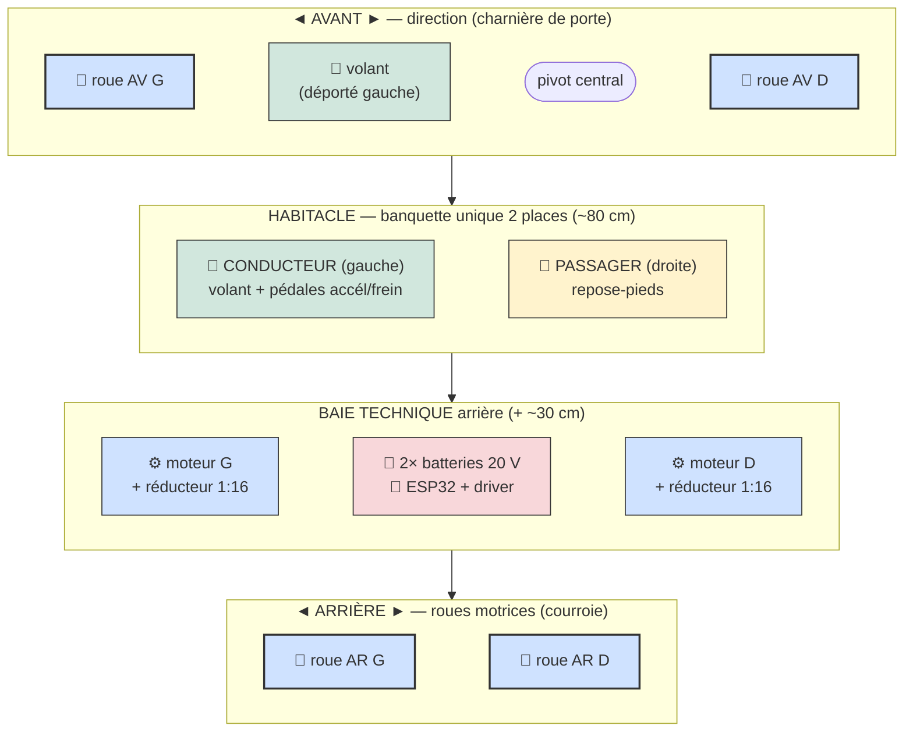
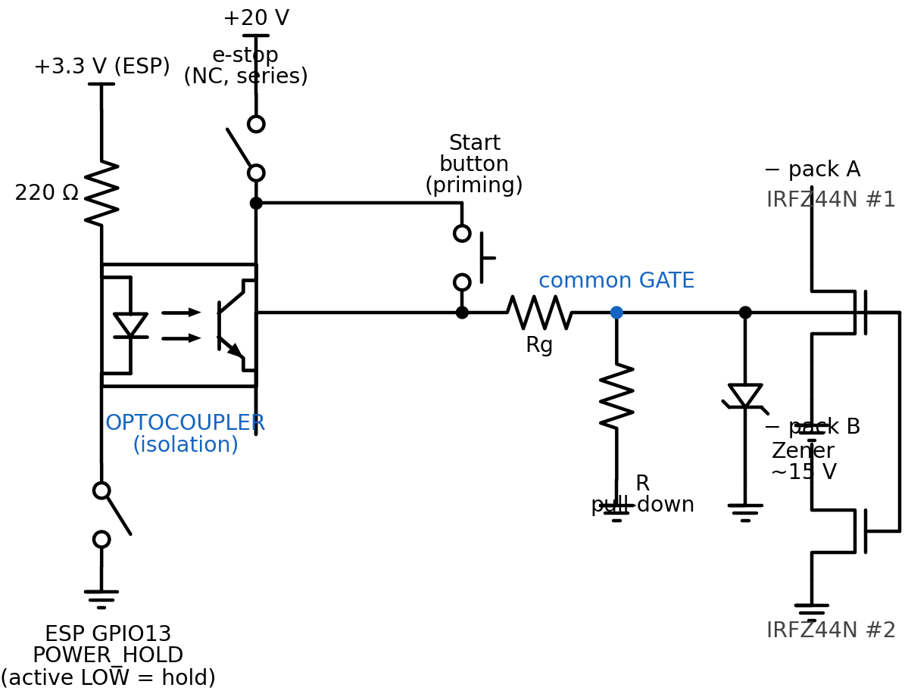

# Powered Soapbox Car — Kart électrique 2 places pour enfants

Projet de construction d'un **kart électrique biplace** pour enfants (~10 ans, 1,38–1,45 m), conçu pour être réalisable avec des **outils basiques** (perceuse, scie, clés) + une **imprimante 3D** pour les réducteurs.

## Aperçu (vue de dessus schématique)

**Gabarit :** longueur ~150–180 cm · largeur ~96 cm · voie ~84 cm · 4 roues Ø30 cm · assise basse 16 cm (anti-basculement).

> Schéma conceptuel (non coté). Les plans cotés et croquis détaillés sont dans [`doc/kart-pedales-enfant.md`](doc/kart-pedales-enfant.md).

## En bref

| Élément | Choix |
|---|---|
| **Places** | 2, banquette unique côte à côte ; **conducteur à gauche** |
| **Direction** | Essieu avant **pivotant central** sur **charnière de porte** ; **volant déporté à gauche** |
| **Propulsion** | **2 moteurs CC 12 V (~172 W / 0,23 HP)** (un par roue arrière) — **même PWM aux deux** |
| **Transmission** | Réducteurs **imprimés 3D 1:16** + **poulies vissées sur les roues + courroies** |
| **Roues** | 4 × **Ø30 cm (12")**, jante plastique, roulement 1/2", à roulement libre |
| **Électronique** | **ESP32** → **driver double canal 20 A / 6–30 V** (PWM + DIR), **PWM bridé ~50 %** |
| **Énergie** | **2 × packs 20 V / 5 Ah en parallèle** (diode-OR) + 2 adaptateurs vers bornes de puissance |
| **Commandes** | Pédale **accélérateur à effet Hall** (signal 0,8–4,2 V → diviseur → ESP32) ; **frein électrique au relâché** ; bouton **armement** + bouton **marche arrière** |
| **Châssis** | **Bois** allégé : madriers **2×3** + plancher **contreplaqué 6 mm** |
| **Masse** | ~**34 kg** à vide · ~**100 kg** en charge (2 enfants) |

## Pourquoi ces choix

- **Stabilité avant tout** : assise basse (16 cm), **voie large (84 cm)**, empattement long (95 cm) → ne bascule pas, même avec 2 enfants.
- **Moteurs 12 V sur batterie 20 V** : le **PWM est plafonné à ~50 %** (≈ 10 V moyens) pour éviter la surchauffe des moteurs.
- **Roues à roulement libre** : entraînées par **courroie** (poulie vissée sur la jante), elles gardent leur roulement d'origine — pas d'essieu moteur traversant.
- **Sécurité** : arrêt d'urgence **coupe-courant général** (en série dans la gate du latch, ESP32 compris), démarrage par **bouton momentané** + latch low-side (2× MOSFET, l'ESP se maintient en vie), fusible par pack, **frein électrique au relâché**, coupure basse tension (LVC, l'ESP peut se couper lui-même), **watchdog 5 s** (reboot si la boucle se bloque), démarrage **désarmé** par défaut, carters sur courroies/poulies, ceinture, casque.

## Matériel électronique

| Catégorie | Élément | Détail |
|---|---|---|
| **Calculateur** | Carte **ESP32-WROOM** | Wi-Fi/BT, double cœur 240 MHz |
| | Carte d'extension à borniers | 5 V / 3,3 V + LED d'état GPIO |
| **Puissance** | **Driver moteur double canal** | **20 A continu / 60 A crête** par canal, 6–30 V, PWM + DIR ; protections surintensité/sous-tension/température ; ⚠️ **pas de protection inversion de polarité** |
| | 2 × **moteurs CC 12 V** (~172 W / 0,23 HP, 19,6 A, 4615 tr/min) | même PWM aux deux ; vitesse mesurée par **capteur d'angle AS5600 (I²C)** sur l'**essieu** |
| | **Capteur d'angle AS5600** (I²C) + aimant diamétral | sur l'essieu, **12 bits absolu**, **3,3 V natif** (aucun level-shift), pull-ups 4,7 kΩ |
| | 2 × réducteurs imprimés 3D 1:16 + poulies + courroies | transmission vers les roues |
| **Énergie** | **2 × packs 20 V / 5 Ah** (parallèle, requis) + 2 adaptateurs | total ~40 A → ~20 A/pack |
| | **Buck 20 V → 5 V** (déjà disponible) | alimente l'ESP32 (qui fabrique son 3,3 V → capteur AS5600 + pédale) |
| | **Carte à pastilles (perfboard) soudée** | porte les 2 ponts diviseurs + condensateurs (⚠️ pas de breadboard — vibrations) |
| | Pont diviseur **throttle ÷1,5** (10 k/20 k) + 0,1 µF | signal Hall 0,8–4,2 V → ADC (GPIO34) |
| | Pont diviseur **100 kΩ / 15 kΩ** + 0,1 µF | mesure de tension batterie (LVC, GPIO39) |
| | **Fusible** par pack (~30 A) + **arrêt d'urgence (NF) en série** dans la gate du latch | coupe-courant général |
| | **Interrupteur d'alimentation (latch)** | **2× MOSFET N IRFZ44N** low-side (+ dissipateur) + **opto** + zener/pull-down + **bouton démarrage** |
| | **Diodes idéales (diode-OR)** — requis (2 batteries) | **2 × modules diode idéale 40 A / 60 A** (un par batterie) |
| **Commandes** | Pédale accélérateur à **effet Hall** (à rappel) | 3 fils 5 V/GND/**signal 0,8–4,2 V** + **pont diviseur ~÷1,5** vers l'ADC ; couleurs à repérer au multimètre |
| | Bouton **armement** (momentané) | appui ~1 s pour armer |
| | Bouton **marche arrière** (momentané) + LED | maintenu = recul |
| **Signalisation** | Ruban **WS2812B** (~10 LEDs) | état : vert = en route, rouge = désarmé |
| **Réserves futures** (câblées, non utilisées) | **2× encodeur A/B 3,3 V**, **3 boutons**, **1 LED** | connecteurs prévus sur le circuit pour évolutions ; logique 3,3 V |
| **Câblage** | Puissance ~**10 AWG**, signaux fil fin | masses communes, cosses serties |

Brochage GPIO complet : voir l'onglet **Brochage** de la page web ou le §4 du
[plan détaillé](doc/kart-pedales-enfant.md).

### Schéma d'alimentation (latch low-side)

Comme les **MOSFET low-side** coupent la masse, **tant qu'ils sont ouverts l'ESP n'est pas
alimenté** (pas de 3,3 V) → deux chemins vers la gate, tous deux pris sur le **+20 V** :
le **bouton de démarrage** met le **+20 V directement sur la gate** (amorçage), puis l'**ESP**,
une fois alimenté, **maintient** via l'**optocoupleur** (LED côté **3,3 V**, GPIO13 actif bas) —
ainsi le **+20 V ne remonte jamais à l'ESP**. L'**arrêt d'urgence (NF) est en série** dans la
ligne de gate ; **pull-down** = MOSFET ouverts par défaut (*fail-safe*), **zener ~15 V** borne
Vgs. L'ESP **se coupe** en relâchant GPIO13 (LVC prolongée). Régénérable :
`. .venv-schem/bin/activate && python doc/schematics/power_latch.py`.

### Schéma système complet (tous les connecteurs)

Vue d'ensemble (pédale, capteur AS5600 I²C, boutons, moteurs, WS2812, alimentation) :
voir le **[§4 — Schéma système complet](doc/kart-pedales-enfant.md#-schéma-système-complet-tous-les-connecteurs)**
du plan détaillé (diagramme Mermaid, rendu directement sur GitHub).

## Documentation

📄 **Plan de construction complet** (cotes, croquis Mermaid, schéma de câblage, matériaux, sécurité) :
[`doc/kart-pedales-enfant.md`](doc/kart-pedales-enfant.md)

🛠️ **Plan d'implémentation** (ordre de montage et de mise en service, phase par phase) :
[`doc/plan-implementation.md`](doc/plan-implementation.md)

Le document contient :
1. Dimensions générales du châssis
2. Position banquette / pédales (vue de côté + vue de dessus 2 places)
3. Système de direction à charnière de porte
4. Liste des matériaux + **propulsion électrique** + **schéma de câblage** (moteurs + driver + ESP32)
5. Points critiques de sécurité
6. Banquette / réglage

> ⚠️ Réservé au **terrain plat, sous surveillance adulte**. Vitesse estimée ~8–13 km/h, autonomie ~10–20 min.

## Limitations et risques connus

Revue du projet — points à **traiter / valider avant tout usage réel**.

### Sécurité & accès
- **L'arrêt d'urgence est le seul arrêt matériel garanti** : NF en série dans la gate du latch → ouvre les 2 MOSFET low-side → coupe-courant total (ESP32 compris). Le reste (LVC, désarmement, watchdog) est logiciel ; l'ESP peut aussi se couper lui-même via POWER_HOLD.
- **Web non authentifié — par choix** : les enfants n'ont pas accès au Wi-Fi ; seul le mot de passe de l'AP protège l'accès (le changer reste recommandé). La **calibration** est désormais **verrouillée hors état désarmé/à l'arrêt**, et un appui maintenu sur START **désarme** en roulant.

### Firmware / capteurs
- **Capteur de vitesse AS5600** (I²C, **angle 12 bits absolu**) : vitesse = dérivée de l'angle à **500 Hz** (FreeRTOS 1000 Hz), gestion du wrap 0↔4095 ; **3,3 V natif** (aucun level-shift). Cinématique **connue** : capteur 1:16 depuis le moteur + courroie 1:1 → tourne à la vitesse roue ⇒ constantes **hardcodées** exactes (`AS5600_CPR = 4096`, `GEAR_RATIO = 1`, `WHEEL_DIAM_M = 0,3048` pour 12″). Pas de réglage web.
- **Détection de panne capteur** (implémentée) : PWM actif (> 10 %) mais **0 rotation pendant > 1 s** → défaut `Encoder` (couvre aussi blocage moteur / courroie cassée).
- **Conversion vitesse entièrement déterminée** — aucun paramètre cinématique à mesurer ; ne reste qu'à **vérifier finement** au banc (tour-mètre/GPS) que l'affichage colle au réel.
- **Seuils de défaut accélérateur fixes** (`THR_FAULT_RAW_*`) : à ajuster selon la pédale, sinon faux défauts ou non-détection d'un fil coupé.
- **Frein = PID vers vitesse 0** (lecture capteur ; sortie signée → peut **inverser le moteur**, *plugging*) : efficace mais **génère des pics de courant** (pas de régénération). S'appuie sur la limitation de courant du driver.

### Électrique / puissance
- **Courant moteur 19,6 A ≈ limite 20 A/canal** du driver : un **blocage de roue** prolongé déclenche la limitation/échauffement du driver. **Pas de mesure de courant** côté firmware (on dépend des protections du driver).
- **Sag batterie ~40 A** : risque de **brownout/reset de l'ESP32** si l'alimentation logique chute. → Bon abaisseur avec condensateurs, et les **2 batteries en parallèle** atténuent.
- **Driver sans protection d'inversion de polarité** (VB+/VB-) : un branchement inversé le **détruit**. Vérifier deux fois.
- **2 batteries en parallèle** : respecter packs à même charge, **diodes idéales + 1 fusible/pack** (voir §4).

### Mécanique
- **Pas de différentiel** : les 2 roues AR reçoivent le même couple → léger **ripage des pneus en virage**.
- **Plastique sous contrainte** : jante (poulie vissée) et plancher CP 6 mm → risque de **fissuration** ; renforcer (contre-platine, grille 2×3 rapprochée, 12 mm sous la banquette).
- **Roues à pneu PVC dur** : faible adhérence → vitesse modérée, virages doux.
