# Kart électrique 2 places pour enfants (10 ans) — Plan de construction complet

Plan réaliste, faisable avec **perceuse, scie et clés** (+ imprimante 3D pour les réducteurs). Chaque choix est expliqué pour pouvoir adapter selon le matériel disponible.

> **Note importante :** ce kart est **électrique** et **biplace** (deux enfants **côte à côte**). Le **conducteur est à gauche** ; le **volant est légèrement déporté à gauche** devant lui, et les **pédales (accél./frein) sont du côté gauche** uniquement. La place de droite est **passager** (repose-pieds, pas de commandes).
>
> Les « pédales » désignent les **commandes au pied façon voiture** : **accélérateur** (capteur → ESP32) et **frein** (mécanique). La propulsion vient de **2 moteurs CC 12 V (~172 W / 0,23 HP)** (un par roue arrière) — voir §4. Il n'y a **pas** de pédalier de vélo ni de chaîne.

---

## 1. Dimensions générales du châssis

| Cote | Valeur | Pourquoi |
|---|---|---|
| Longueur totale | **150 cm** (prévoir **jusqu'à ~180 cm**) | Pédales + dossier devant ; **+ ~30 cm à l'arrière** possiblement nécessaires pour loger **moteurs, driver et batteries** (baie technique) |
| Largeur hors-tout | **96 cm** | Doit loger **deux enfants côte à côte** |
| **Largeur intérieure banquette** | **~80 cm** | 2 × ~40 cm/enfant (épaules + coudes) |
| **Voie** (écartement roues, axe à axe) | **84 cm** | Voie large = **anti-basculement**, crucial avec 2 occupants |
| **Empattement** (essieu AV ↔ AR) | **95 cm** | Long = stable et droit ; encaisse mieux le surcroît de poids |
| Hauteur d'assise (sol → fond du siège) | **16 cm** | Centre de gravité **bas** = ne se renverse pas (légèrement relevée car roues de 30 cm) |
| Garde au sol (sous châssis) | **8 cm** | Passe les petits obstacles sans talonner |
| Hauteur de dossier (assise → haut) | **34 cm** | Soutient le dos des deux enfants |
| **Roues (×4 identiques)** | **Ø30 cm (12")**, jante plastique + pneu PVC dur | Mêmes roues partout → plan simplifié |
| Moyeu / fixation | **Roulement métal, alésage 1/2"**, moyeu large ~3,8 cm | Tourne **libre** sur un boulon à épaulement fixe (fournis) |

**Idée directrice :** assise basse + **voie très large (84 cm)** + empattement long = un engin **qui ne bascule pas** malgré deux enfants côte à côte. Avec des roues pleines de 30 cm (axe à 15 cm du sol), on garde l'assise au plus bas et on répartit le poids des 2 occupants au centre, entre les essieux.

---

## 2. Position siège / pédales (repère 0 = essieu arrière)

Toutes les cotes sont mesurées **vers l'avant** depuis l'essieu arrière.

| Élément | Distance depuis essieu AR | Hauteur / sol |
|---|---|---|
| Essieu arrière (repère) | **0 cm** | centre à 15 cm (roue Ø30) |
| **Fond du dossier** | **23 cm** | assise à 16 cm |
| Avant de l'assise | **53 cm** | 16 cm |
| **Boîtier de pédales** (accél./frein) | **70 cm** | ~22 cm (pédales légèrement surélevées) |
| **Pédale la plus avancée** | **85 cm** | — |
| Essieu avant | **88 cm** | centre à 15 cm (roue Ø30) |

➡️ **Distance dossier → pédale avancée = 85 − 23 = 62 cm.** ✔ (dans la cible 60–65 cm, jambe presque tendue, léger pli du genou pour atteindre accélérateur et frein)

### Vue de côté (de l'arrière vers l'avant)

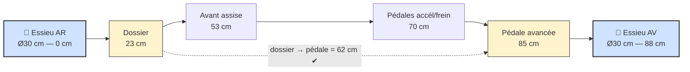

> **Banquette unique 2 places** : les deux enfants sont assis **côte à côte** sur la même banquette (~80 cm intérieure), même dossier. Seul le **côté gauche** reçoit le **volant (déporté à gauche)** et les **pédales accél./frein** ; le côté droit est passager (repose-pieds). Les cotes avant/arrière ci-dessus valent pour la **place conducteur (gauche)**.

### Vue de dessus (disposition 2 places)

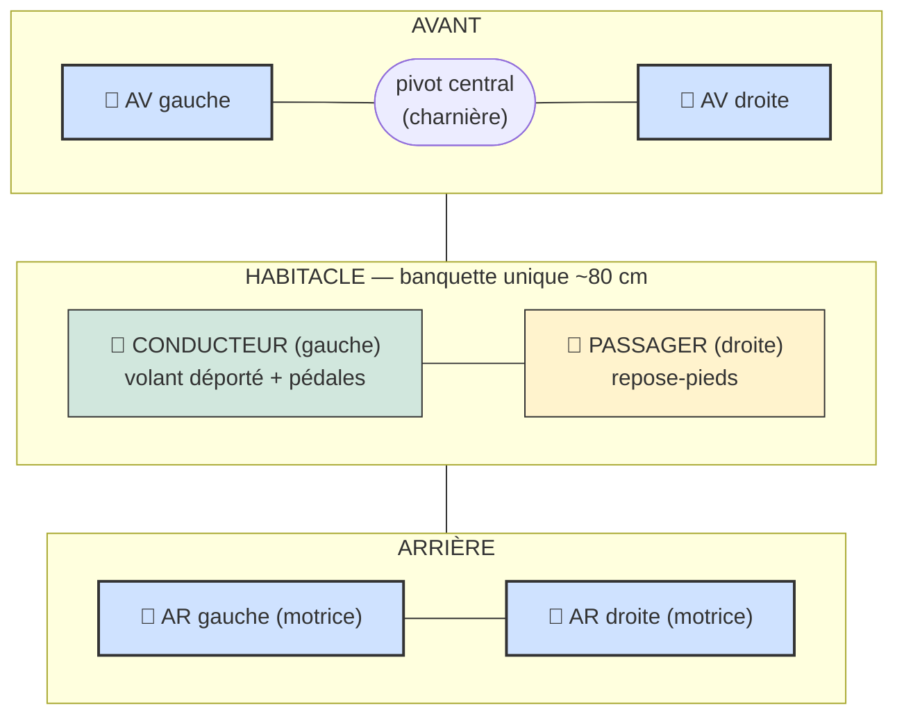

---

## 3. Système de direction à charnière(s) de porte

### Choix retenu : **essieu avant pivotant central** (pas de fusées/kingpins)

**Pourquoi ?** Une charnière de porte pivote autour d'**un seul axe vertical**. C'est exactement le principe de l'**essieu pivotant central** (toute la traverse avant tourne d'un bloc autour d'un point central). Les fusées/kingpins demandent **deux** pivots + une tringlerie de parallélisme : trop complexe, trop d'usinage pour des outils basiques. Le pivot central est **simple, solide et robuste**, parfait ici.

### Montage étape par étape

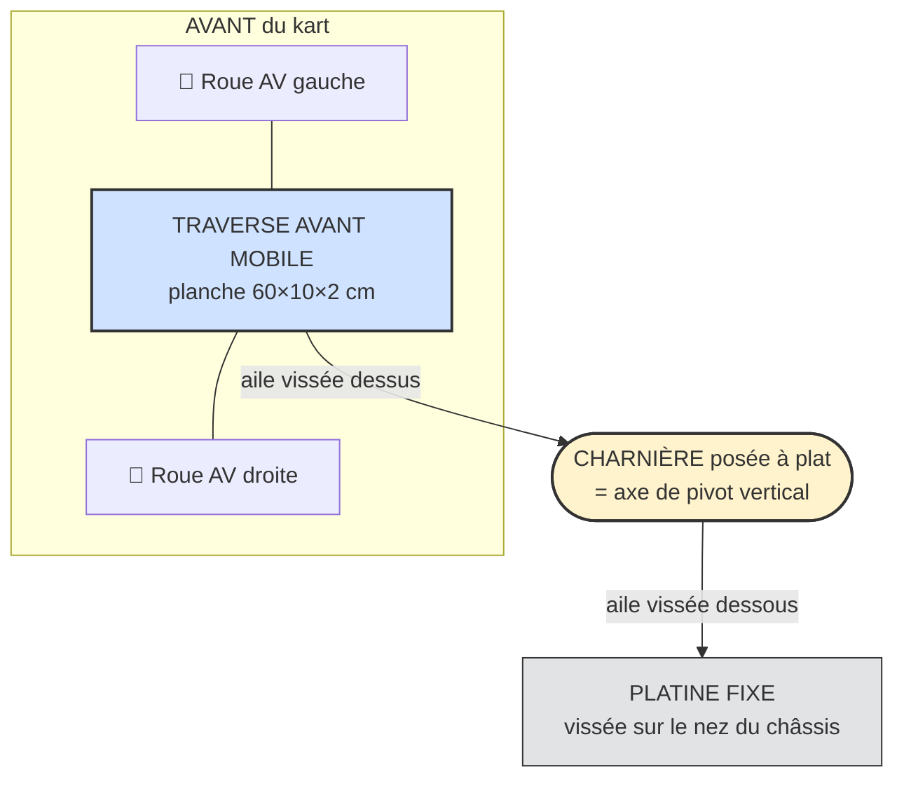

1. **Traverse avant mobile** : une planche solide (chêne/multiplis 2 cm, 60 × 10 cm) qui porte les deux roues avant à ses extrémités.
2. **Platine pivot fixe** : une planche identique boulonnée sur le nez du châssis.
3. **Charnière posée à plat** entre les deux, **au centre exact** : une aile vissée dessus (traverse mobile), l'autre dessous (platine fixe). L'axe de la charnière devient l'axe de pivot.
4. **Renfort tige verticale** : un boulon long (M10) traversant le centre de pivot **en plus** de la charnière → reprend les efforts verticaux et empêche l'arrachement.

### Variante plus rigide : **deux charnières empilées**

Empile deux charnières dos à dos sur le même axe (ou deux charnières alignées sur une tige filetée centrale). Ça **double la surface de fixation** et empêche la traverse de gauchir sous le poids. Recommandé si l'enfant est costaud ou le terrain irrégulier.

### Liaison volant → essieu

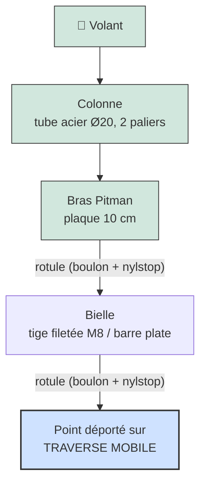

- **Colonne** : tube acier Ø20 mm, tenu par 2 supports percés vissés au châssis.
- **Bras Pitman** : plaque métal (10 cm) fixée en bas de la colonne, qui balaye à gauche/droite.
- **Bielle** : tige filetée ou barre plate reliant le bras Pitman à un point **décalé** de la traverse mobile.
- **Rotules improvisées** : à chaque extrémité de la bielle, un **boulon + écrou nylstop serré "juste assez"** (rondelles de chaque côté) → articulation qui tourne mais ne se desserre jamais. Une rondelle nylon en sandwich améliore le pivot.

### Variante **barre en T** (plus simple)

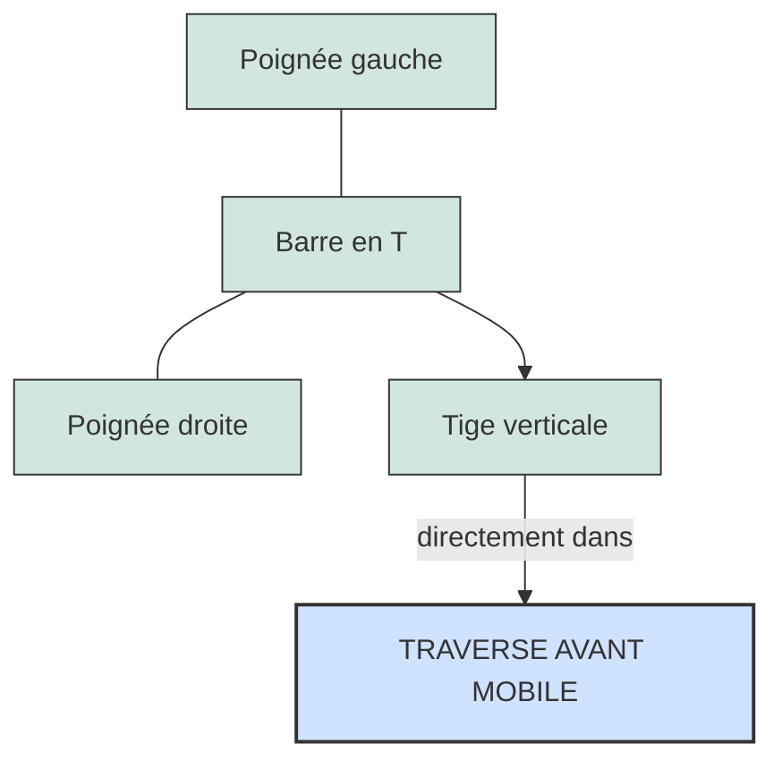

Une barre horizontale fixée sur une tige verticale qui plonge **directement** dans la traverse avant pivotante. L'enfant pousse/tire : la traverse tourne. **Zéro tringlerie.**

### 🏆 Recommandation (version 2 places)
Comme on veut un **volant déporté à gauche** devant le conducteur, on retient la **solution volant + colonne + bras Pitman + bielle** (la barre en T conviendrait mal à un poste de conduite décalé).

**Déport à gauche — comment faire :**
- Le **pivot central reste au milieu** de la traverse avant (centré entre les 2 roues) : ça ne change pas, c'est lui qui assure la géométrie.
- Seule la **colonne de volant est montée à gauche**, devant le conducteur ; elle est simplement **inclinée/positionnée** vers la place de gauche.
- La **bielle relie le bras Pitman (sous le volant, à gauche) au point déporté de la traverse mobile** — elle sera un peu plus longue et oblique, ce qui est sans problème (prévoir des rotules boulon+nylstop bien serrées).
- Régler la longueur de bielle pour que **roues droites = volant centré**.

---

## 4. Liste des matériaux

> **Châssis essentiellement en bois, version allégée** : grille de **madriers 2×3** (SPF ~38×64 mm) + **plancher en contreplaqué 6 mm**. Le métal/plastique se limite aux pièces de direction, axes, transmission et électronique. Bien renforcer aux points de charge (pivot, supports moteurs, ancrage ceinture) avec équerres et boulons traversants. ⚠️ Le CP 6 mm impose une **grille 2×3 rapprochée** (traverses tous les ~25–30 cm) ; garder **12 mm sous la banquette** (zone la plus chargée).

| Catégorie | Élément | Taille / spec |
|---|---|---|
| **Bois** | Châssis (longerons + traverses) | Madriers **2×3** (SPF ~38×64 mm), grille rapprochée |
| | Plancher | Contreplaqué **6 mm**, ~140 × 90 cm, **soutenu par la grille 2×3** |
| | Assise (zone chargée) | Contreplaqué **12 mm** sous la banquette |
| | Support pivot (charnière) | Bloc bois dur + **platine métallique anti-arrachement** |
| | Dossier | Contreplaqué 6 mm + battes 2×3 de soutien |
| **Direction** | Charnière(s) de porte | Acier, **lame ≥ 10 cm**, 1 (ou 2 empilées) |
| | Boulon de pivot central | **M10 × 80**, écrou nylstop, grosses rondelles |
| | Colonne / barre en T | Tube acier Ø20 mm |
| **Roues** | ×4 identiques | **Ø30 cm (12")**, jante plastique + pneu PVC, roulement 1/2" |
| | Boulons à épaulement | **Fournis avec les roues** (épaulement 1/2", filetage 3/8") |
| **Essieux / supports** | Axes des 4 roues | **Boulons à épaulement fournis** ; perçage **3/8"** dans les supports ; les 4 roues tournent libres |
| **Propulsion** | 2 moteurs CC **12 V** | ~172 W (0,23 HP), 19,6 A, 4615 tr/min ; un par roue AR (détail §4) |
| | **Capteur d'angle AS5600** (sur l'essieu) | magnétique sans contact, **12 bits absolu sur I²C** ; **3,3 V natif** (aucun level-shift) ; mesure directe de la vitesse roue |
| | **Aimant diamétral** + support | collé en bout d'essieu, centré face à la puce (entrefer ~0,5–3 mm) ; **pull-ups 4,7 kΩ** SDA/SCL |
| | 2 réducteurs 3D | Rapport **1:16**, imprimés (PETG/ABS/nylon) |
| | Poulies + courroies | Poulie **vissée sur chaque roue AR** + courroie vers le gearbox |
| **Énergie / électronique** | Batteries (**2 requises**) | **2 × packs outillage 20 V / 5 Ah** à glissière, **en parallèle** (le total ~40 A dépasse un seul pack) |
| | **Adaptateurs de batterie** (×2) | Support à glissière → **bornes de puissance** (fils/vis) pour capter le **+ et le –** de chaque pack |
| | **Diodes idéales (diode-OR)** — **requis** (2 batteries) | **2 × modules diode idéale 40 A / 60 A** (un par batterie, MOSFET + contrôleur intégrés) + 1 fusible/pack |
| | **Interrupteur d'alimentation (latch)** | **2 × MOSFET N IRFZ44N** (low-side, un par pack, **+ dissipateur**), **1 optocoupleur**, **zener ~15 V** + **R pull-down** sur la gate, **bouton démarrage** momentané (détail §4) |
| | Driver moteur | **1 carte double canal 20 A / 6–30 V** (PWM+DIR/canal), duty **bridé ~50 %** |
| | Calculateur | **Carte ESP32-WROOM** (double cœur 240 MHz, Wi-Fi/BT, 4 MB flash) — exécute le firmware |
| | **Carte d'extension (breakout)** | Borniers à vis pour les GPIO + **sorties 5 V / 3,3 V** + **LED d'état** ; reçoit la carte ESP32 et simplifie tout le câblage (throttle, capteur I²C, PWM/DIR). Le **3,3 V** alimente le capteur AS5600 (I²C direct) |
| | **Carte à pastilles (perfboard) soudée** | Porte les **2 ponts diviseurs** (throttle 10 k/20 k, Vbat 100 k/15 k) + **2 × 0,1 µF**. ⚠️ **soudée, pas de breadboard** (vibrations) |
| | Sécurité élec. | **Arrêt d'urgence (NF) en série** dans la ligne de gate → coupe-courant général, **fusible/pack** |
| | Ruban **WS2812B** (~10 LEDs) | état visuel : vert = en route, rouge = désarmé |
| | LED du bouton marche arrière | allumée quand le recul est actif |
| **Commandes** | **Pédale d'accélérateur à effet Hall** (universelle e-bike/kart) | 3 fils (5 V / GND / **signal 0,8–4,2 V**), à rappel. ⚠️ couleurs de fils **non standard** (repérer au multimètre) ; **pont diviseur ~÷1,5** requis (signal 4,2 V > 3,3 V ADC) |
| | Bouton **armement** + bouton **marche arrière** | momentanés ; armement = appui ~1 s |
| **Frein** | **Frein électrique au relâché** ✅ | Relâcher l'accélérateur → le firmware freine électriquement (driver en marche arrière) ; pas de contact ni de patin |
| **Visserie** | Boulons traversants | M8 / M10, **écrous nylstop** partout |
| | Équerres / pattes acier | Pour paliers de colonne + renforts |
| **Finition** | Vis à bois, colle PU, vernis/peinture | Arêtes arrondies, anti-échardes |

### Propulsion — 2 moteurs CC à aimants permanents (12 V, un par roue arrière)

Chaque roue AR est entraînée par son **propre moteur CC à aimants permanents 12 V** via un **réducteur (gearbox) imprimé en 3D au rapport 1:16**. **Système simplifié** : les **deux moteurs reçoivent exactement le même PWM** (commande unique, pas de différentiel) ; **un seul capteur de vitesse** (AS5600 sur l'essieu) sert au contrôle.

**Spécifications moteur (relevées sur la plaque) :**

| Caractéristique | Valeur |
|---|---|
| Type | CC à **aimants permanents** |
| Modèle | RX0086 |
| Puissance | **0,23 HP (~172 W)** |
| Régime | **4615 tr/min** (à 12 V, à vide) |
| Tension | **12 VDC** |
| Courant | **19,6 A** |
| Service | **intermittent** (INT.) — adapté à un usage loisir, pas en continu |
| Refroidissement | TENV (fermé non ventilé) · classe d'isolation F · 40 °C ambiant |

> ⚠️ **Tension :** moteurs **12 V**, batterie **20 V** → **PWM bridé à ~50 %** (≈ 10 V moyens) pour **protéger les moteurs de la surchauffe**.
>
> ⚠️ **Courant :** chaque moteur peut tirer **19,6 A** → le driver **20 A continu/canal** le couvre (avec marge en crête). Mais le **total ~40 A** dépasse ce qu'un seul pack 5 Ah fournit confortablement → **2 batteries en parallèle requises** (~20 A/pack, voir §4 sécurité). Surveiller tout de même l'échauffement du driver et **éviter les blocages de roue prolongés**.

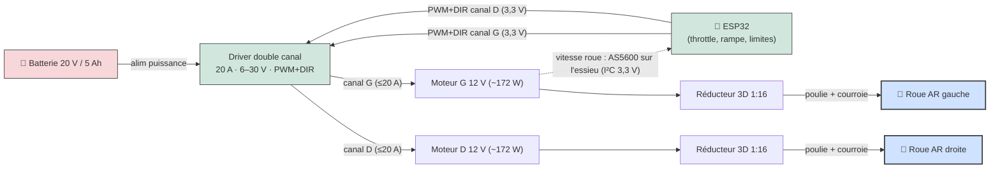

**Performances estimées** (à confirmer en mesurant le régime réel des moteurs) :

| Paramètre | Valeur / estimation |
|---|---|
| Tension nominale moteurs | **12 V** (4615 tr/min à vide) |
| Alimentation | Pack **20 V max / 5 Ah** → PWM **bridé ~50 %** (≈ 10 V moyens) |
| Régime à ~50 % (≈ 10 V) | ~**3850 tr/min** moteur → **~240 tr/min roue** (÷16) |
| Réduction gearbox | **1:16** (× rapport de la courroie) |
| Vitesse de pointe estimée | **~13 km/h** (roue Ø30 cm à ~240 tr/min) — limitée par firmware |
| Puissance par moteur | ~172 W (0,23 HP) — **réelle plus basse** à 50 % de duty |
| Énergie batterie | ~**90–100 Wh** (20 V × 5 Ah) |
| Courant moteur | **19,6 A**/moteur — couvert par le driver (**20 A continu/canal**) ✓ |
| Courant total | ~**40 A** (2 moteurs) → **2 batteries en parallèle requises** (~20 A/pack) |
| Autonomie estimée | **~10–20 min** selon l'usage (plein gaz = court) |

**Transmission gearbox → roue (poulie + courroie) :**
- Une **poulie est vissée sur la roue** (sur la jante plastique). Visser dans **plusieurs rayons** avec **grandes rondelles des 2 côtés** + écrous nylstop pour ne pas fendre le plastique ; au besoin, une **contre-platine (disque) répartit l'effort** sur toute la jante.
- Une **courroie** relie la poulie de sortie du gearbox à la poulie de roue. Prévoir un **réglage de tension** (gearbox monté sur trous oblongs ou galet tendeur) — une courroie trop lâche saute, trop tendue use les roulements.
- La roue continue de tourner sur **son boulon à épaulement + roulement** : le moteur+gearbox ne portent pas la roue, ils ne font que l'entraîner par la courroie.
- Imprimer les gearbox en matière résistante (PETG/ABS/nylon, remplissage élevé), **arbres et roulements métalliques** aux points de charge, **carter fermé** sur poulies/courroies (doigts, vêtements).
- Le **rapport courroie** (Ø poulie roue ÷ Ø poulie gearbox) s'ajoute au 1:16 du gearbox : à intégrer dans le calcul de vitesse finale.

### Commande électronique — ESP32 + contrôleurs PWM

- L'**ESP32** lit le throttle et envoie la **même commande PWM + DIR aux deux canaux** du driver (les 2 moteurs tournent ensemble).
- Driver : **double canal, 20 A continu / 60 A crête par canal, 6–30 V** (H-bridge NMOS discret, 20 A **sans dissipateur**), entrées **PWM + DIR** logiques compatibles **3,3 V** (ESP32), PWM jusqu'à 20 kHz. Protections intégrées : **limitation de courant active** (seuil selon température carte), **sous-tension**, **température**. ⚠️ **Aucune protection contre l'inversion de polarité** sur l'entrée VB+/VB- → un branchement inversé **détruit la carte** (respecter la polarité ; les diodes idéales aident mais vérifier le câblage).
- **Accélérateur = PWM direct** (boucle ouverte) ; au **relâché**, un **PID ramène la vitesse à 0** (lecture du capteur AS5600) — sa sortie peut **inverser le moteur** (plugging) pour freiner.
- Bonnes pratiques firmware : **PWM plafonné à ~50 %** (protège les moteurs 12 V alimentés en 20 V), **rampe** de montée, **limiteur de vitesse** (mesure capteur), **watchdog** qui reboot si l'ESP32 plante, throttle **à rappel** (PWM = 0 au repos).
- Alimenter l'ESP32 via un **régulateur/abaisseur** propre (pas directement sur la batterie de puissance) ; masses communes soignées.

### 🔄 Capteur de vitesse (AS5600 sur I²C)

Capteur d'angle **AS5600** : magnétique **sans contact**, **angle absolu 12 bits** (4096 points/tour) lu en **I²C**, avec un **aimant diamétral** collé en bout d'arbre. **Cinématique connue** : le capteur fait **1 tour pour 16 tours moteur** (= sortie du gearbox **1:16**), et la **courroie est 1:1** jusqu'à la roue → **le capteur tourne exactement à la vitesse de la roue** ⇒ `GEAR_RATIO = 1`, **roue 12″ = 0,3048 m**. La conversion vitesse est donc **entièrement déterminée** (plus de paramètre à mesurer). Il sert à :
- **Mesurer la vitesse** → **limiteur de vitesse fiable** (mesure réelle, pas le duty PWM).
- **Frein PID** : ramène la vitesse à **0** au relâché (sortie signée → peut **inverser le moteur**).
- **Sens de rotation** : donné par le **signe de Δangle** (et la broche **DIR** fixe la convention CW/CCW).
- **Sécurité** : détecter un **blocage** (PWM actif sans rotation > 1 s → défaut).

✅ **Tension : 3,3 V natif** (broches VDD5V et VDD3V3 reliées) → **SDA/SCL directement sur l'ESP32, AUCUN level-shift**. Câblage minimal : **SDA, SCL, 3,3 V, GND** (+ aimant), pull-ups **4,7 kΩ** sur SDA/SCL.

Mise en œuvre :
- **Lecture I²C** du registre **RAW ANGLE** (0x0C/0x0D, 12 bits) ; **vitesse = dérivée de l'angle** : `Δcounts × fréquence`, avec **gestion du wrap 0↔4095**.
- **Boucle d'asservissement à 500 Hz** (FreeRTOS à 1000 Hz). À 500 Hz, sur l'essieu (~288 tr/min) on a ~**39 counts/échantillon** → **aucune ambiguïté** (et même sur l'arbre moteur à pleine vitesse, ~55°/échantillon resterait non ambigu).
- **Adresse I²C fixe 0x36** → **un seul AS5600 par bus**. Pour un 2ᵉ capteur (réserve) : **2ᵉ bus I²C** (GPIO27/14 réservés) ou multiplexeur I²C.
- **Montage mécanique** : sur l'arbre tournant à la vitesse roue (sortie gearbox ou moyeu, équivalents car courroie 1:1) ; aimant **diamétral** centré face à la puce, **entrefer ~0,5–3 mm** → support imprimé. La détection d'aimant intégrée (AGC) sert de diagnostic.
- Bus I²C **à l'écart de la puissance** (paire torsadée), **0,1 µF** sur l'alim du capteur, **GND commun**.

> *Alternative envisagée : un encodeur incrémental en quadrature (type AMT103-V) — écarté car il s'alimente en 5 V (sorties ~4,2 V → level-shift obligatoire) et n'apporte pas l'angle absolu.*

### 🎚️ Calibration de l'accélérateur

Le potentiomètre de pédale n'atteint jamais pile 0 V / 3,3 V et varie d'une pièce à l'autre → on **calibre** au lieu de coder les seuils en dur.

**Procédure :**
1. Entrer en **mode calibration** (bouton maintenu au démarrage, ou commande série/Bluetooth).
2. Pédale **relâchée** → enregistre la valeur **MIN** (repos).
3. Pédale **à fond** → enregistre la valeur **MAX**.
4. Relâcher → fin ; **stocker MIN/MAX en flash (NVS)** pour que ça persiste après extinction.

**Mapping appliqué ensuite :**
```
throttle% = clamp( (brut − MIN − zone_morte) / (MAX − marge − MIN), 0 … 1 )
```
- **Zone morte** en bas → relâché = **0 % garanti** (pas de reptation).
- **Marge** en haut → on atteint **100 %** même si la pédale ne va pas tout à fait au max.
- Inverser le sens si le câblage est inversé.

**Sécurités liées :**
- **Détection de défaut** : lecture **hors plage** attendue (fil coupé / pot débranché → 0 ou valeur flottante) → **throttle forcé à 0** + alerte.
- **Anti-démarrage pédale enfoncée** : au cycle clé, si la pédale n'est pas au repos → **refuse de rouler** tant qu'elle n'est pas revenue à 0 (anti-emballement, comme une voiture).
- **Calibration invalide** : si `MAX − MIN` trop faible → on garde des **valeurs par défaut sûres** / on refuse de rouler.
- Calibration déclenchée **via l'interface web uniquement** (pas de bouton) ; guidage par **LED** pour les étapes.

### ⚡ Sécurité électrique (critique pour un enfant)

- **Arrêt d'urgence (e-stop)** bien accessible, **normalement fermé, en série dans la ligne de gate** du latch (détail §4) : l'ouvrir retire l'alimentation de gate → les 2 MOSFET s'ouvrent → **coupe le courant de TOUT le système** (puissance **et** ESP32), **sans passer les 40 A dans le contact**. Au retour, le système redémarre **désarmé** (réarmer avec START).
- **Démarrage par bouton momentané** (amorce le latch), puis l'ESP **se maintient en vie** ; **fusible / disjoncteur par pack**, câblage dimensionné ≥ courant des 2 moteurs (~25–28 A à fond).
- **Batterie : pack outillage 20 V / 5 Ah à glissière** (interface propriétaire) → prévoir un **adaptateur/support spécifique** correspondant à cette interface pour capter les bornes (acheté ou imprimé 3D). Pack **fixé, ventilé, à l'abri des chocs**.
- **Architecture : 5S Li-ion** (« 20 V max » = nominal ~18,5 V, **21 V** pleine charge, ~15 V seuil bas) → seuils LVC ci-dessus validés. ⚠️ **Config cellules à vérifier (5S1P vs 5S2P)** : elle fixe le **courant de décharge max** admissible — critique car on tire ~**40 A à fond** (~20 A/pack avec 2 batteries). Protection décharge profonde = **BMS du pack + LVC côté ESP32**.
- **2 batteries en parallèle (REQUISES)** : un seul pack 5 Ah ne fournit pas confortablement ~40 A → **2 packs en PARALLÈLE** → même 20 V, **capacité ×2 (~10 Ah)** et **courant ÷2 par pack** (~20 A/pack au lieu de ~40 A). ⚠️ **Jamais en série** (= 40 V, incompatible moteurs 12 V). Précautions parallèle : ne relier que des packs **au même niveau de charge** (sinon fort courant d'équilibrage entre eux), **un fusible par pack**, et idéalement un **diode-OR / isolateur** pour qu'un pack ne se décharge pas dans l'autre (les BMS ne communiquent pas). La mesure de tension et la **LVC restent inchangées** (même rail commun).
- **Limiteur de vitesse** réglé bas au début ; ne jamais laisser la vitesse max par défaut.
- **Batterie fixée et protégée** des chocs (BMS si Li-ion), **carter** sur moteurs/gearbox/poulies/courroies/câbles.
- **Frein électrique au relâché** + **désarmement auto** après 30 s sans accélérateur + **watchdog 5 s** (reboot si la boucle se bloque) + **PWM plafonné ~50 %**. L'e-stop coupe-courant reste l'arrêt ultime.
- Couper l'alimentation avant toute intervention ; vérifier tension de courroie et serrage des poulies.

### 🔌 Schéma de câblage (2 moteurs + driver + ESP32)

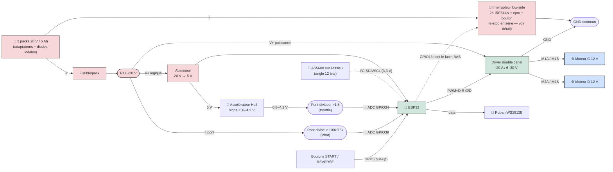

**Brochage ESP32 (récapitulatif — identique au firmware `pinout.hpp`) :**

| GPIO | Fonction | Sens | Note |
|---|---|---|---|
| 25 | **PWM moteur gauche** | sortie | LEDC ~18 kHz, **duty ≤ 50 %** |
| 26 | **DIR moteur gauche** | sortie | sens de rotation |
| 32 | **PWM moteur droite** | sortie | LEDC, duty ≤ 50 % |
| 33 | **DIR moteur droite** | sortie | sens de rotation |
| 34 | **Accélérateur** (signal Hall) | entrée ADC | pédale Hall 0,8–4,2 V → **pont diviseur ~÷1,5** vers l'ADC |
| 39 | **Tension batterie** | entrée ADC | pont **100 k / 15 k** + 0,1 µF |
| 18 / 19 | **I²C SDA / SCL** (AS5600) | E/S | capteur d'angle 0x36, **3,3 V natif**, pull-ups 4,7 kΩ |
| 13 | **POWER_HOLD** (latch alim.) | sortie | **actif BAS** : tient la LED de l'opto à GND → maintient l'alim ; HAUT = coupe |
| 16 | **Bouton armement (START)** | entrée | pull-up, appui ~1 s pour armer |
| 21 | **Bouton marche arrière** | entrée | pull-up, **momentané** (maintenu) |
| 17 | **Ruban WS2812B** (data) | sortie | ~10 LEDs |
| 4 | **LED bouton marche arrière** | sortie | allumée si recul actif |
| 2 | **LED d'état** (onboard) | sortie | — |
| **Réserves futures (câblées, non utilisées) — toutes en 3,3 V** | | | |
| 27 / 14 | **Encodeur 1 — A / B** (réserve) | entrées | quadrature 3,3 V, signal direct |
| 35 / 36 | **Encodeur 2 — A / B** (réserve) | entrées seules | quadrature 3,3 V (pull-up externe si open-collector) |
| 22 / 23 | **2 boutons auxiliaires** (réserve) | entrées | actifs bas, pull-up interne |

Alimentations : un **buck 20 V → 5 V (déjà disponible)** alimente l'**ESP32** (qui fabrique son **3,3 V via le régulateur de sa carte**) ; le **3,3 V** de l'ESP32 alimente le **capteur AS5600 (I²C)** et la pédale (capteur Hall) ; **+20 V** (rail commun, via fusibles) → driver. La **masse (−)** des packs est commutée par le **latch low-side** (2× MOSFET). **GND commun** à tout.

**Points clés du câblage :**
- **Masse commune** ESP32 ↔ driver ↔ accélérateur ↔ capteur I²C : indispensable, sinon signaux erratiques.
- **Interrupteur low-side + e-stop en série** (détail §4) : le **+** reste toujours présent ; couper se fait en ouvrant les **2 MOSFET côté masse**. L'**e-stop** ouvre la ligne de gate (faible courant) → coupe **toute** l'alimentation (ESP32 compris). Au retour, l'ESP32 redémarre **désarmé**.
- **Pas de contact de frein** : relâcher l'accélérateur déclenche le **frein électrique** (géré par le firmware) ; sous une vitesse mini, on coupe simplement.
- **Puissance ~10 AWG** (≈ 28 A crête), **signaux en fil fin**. Cosses serties, gaine, rien qui frotte.
- **Fusible 30 A** sur le + batterie ; vérifier que la **décharge max du pack** couvre la demande.
- **Ne jamais** alimenter l'ESP32 en 20 V : passer par l'abaisseur 5 V.
- **Deux ponts diviseurs vers l'ADC** (le signal dépasse 3,3 V) : **accélérateur** Hall ÷1,5 (ex. 10 k + 20 k) sur GPIO34, et **tension batterie** 100 k/15 k sur GPIO39. Alimenter la pédale en **5 V**, masse commune. Un **condensateur 0,1 µF** sur chaque nœud ADC stabilise la lecture.
- ⚠️ **Polarité du driver (VB+/VB-)** : le driver n'a **aucune protection contre l'inversion** → un branchement inversé le **détruit instantanément**. Vérifier deux fois avant de mettre sous tension.
- **2 batteries** : chaque pack passe par **son adaptateur à glissière** → **son fusible** → **sa diode idéale 40 A/60 A** → rail commun (voir montage parallèle ci-dessous).
- Accélérateur : **pédale à effet Hall** (universelle e-bike/kart, à rappel). **3 fils : +5 V / GND / signal 0,8–4,2 V**. ⚠️ Couleurs **non standardisées** → repérer au multimètre (le signal varie 0,8→4,2 V quand on appuie). Le signal dépassant 3,3 V, **insérer un pont diviseur ~÷1,5** (ex. 10 k en série + 20 k vers GND → 4,2 V donne ~2,8 V) sur l'entrée ADC. Le firmware lit le **brut ADC** : la **calibration** capture min/max réels et la **zone morte** absorbe l'offset de repos ; rampe/filtrage logiciels pour un démarrage doux.

### 🧩 Schéma système complet (tous les connecteurs)

Vue d'ensemble bloc-à-bloc montrant **chaque connecteur** (pédale, capteur AS5600 I²C, boutons, moteurs, WS2812), le **conditionnement** (diviseurs) et l'**alimentation**. Le détail du **coupe-circuit** (MOSFET low-side + opto + e-stop + bouton) est dans la section « Interrupteur d'alimentation » et le schéma `doc/schematics/power_latch.png`.

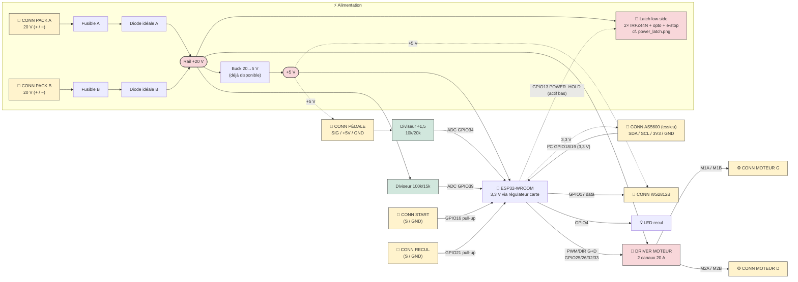

### 🔋 Mesure de tension batterie & coupure basse tension (LVC)

L'ESP32 ne lit que **0–3,3 V**, alors que la batterie monte à ~**21 V**. On insère donc un **pont diviseur** qui ramène Vbat sous 3,3 V, lu sur une entrée **ADC1** (GPIO39). Ça permet une **protection logicielle** (réduction de puissance + coupure) **en plus du BMS** du pack.

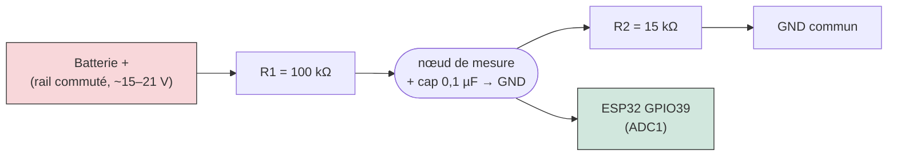

**Dimensionnement (pont 100 k / 15 k) :**
- Rapport = 15 / (100+15) = **0,130** → à 21 V, l'ADC voit **2,74 V** (sous 3,3 V ✔). À 15 V → 1,96 V.
- Reconstruction firmware : **Vbat = V_adc × 7,67** (à **calibrer** avec un multimètre).
- Courant de fuite du pont ≈ **0,18 mA** (négligeable ; brancher le pont sur le **rail commuté par la clé** pour zéro fuite à l'arrêt).
- **Cap 0,1 µF** entre le nœud et GND : stabilise l'échantillonnage de l'ADC + filtre le bruit moteur. Possible **zener 3,3 V** sur l'entrée en sécurité anti-surtension.

**Seuils (pack 5S Li-ion, classe 18 V / « 20 V max » — nombre de cellules réglable dans la config, défaut 5) :**

| État | Tension pack | Tension/cellule | Action firmware |
|---|---:|---:|---|
| Pleine charge | ~21,0 V | 4,20 V | — |
| Nominal | ~18,5 V | 3,70 V | — |
| **Avertissement** | ~16,5 V | 3,30 V | réduire la puissance max + LED |
| **Coupure (LVC)** | ~15,0 V | 3,00 V | **PWM = 0**, refuse de repartir |
| Réarmement (hystérésis) | > 16,0 V | 3,20 V | autorise de nouveau |

**Précautions firmware :**
- **Moyenner** plusieurs lectures + **anti-rebond (~0,5 s)** : la tension **chute sous charge** (sag), il ne faut pas couper sur un creux momentané — distinguer un vrai épuisement d'un sag transitoire.
- Couper **avant** le seuil dur du BMS du pack (qui coupe net) : la LVC ESP32 est une protection **plus douce et plus précoce**.
- À la coupure : ramener le PWM à 0 **en douceur** si possible, puis exiger un cycle clé pour repartir.

### 🔋🔋 Montage 2 batteries en parallèle (sécurisé)

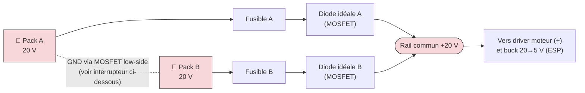

**Pourquoi le diode-OR :** chaque pack alimente **à travers une diode** → le courant **ne peut pas remonter** dans l'autre pack. Plus de courant d'équilibrage, et on peut **clipser un pack même un peu déchargé** sans danger.

**Dimensionnement des diodes idéales :** en marche, les 2 moteurs tirent jusqu'à ~**40 A** (2 × 19,6 A), partagés sur les 2 packs → ~**20 A par diode**. On utilise **2 modules « diode idéale » 40 A / 60 A** (un par batterie) — largement au-dessus des ~20 A/pack, et à très faible chute (MOSFET), contrairement à une diode Schottky qui chuterait ~0,4 V × 20 A ≈ 8 W de pertes par pack. Chaque module = **1 MOSFET + contrôleur intégrés** → orienter **anode = batterie, cathode = rail commun**.

⚠️ **Risque de ΔV (si on relie en direct, sans diode-OR) :**

| Écart de tension ΔV | Conséquence |
|---|---|
| < ~0,1 V (2 packs du même chargeur) | OK, équilibrage négligeable |
| ~0,5–2 V | Fort courant d'équilibrage, échauffement, BMS qui peut déclencher |
| > 2 V (ex. 21 V vs 15 V) | **Dangereux** : pic de plusieurs dizaines/centaines d'A, étincelle, contacts qui fondent |

➡️ **Recommandé : diode-OR + 1 fusible/pack.** À défaut, **ne relier que des packs à la même tension** (sortis ensemble du chargeur). La **LVC et la mesure de tension** se font sur le **rail commun** (inchangées).

---

### 🔌 Interrupteur d'alimentation : MOSFET low-side + latch + arrêt d'urgence

Le rail **+20 V** alimente en permanence le driver ; c'est le **retour de masse (−)** des batteries qui est commuté par **2 MOSFET N en low-side**. ⚠️ Conséquence : **tant que les MOSFET sont ouverts, l'abaisseur n'a pas de masse → l'ESP (et son 3,3 V) ne sont PAS alimentés**. Impossible donc de démarrer le latch depuis le 3,3 V. La solution utilise **deux chemins vers la gate**, tous deux pris sur le **+20 V toujours présent** :

- **Amorçage = le bouton** tire le **+20 V directement sur la gate** (le bouton ne touche jamais l'ESP).
- **Maintien = l'opto**, piloté par l'ESP **une fois qu'il est alimenté** (donc 3,3 V disponible). La LED de l'opto est **côté 3,3 V** ; son transistor commute le +20 V sur la gate → **le +20 V ne remonte jamais à l'ESP** (vraie isolation).

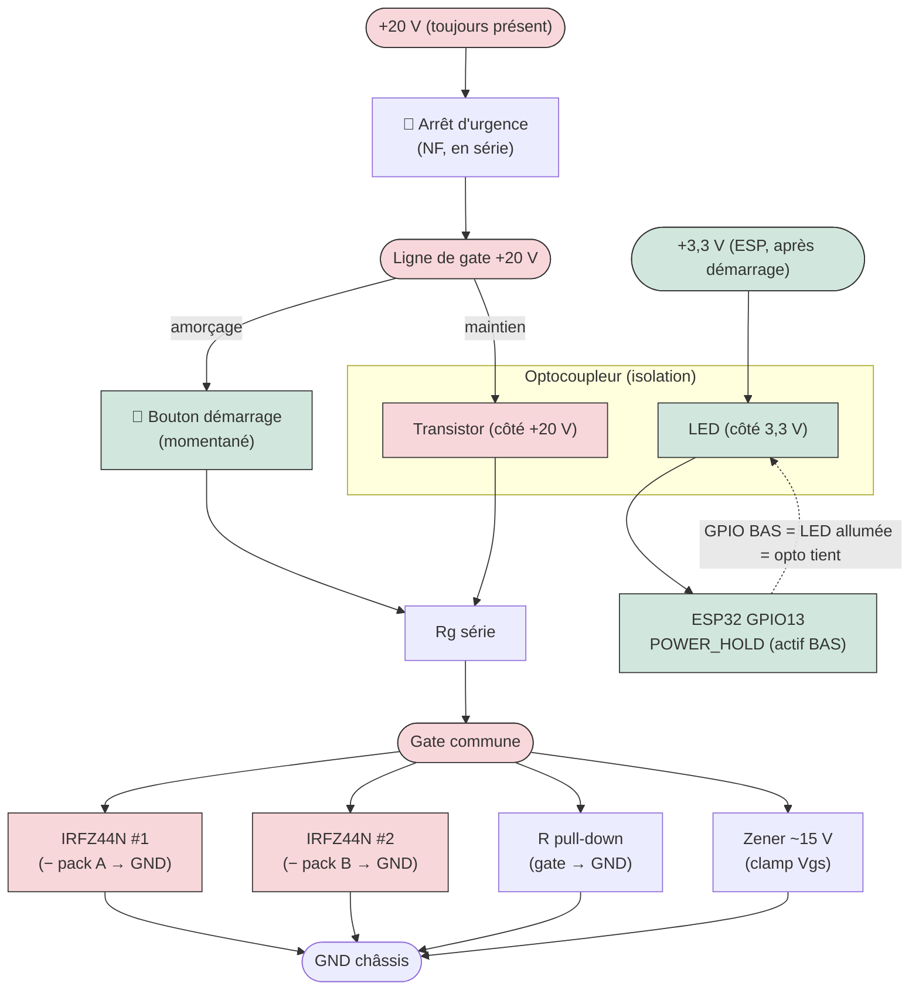

**Séquence (commande active BASSE) :**

1. **Amorçage** : on appuie sur le **bouton** → il relie **+20 V → (e-stop) → Rg → gate** → les 2 MOSFET conduisent → la masse des packs est reliée → l'abaisseur démarre → **l'ESP s'allume** (et son 3,3 V apparaît).
2. **Prise de relais** : dès `app_main`, l'ESP met **GPIO13 BAS** → la LED de l'opto (alimentée par le **3,3 V**, maintenant présent) s'allume → le **transistor de l'opto maintient le +20 V sur la gate**. On peut **relâcher le bouton**.
3. **Maintien / coupure** : l'ESP garde GPIO13 **BAS** « tant qu'il veut rester en vie ». Pour **se couper** (LVC prolongée), il remet GPIO13 **HAUT** → LED éteinte → opto ouvert → gate retombe (pull-down) → MOSFET ouverts → coupure générale. (Si le bouton est encore tenu, il maintient ; c'est un override manuel volontaire — bouton momentané en usage normal.)
4. **Sécurités passives** :
   - **R pull-down** gate→GND : si rien ne pilote (ESP planté/absent **et** bouton relâché), gate à 0 → MOSFET **ouverts par défaut** (*fail-safe*).
   - **Rg série + Zener ~15 V** : limite le courant et **borne Vgs** sous le ±20 V max de l'IRFZ44N tout en gardant ≥10 V pour un Rds(on) faible.
   - **Arrêt d'urgence (NF) en série** dans la ligne de gate (faible courant, **pas les 40 A**) : l'ouvrir coupe **les deux chemins** → coupure immédiate, **non contournable par le MCU**.
   - **Isolation** : la LED de l'opto est sur le 3,3 V, le +20 V uniquement côté transistor → **aucun retour du +20 V vers l'ESP** ; le bouton non plus ne touche l'ESP.

**Pourquoi 2× IRFZ44N (un par pack), en low-side :**

| Aspect | Valeur |
|---|---|
| Type | N-channel, **low-side** (côté masse) — un MOSFET sur le **−** de chaque pack |
| Pilotage gate | ~**12–15 V** (pas *logic-level* : Vgs(th) 2–4 V, il faut ~10 V pour Rds(on) bas) |
| Rds(on) | ~**17,5 mΩ** @ Vgs 10 V |
| Courant/MOSFET | ~**20 A** (un pack) |
| Dissipation | P ≈ 20² × 0,0175 ≈ **7 W par MOSFET** → **dissipateur obligatoire** |
| Si trop chaud | **2 IRFZ44N en parallèle par pack** (gates + sources communes) → ~1,75 W chacun |

> ⚠️ Ne pas confondre : les **2 MOSFET « interrupteur »** (low-side, commutent la masse) sont **distincts** des **2 « diodes idéales »** (qui OR-ent les **+** des packs). Rôles séparés.

---

## 5. Points critiques de sécurité (enfant)

- ⚠️ **Anti-basculement** : respecter voie large (58 cm) + assise basse (16 cm). Ne pas surélever le siège ; garder la batterie et les moteurs bas.
- ⚠️ **Butées de braquage** : deux taquets de bois qui **limitent la rotation de la traverse** (~25° max de chaque côté) → empêche le retournement en virage serré et le blocage des roues.
- ⚠️ **Fixation du pivot** : charnière vissée **+ boulon traversant M10** + écrou **nylstop** + une **patte métallique anti-arrachement** sous la platine. Le pivot ne doit JAMAIS pouvoir se déboîter.
- ⚠️ **Axes de roue sécurisés** : écrous nylstop + **goupille ou rondelle d'arrêt**, jamais un simple écrou qui se dévisse.
- ⚠️ **Carter courroies/poulies** : couvrir poulies, courroies et arbres de sortie → **pas de doigts/lacets/vêtements happés**.
- ⚠️ **Angles arrondis** partout, ponçage anti-échardes, têtes de boulons côté enfant fraisées ou capuchonnées.
- ⚠️ **Ceinture ventrale** (sangle + boucle) ancrée dans le châssis, pas seulement le siège.
- ⚠️ **Casque obligatoire**, et **cale-pieds** pour que les pieds ne glissent pas sous le kart.
- ⚠️ **Inspection avant chaque usage** : serrage pivot, axes, **tension des courroies + serrage des poulies**, **e-stop**, fixation batterie, test du frein électrique.
- ⚠️ **Terrain plat, sous surveillance**, loin de la circulation et des pentes fortes.
- ⚠️ **Pneus plastique = peu d'adhérence** : ça glisse plus qu'un pneu caoutchouc, surtout sur sol humide → vitesse modérée, virages doux, frein bien réglé.
- ⚠️ **Vérifier chaque roue à réception** (roulement qui tourne franc, boulon bien ajusté) avant montage ; prévoir des boulons 1/2" de rechange.

---

## 6. Siège réglable (~15 cm de réglage)

Pour ajuster la distance **dossier ↔ pédale entre 55 et 68 cm** selon la taille de l'enfant. Trois méthodes :

| Méthode | Principe | Avantage |
|---|---|---|
| **A. Base coulissante à fentes** ✅ | Le siège glisse sur 2 rails à **fentes (lumières)** ; on serre avec des **écrous papillon** | Réglage en continu, sans outil |
| **B. Rangée de trous** | Plusieurs trous espacés de 3 cm ; on reboulonne le siège dans le bon trou | Très solide, mais réglage par crans |
| **C. Boîtier de pédales coulissant** | On déplace **le bloc pédales (accél./frein)** au lieu du siège (rails à fentes sous le boîtier) | Garde le siège bien calé contre le dossier |

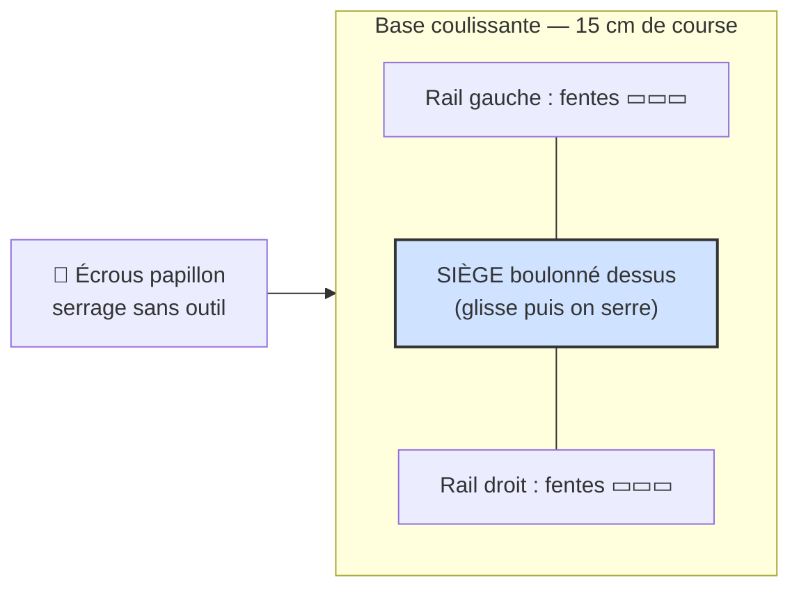

👉 Recommandé : **A (base coulissante + écrous papillon)** : réglage rapide, sans outil, l'enfant grandit → on recule le siège.

---

## 7. Estimation de masse

> Hypothèses : CP ~600 kg/m³ (6 mm ≈ 3,6 kg/m²), madrier **2×3** SPF ≈ **1,17 kg/m**, acier 7,85 g/cm³, roues ~1,0 kg/pièce. À affiner avec les masses réelles des moteurs et de la batterie.

### À vide (kart seul)

| Poste | Détail | Masse |
|---|---|---:|
| Deck / plancher | CP **6 mm**, ~1,3 m² | 4,7 kg |
| Châssis 2×3 | longerons 2 × 1,5 m + 3 traverses (~0,9 m) ≈ 6,5 m | 7,6 kg |
| Support pivot (charnière) | bloc bois dur + platine anti-arrachement | 1,0 kg |
| Banquette + dossier | CP (12 mm zone assise) + battes 2×3 | 3,5 kg |
| Renforts divers | équerres, cales | 1,2 kg |
| **Sous-total bois** | | **~18 kg** |
| 4 roues Ø30 cm | ~1,0 kg pièce | 4,0 kg |
| Direction | colonne, volant, charnières, bielle | 1,8 kg |
| Visserie / boulons à épaulement | | 1,8 kg |
| Propulsion | 2 moteurs + 2 gearbox 3D + poulies/courroies | 3,8 kg |
| Électronique + batterie | pack 20 V, driver, ESP32, câblage | 2,5 kg |
| Pédales + frein | levier, patin, câbles | 1,2 kg |
| Divers | ceinture, carters, peinture | 1,2 kg |
| **TOTAL À VIDE** | | **≈ 34 kg** |

### En charge

| | Masse |
|---|---:|
| Kart à vide | ~34 kg |
| 2 enfants (~33 kg chacun) | ~66 kg |
| **TOTAL EN ROULAGE** | **≈ 100 kg** |

### Conséquences

- **Le bois domine** (~53 % à vide) → premier levier d'allègement (CP 6 mm, 2×3, évidements).
- Résistance au roulement à ~100 kg (pneus plastique, Crr ≈ 0,025) ≈ **25 N** sur le plat.
- Force motrice : ~70 N (PWM bridé 50 %) à ~140 N (crête) → **OK sur le plat**, pente max réaliste **~3–6 %**. Cohérent avec la vitesse estimée 8–12 km/h.
- Le **freinage** doit être dimensionné pour ~100 kg : patin mordant + frein moteur en appoint.
