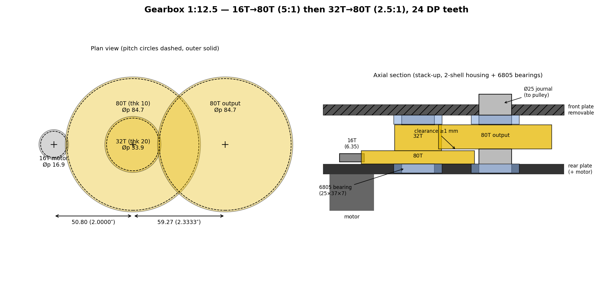
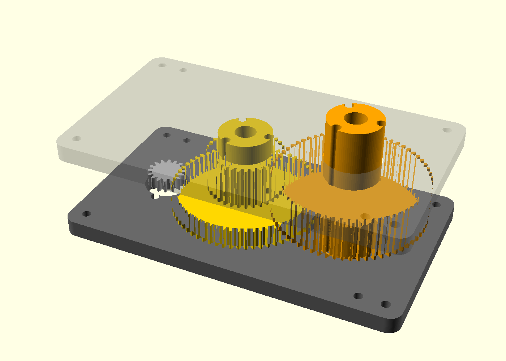

# 1:17 gearbox — motor pinion identification and gear train design

## Motor pinion (measured)

| Parameter | Value | Source |
|---|---|---|
| Number of teeth `z` | **16** | counted |
| Outside Ø `dₐ` | **19 mm** | caliper (even z → reliable direct measurement) |
| Tooth face width | **≈ 1/4″ (6.35 mm)** | measured — limits the USEFUL width of stage 1 |
| Apparent module | `m = dₐ/(z+2) = 19/18 ≈ 1.056` | calculation |
| **Identified standard** | **24 DP** (imperial diametral pitch) → `m = 25.4/24 = 1.058`; `dₐ = 18/24″ = 0.750″ = 19.05 mm` ✅ | deduction |
| Pressure angle | 20° (to confirm at meshing; 14.5° possible on old imperial gear teeth) | assumption |

**Variant to rule out/confirm by test**: metric module 1 with profile shift `x = +0.5`
(`dₐ = m·(z+2+2x) = 19 mm` too). Tie-breaker: apparent pitch `p = π·m` →
**24 DP: 3.33 mm** vs module 1: 3.14 mm; or print a 16T/24 DP test pinion
and check the tooth-in-tooth meshing with the motor pinion.

## ⭐ REVISION (chosen): 1:13.33 gearbox (16→80, 30→80) + 25T→32T #35 chain = **1:17.07**

| Mesh | Ratio | Center distance | Parts |
|---|---|---|---|
| **16T motor → 80T** | 5:1 | `96/48` = 2.0000″ = **50.80 mm** | 80T: pitch Ø 84.7, outside Ø **86.8 mm** |
| **30T → 80T (output)** | 2.667:1 | `110/48` = 2.2917″ = **58.21 mm** | 30T integral with the 1st 80T (compound gear) |
| **25T → 32T #35 sprockets** | 1.28:1 | **free** (chain cut to length) | 25 and 32 **coprime** (wear spread out) |

- **Total: 13.33 × 1.28 = 17.07** — top speed ~3.4 m/s (10″ wheel), firmware-limited to 3.3 m/s; ~7% more torque than 1:16.
- ⚠️ **Higher loads at stage 2**: intermediate torque ×5 (1.8 N·m) → **Ft ≈ 113 N** on
  the 30T. At 20 mm thickness → ~22 MPa (ASA limit): **increase stage 2 to 25 mm** (~18 MPa).
- **Why a #35 roller chain and not a toothed belt** (belts abandoned for now): a chain is
  **cut to whatever length you need** — add or remove links, close it with a master link — so the
  gearbox-to-wheel **centre distance is a free variable** instead of being dictated by the stock
  belt lengths on the shelf. On a one-off build where the mount position settles during assembly,
  that is decisive. **#35** = 3/8″ (9.525 mm) pitch, roller/bushing Ø 0.200″, inner link width
  3/16″; **9.3 kN minimum ultimate** per ANSI, so roughly **1.2 kN working** (ultimate ÷ 8).
  Against an actual chain tension of **~126 N** (4.8 N·m at the gearbox output on the 25T's
  38 mm pitch radius) that is a factor of ~10 — vastly over-specified, which is fine.
- ⚠️ **The counterpart**: a chain does **not** damp shocks the way a belt does (they go straight
  into the gear teeth), it needs **lubrication**, and it needs **sprocket alignment + tension**
  kept up — slack chain climbs a sprocket flank and gets thrown. Budget an adjustable motor mount.
- ⚠️ **Sprockets are big**: at 3/8″ pitch a 25T sprocket is Ø 76 mm at the pitch line — nearly the
  84.7 mm of the 80T gear next to it. Check the housing clearance; a 25T *pulley* was half that.
- Firmware: `GEAR_RATIO = 1.28` (magnet at the gearbox output). Calculated alternatives:
  25→34 = 1:17.0; 30→42 = 1:17.5; 25→36 = 1:18.0.



> Regenerable: `. .venv-schem/bin/activate && python doc/schematics/gearbox.py`
> (plan view at the real center distances + axial section of the stack).

**Parametric 3D model**: [`doc/cad/gearbox.scad`](cad/gearbox.scad) (OpenSCAD, standalone —
involute gear-tooth generator included, revision dimensions as parameters).
`part` selector: `assembly` / `compound` (80T+30T) / `output` / `back` / `front` /
`pinion_test` (16T test pinion to validate the 24 DP) → direct STL export.



### PETG print profile — gears (validated)

Settings that finally printed the gears cleanly after chasing a recurring extruder jam
(all-metal hotend):

- **Nozzle 260 °C, first layer also 260 °C** (0.4 mm nozzle, 0.12 mm layers). Do **not**
  lower the first-layer temperature — a cooler, more viscous first layer raises back-pressure
  and jams. A little stringing at 260 °C is purely cosmetic on a gear; peel it off / clean
  the tooth flanks.
- **Heatsink (hotend) fan at 100%** the whole time.
- **Enclosure open** (validated on an enclosed printer with the lid removed). PETG needs no
  chamber, and a warm enclosure made the jamming worse (heat creep + hotter extruder motor).
- **≥ 5 perimeters** (solid teeth), **gyroid infill**, printed **flat** (gear face on the
  bed) so the tooth-bending load runs in-plane with the layers, not across them.
- **One gear per plate** — fewer travel moves = fewer retractions (a heat-creep contributor).
- **Retraction 1 mm @ 35 mm/s** (validated, direct-drive extruder) — short and slow so the
  soft PETG is pulled, not ground; Bowden setups need more (~4 mm).
- **Filament dry** (PETG is hygroscopic) and at the correct 1.75 mm diameter.

> Diagnostic note: the jam was **thermal/flow**, not mechanical. Ruled out along the way —
> moisture (fresh vacuum-sealed spool), a nozzle clog (clean cold pull), and oversized
> filament (measured). It was cured by **more heat (260 °C) + maximum heat-break cooling +
> an open chamber**, not by lowering the temperature.

> ⚠️ That profile is tied to **that** printer — an open-frame machine whose all-metal hotend
> was heat-creeping. "Open the enclosure, push to 260 °C" is the cure for that fault, **not**
> a general PETG rule. Do not port it onto an enclosed machine (see the K1 Max profile below,
> which runs happily at 255 °C with the chamber at 35 °C).

### PETG print profile — 25T #35 sprocket (Creality K1 Max, printed)

| Setting | Value |
|---|---|
| Nozzle / bed / chamber | **255 °C** (first layer too) · 70 °C · 35 °C |
| Layer height | **0.24 mm** (first layer 0.20), 0.4 mm nozzle |
| Walls | **5 loops**, 0.42 mm, inner→outer |
| Top / bottom shells | 5 / 5 |
| Infill | 40 %, **triangles** |
| Flow ratio | 0.95 · max volumetric **9 mm³/s** |
| Elephant-foot comp. | 0.15 mm · brim **ears**, 5 mm |
| Retraction | 0.8 mm @ 40 mm/s, z-hop 0.4 mm |

Three things worth knowing about this profile before reusing it:

- **The teeth come out 100 % perimeter, by accident and happily.** A #35 tooth is ~4–5 mm
  across and 5 walls give 2.1 mm of solid from each side = 4.2 mm. Nothing is left for the
  infill to fill, so the infill pattern only matters for the hub and web. This is exactly the
  property you want on a tooth and it is why 40 % triangles is fine here even though the gears
  wanted gyroid.
- **The headline speeds are fiction** — the 9 mm³/s volumetric cap governs everything:

  | | profile says | actually prints at |
  |---|---|---|
  | outer wall | 200 mm/s | **89 mm/s** |
  | inner wall | 300 mm/s | 83 mm/s |
  | infill | 250 mm/s | 83 mm/s |

  Not a problem (slow and cool suits PETG), but do not go tuning those numbers expecting
  anything to change until the volumetric cap moves.
- **Thickness quantises to 4.08 or 4.32 mm** (17 or 18 layers for a 4.27 mm tooth). Both clear
  the 4.76 mm inner link width, so either is fine — but check which one you got before
  blaming the chain if it binds.

⚠️ **Print it FLAT** (face on the bed): the tooth-bending load then runs in the plane of the
layers instead of across them. Same rule as the gears, and it matters more here — the chain
loads one tooth at a time.

⚠️ `xy_hole_compensation` is **0** in this profile, so the bore prints undersize by the usual
0.1–0.2 mm. Measure the shaft fit on the first part rather than assuming nominal.

---

## Previous iteration (reference): printed 1:8 gearbox + 1:2 belt to the wheel (= 1:16)

> ⛔ **Superseded.** Kept for the sizing work only — the belt was dropped in favour of the
> #35 chain (free length, see the revision above). The shock-absorption argument below is
> what a belt would have bought us; the chain does not offer it.

Same total reduction (~3.2 m/s on a 10″ wheel), but the **last stage — the most loaded — becomes the
belt** (absorbs shocks, quiet, tolerant of alignment): the gearbox now sees
only ~2.9 N·m at the output instead of ~5.8 N·m.

**Chosen 1:8 gearbox — all in 24 DP** (reuses the 64T design):

| Mesh | Ratio | Center distance | Parts |
|---|---|---|---|
| **16T motor → 64T** | 4:1 | `80/48` = 1.6667″ = **42.33 mm** | printed 64T (outside Ø 69.9 mm), 10 mm thick — USEFUL width limited by the motor pinion (6.35 mm) → ≈15 MPa, OK; the 10 mm give ±1.8 mm of axial alignment tolerance |
| **32T → 64T (output)** | 2:1 | `96/48` = 2.0000″ = **50.80 mm** | 32T **integral with the 1st 64T** (compound gear); output 64T identical to the 1st |

- The **32T** (outside Ø 36.0 mm) is glued/fused to the stage-1 64T → a single compound
  gear on the intermediate shaft; the gearbox output carries the 2nd 64T + the pulley.
- **Ø25 journal compatibility** (25×37 bearings): 32T root Ø = **31.2 mm** →
  OK **only as a one-piece printed journal** (monolithic). ⚠️ Do NOT bore the 32T
  to 25 for a through-axle (3 mm of wall under the teeth, no room for a key).
  On the output side, no problem (64T root = 65.1 mm).
- **Flange/journal assembly: 3 screws on a bolt circle + central pilot**
  (chosen): the 3 screws precompress the layers (FDM anti-delamination) and transmit the
  torque (~30 N/screw at ~15 mm radius — very generous); the **central bore acts as an alignment
  pilot**: tight fit (+0.05/+0.1) and **≥ 5 mm of engagement** to guarantee
  concentricity AND perpendicularity (any warp = irregular meshing once/rev). Heads and
  nuts in counterbores/hex pockets + washers, nylock, retighten after break-in (creep); check
  that nothing protrudes into the adjacent gear-tooth plane (the overlap zone of the two 64T).
- **Thicknesses (Lewis calculation, motor τ 0.36 N·m, driver limited to 20 A, ASA allowable 15–20 MPa,
  velocity factors + plugging-brake jolts included)**:
  | Gear | Thickness | Peak stress |
  |---|---|---|
  | 16T motor (metal) | 6.35 mm (imposed) | — (sets the useful width of stage 1) |
  | 64T stage 1 | **10 mm** (12 if alignment margin desired) | ~18–20 MPa over the 6.35 useful — thickening it changes nothing |
  | 32T | **20 mm** | ~16 MPa (Ft ≈ 80 N) |
  | 64T output | **20 mm minimum** (22 = alignment margin) | ~13 MPa; ⚠️ useful width of stage 2 = min(32T, 64T) — at 15 mm the 32T rises back to ~21 MPa |
- Motor→output footprint: 42.33 + 50.80 ≈ **93 mm** (axes foldable at an angle).
- **Break-in & lubrication**: (1) **dry** break-in 10–15 min unloaded, low speed — the
  layer ridges polish themselves, the dust falls off (greasing too early = abrasive paste);
  (2) **clean** the dust; (3) **thin layer** of **PTFE or silicone** grease on the
  tooth flanks (no bath; lithium tolerated, **never** any penetrating oil/solvent on the ASA);
  (4) after a few hours: retighten the flange screws (creep), check for wear.
  6805 bearings greased for life. ⚠️ With the #35 chain the opposite rule applies on the output side: the **chain must stay lubricated** (chain oil on the rollers, wiped off the outside) — only the *gear* flanks take PTFE/silicone.
- **2-part housing**: main shell + **removable plate** (insert the gears
  then close). Plate requirements: **2 centering dowels** (screws alone have play →
  the center distance must repeat to ~0.1 mm), **shouldered** bearing seats (captive with the plate
  screwed on), thickness ≥ 6–8 mm or ribbed, heat-set threaded inserts on the shell side.
- **Material: ASA** (chosen if printing allows) — nozzle 240–260 °C, bed 90–110 °C,
  **enclosure almost indispensable**, ventilate (styrene), **shrinkage ~0.4–0.7%** → a test jig
  to calibrate the dimensions (Ø37 seats, Ø24.9 journals, gear teeth).
- **Materials comparison** (decisive criterion: temperature — friction + closed housing + summer):
  | | Tg | Hot fatigue allowable | Gear verdict |
  |---|---|---|---|
  | **ASA** | ~100 °C | 15–20 MPa | ✅ **final choice** (UV + heat + creep); weak inter-layer bonding offset by the 3 screws |
  | **PETG** | ~80 °C | 12–15 MPa | 🟡 fallback without an enclosure: thicken stage 2 to **22–25 mm**, retighten the screws (creep), slightly faster wear |
  | **PLA** | ~58 °C | 5–8 MPa at 50 °C | ❌ **prototypes only** (accurate and fast to validate center distances/meshing) — softens in summer, creeps at standstill, teeth that chip |

*Alternatives studied: single stage 16T→128T (center distance 76.20 mm, Ø137.6 wheel) or a 2nd stage in
module 2 (15T→30T, center distance 45 mm) — ruled out in favor of reusing the 64T.*

**1:2 belt**: tooth ratio **exactly 2:1** (e.g. HTD 5M synchronous: gearbox pulley
30T Ø47.7 → wheel pulley 60T Ø95.5, screwed onto the 12″ rim). Useful tension ≈ 100 N at max
torque — very comfortable for a 15 mm belt.

> ✅ **Firmware aligned (1:13.33 revision + 1.28 sprockets)**: `hw::GEAR_RATIO = 1.28` (AS5600
> magnet on the **gearbox output**) and `WHEEL_DIAM_M = 0.254` (**10″** wheel) applied in
> config.hpp; vehicle speed in **m/s** (signed average of the 2 wheels — pivot → 0).
> If the magnet is moved **onto the wheel**, set `GEAR_RATIO` back to 1.

---

## Initial train (reference): 2 stages of 4:1 (= 1:16), 1:1 belt

> ⛔ **Superseded** (belt abandoned — see the revision at the top).

```
Motor ──[16T metal, 24 DP]──╮
                            ├─ Stage 1 (4:1) ─→ intermediate shaft ──[15T]──╮
                 [64T printed]                                              ├─ Stage 2 (4:1) ─→ wheel
                                                                 [60T printed]
```

The 64T (stage 1) and the 15T (stage 2) are **integral** (compound gear, printed as one piece).
Only stage 1 must match the motor pinion; stage 2 is free → **module 2** (4× higher
torque = larger teeth).

### Stage 1 — 16T (metal) → 64T (printed)

| Parameter | Value (24 DP) | Module 1 + profile shift variant |
|---|---|---|
| Module / angle | 1.058 mm (24 DP), 20° | m = 1, wheel generated with x = −0.5 |
| **Center distance** | **42.33 mm** | **40.00 mm** |
| 64T wheel outside Ø | ≈ 69.9 mm | ≈ 67 mm |
| Tooth face width | 10–12 mm (≥ motor pinion) | same |
| Form | spur (imposed by the metal pinion) | same |

### CAD parameters entered — stage-1 64T wheel (spur gear generator)

| Field | Entered value | Metric equivalent |
|---|---|---|
| Standard | **English** | — |
| Pressure Angle | **20 deg** | 20° |
| Diametral Pitch | **24** | module 1.058 mm |
| Number of Teeth | **64** | — |
| Backlash | **0.1 mm** | print clearance |
| Root Fillet Radius | 0.000 in | ⚠️ see note |
| Gear Thickness | 0.394 in | **10.0 mm** |
| Hole Diameter | 0.394 in | **10.0 mm** (bore) |
| Pitch Diameter (computed) | 2.7 in (= 64/24 = 2.667″) | **67.7 mm** pitch → outside Ø 69.85 mm |

> ⚠️ **Root Fillet Radius = 0**: zero tooth-root fillet = stress concentration at the
> root (where a printed tooth breaks). Set a small value (e.g. **0.012 in ≈ 0.3 mm**)
> if the generator accepts it — free in 3D printing and much stronger.

### Stage 2 — 15T → 60T (printed, module 2)

| Parameter | Value |
|---|---|
| Module / angle | 2 mm, 20° |
| **Center distance** | **75.00 mm** |
| 15T / 60T outside Ø | 34 mm / 124 mm |
| Tooth face width | 15 mm |
| Form | **herringbone (chevrons)** recommended — printable, quiet, self-centering |

### Sizing (orders of magnitude)

- Motor torque ≈ 0.36 N·m (172 W @ 4615 rpm) → intermediate ≈ 1.4 N·m → **~95 N**
  tangential on the 15T → ≈ 13 MPa at the tooth root (Lewis, m2 × 15 mm) → margin ≈ ×3 in
  **PETG** (nylon even better for the 15T). The driver limits to 20 A → no excessive stall
  torque.
- Output: 4615/16 ≈ 288 rpm at 12 V; **~240 rpm at 50% PWM → ~3.2 m/s (11.5 km/h)** on a 10″ wheel.

### Printing / assembly

- **Backlash +0.10–0.15 mm** in the generator for all printed parts.
- 100% infill or ≥ 6 perimeters.
- **Chosen bearings: 6805 — 25×37×7 mm (thickness confirmed)** → housing seats
  **7 mm** deep, shouldered.
  Assembly: bearings **seated in the housing walls**; the 64T+15T compound gear is
  printed with **integrated Ø25 journals** on each side that turn inside them.
  - ⚠️ Impossible to seat the bearing **inside** the 15T (root Ø ≈ 25 mm < the bearing's
    37 mm outside Ø) → it is indeed the axle that turns, not the bearing inside the gear.
  - Housing seat: Ø **37.1–37.2 mm** (printed fit), shouldered, depth = bearing
    thickness; journal Ø **24.9 mm** (slight interference in the inner race).
  - The 10 mm bore entered in the 64T CAD becomes useless with the integrated journals
    (or serves as a central passage if you prefer a through-axle).
- Motor→output footprint: 42.33 + 75 ≈ **117 mm** total center distance.
- Validation order: 16T/24 DP test pinion → stage 1 alone → complete train.
