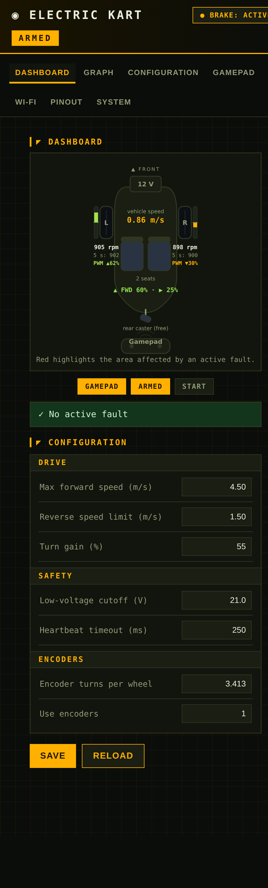
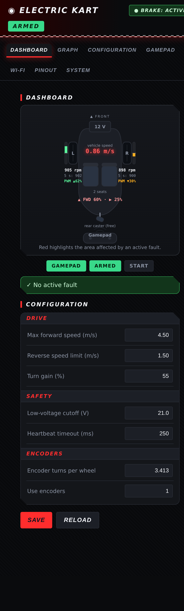
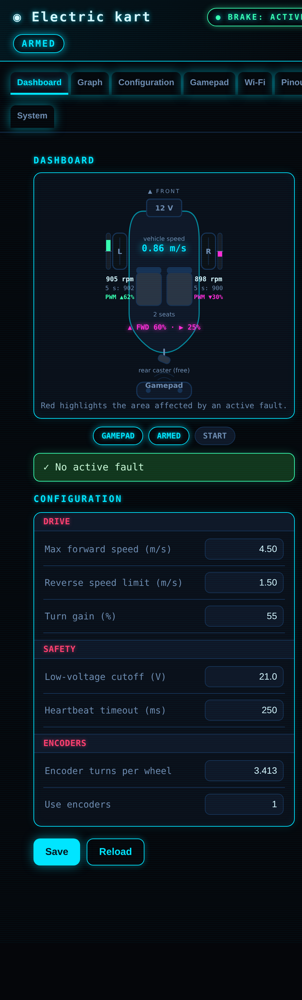

# Web UI themes (skins)

The on-board web UI ([`firmware/main/assets/`](../../firmware/main/assets/)) keeps
its **layout and behaviour** in the bulk of `style.css` / `index.html`, and its
**look** (colours + a few flourishes) in a single, clearly delimited block at
the bottom of `style.css`:

```
/* ===== THEME: … (active skin — everything above is structure) ===== */
```

Switching skins is therefore a **one-block replace**: delete that block and
paste one of the blocks below. Nothing else changes — the ids/classes the
JavaScript drives (`fd-*`, `#ind`, `.pill`, `.hudcard`, …) are theme-agnostic,
so the live telemetry keeps working untouched.

Rebuild + flash after editing (`idf.py build flash`); the assets are embedded
in the firmware image.

The previews below are static mockups of the **Dashboard** and **Configuration**
pages rendered from the real components (sample data, not a live kart).

---

## Tactical / mil-spec  — *currently active*

Amber-on-black instrument panel: faint grid overlay, all-sharp corners,
uppercase mono headers, olive-green readouts, amber controls.



```css
:root{
 --bg:#0b0d0a; --card:#12150e; --card2:#1a1e13; --line:#2f3722;
 --txt:#e9efdd; --muted:#8f9c78; --accent:#ffb000; --green:#8fe04f;
 --amber:#ffb000; --red:#ff5a3c;
}
body{font-family:ui-monospace,Menlo,Consolas,monospace;background:
 repeating-linear-gradient(0deg,rgba(255,176,0,.045) 0 1px,transparent 1px 26px),
 repeating-linear-gradient(90deg,rgba(255,176,0,.045) 0 1px,transparent 1px 26px),#0b0d0a}
*{border-radius:0 !important}
header{background:linear-gradient(90deg,#1a1400,#0b0d0a);border-bottom:2px solid var(--accent);
 text-transform:uppercase;letter-spacing:3px}
.hdr-state.s2{background:var(--accent);color:#1a1200}
.pill.brakemode.bm2{background:var(--card2);color:var(--accent);border:1px solid var(--accent)}
.tab{text-transform:uppercase;letter-spacing:1px}
.tab.active{border-bottom-color:var(--accent);color:var(--accent)}
.chart-title{text-transform:uppercase;letter-spacing:2px;color:var(--accent);
 border-left:3px solid var(--accent);padding-left:8px}
.cfgcat{color:var(--accent);text-transform:uppercase;letter-spacing:2px}
.hudcard,form,.status,#bars,.faultok{box-shadow:inset 0 0 0 1px rgba(255,176,0,.06)}
.pill{text-transform:uppercase;letter-spacing:1px}
.pill.on{background:var(--accent);color:#1a1200}
button{background:var(--accent);color:#1a1200;text-transform:uppercase;letter-spacing:1px}
button.alt{background:var(--card2);color:var(--accent);border:1px solid var(--accent)}
#faultdiag .fdms{fill:var(--accent);font:800 16px ui-monospace,monospace}
#faultdiag .fdpwml{fill:#a6e04f}
#faultdiag .fdpwmr{fill:#ffb000}
#faultdiag .fdmix{fill:var(--green)}
```

---

## Racing HUD

Red/carbon motorsport look: diagonal carbon-weave background, checkered strip
under the header, italic uppercase headers, **clipped-corner panels**, a glowing
red speed readout.



```css
:root{--bg:#0a0b0d;--card:#14161a;--card2:#1c1f26;--line:#2a2e37;--txt:#f2f4f8;
 --muted:#8b93a3;--accent:#ff2d2d;--green:#39d98a;--amber:#ffb020;--red:#ff2d2d;}
body{font-family:'Segoe UI',Roboto,system-ui,sans-serif;background:
 repeating-linear-gradient(45deg,#0b0c0f 0 3px,#08090b 3px 6px),
 repeating-linear-gradient(-45deg,rgba(255,255,255,.015) 0 3px,transparent 3px 6px),#0a0b0d}
header{position:relative;background:linear-gradient(90deg,#2a0000,#0a0b0d 60%);
 border-bottom:2px solid var(--accent);text-transform:uppercase;letter-spacing:2px;
 font-style:italic;box-shadow:0 2px 18px rgba(255,45,45,.25)}
header::after{content:"";position:absolute;left:0;right:0;bottom:-2px;height:5px;
 background:repeating-conic-gradient(#e8e8e8 0 25%,#000 0 50%) 0/14px 14px;opacity:.55}
.tabs{text-transform:uppercase;letter-spacing:1px}
.tab.active{border-bottom-color:var(--accent);background:var(--card);box-shadow:0 3px 14px rgba(255,45,45,.3)}
.chart-title{text-transform:uppercase;letter-spacing:2px;font-style:italic;font-weight:800;
 color:var(--txt);border-left:4px solid var(--accent);padding-left:10px}
.cfgcat{color:var(--accent);text-transform:uppercase;letter-spacing:1.5px;font-style:italic}
.hudcard{background:linear-gradient(180deg,#15171c,#101216);border:1px solid #33383f}
.hudcard,form,.status,#bars,.faultok{
 clip-path:polygon(0 0,calc(100% - 16px) 0,100% 16px,100% 100%,16px 100%,0 calc(100% - 16px))}
.pill{border-radius:4px;text-transform:uppercase;letter-spacing:1px}
.hdr-state{border-radius:4px}
button{border-radius:4px;text-transform:uppercase;letter-spacing:1px;font-style:italic}
input{border-radius:3px}
#faultdiag .fdms{fill:#ff5a5a;font:800 18px ui-monospace,monospace;filter:drop-shadow(0 0 5px rgba(255,45,45,.9))}
#faultdiag .fdpwml{fill:#59f39a}
#faultdiag .fdpwmr{fill:#ffb020}
#faultdiag .fdmix{fill:#ff9a9a}
```

---

## Cyberpunk neon

Cyan/magenta glow on near-black, subtle scanline overlay, neon-outlined cards
and pills, full mono type, the vehicle body outlined in neon.



```css
:root{--bg:#05060a;--card:#0a0e18;--card2:#0f1626;--line:#173154;--txt:#d7f7ff;
 --muted:#6f8bb0;--accent:#00e5ff;--green:#39ffb0;--amber:#ffcf3a;--red:#ff3d6e;}
body{font-family:ui-monospace,Menlo,Consolas,monospace;background:#05060a}
body::before{content:"";position:fixed;inset:0;pointer-events:none;z-index:999;
 background:repeating-linear-gradient(0deg,rgba(0,229,255,.045) 0 1px,transparent 1px 3px)}
header{background:linear-gradient(90deg,#04141c,#05060a);border-bottom:1px solid var(--accent);
 text-shadow:0 0 8px rgba(0,229,255,.8);letter-spacing:2px;box-shadow:0 0 26px rgba(0,229,255,.22)}
.tab.active{border-bottom-color:var(--accent);background:var(--card);color:var(--accent);
 text-shadow:0 0 8px rgba(0,229,255,.7)}
.chart-title{color:var(--accent);text-shadow:0 0 6px rgba(0,229,255,.6);letter-spacing:1.5px}
.cfgcat{color:var(--red);text-shadow:0 0 6px rgba(255,61,110,.6);background:#0f1626}
.hudcard,form,.status,#bars,.faultok{border:1px solid var(--accent);
 box-shadow:0 0 14px rgba(0,229,255,.12),inset 0 0 14px rgba(0,229,255,.05)}
.faultok{border-color:var(--green);box-shadow:0 0 14px rgba(57,255,176,.2)}
.pill.on{background:transparent;color:var(--accent);border:1px solid var(--accent);
 box-shadow:0 0 10px rgba(0,229,255,.5);text-shadow:0 0 6px rgba(0,229,255,.7)}
.hdr-state.s2{background:transparent;color:var(--accent);border:1px solid var(--accent);
 box-shadow:0 0 12px rgba(0,229,255,.6)}
.pill.brakemode.bm2{background:transparent;color:var(--green);border:1px solid var(--green);
 box-shadow:0 0 10px rgba(57,255,176,.4)}
button{background:var(--accent);color:#04121a;box-shadow:0 0 16px rgba(0,229,255,.5)}
button.alt{background:transparent;color:var(--accent);border:1px solid var(--accent);
 box-shadow:0 0 10px rgba(0,229,255,.3)}
input:focus{border-color:var(--accent);box-shadow:0 0 8px rgba(0,229,255,.5)}
#faultdiag .fdms{fill:#00e5ff;font:800 17px ui-monospace,monospace;filter:drop-shadow(0 0 7px rgba(0,229,255,1))}
#faultdiag .fdmix{fill:#ff2bd6;filter:drop-shadow(0 0 4px rgba(255,43,214,.8))}
#faultdiag .fdpwml{fill:#39ffb0}
#faultdiag .fdpwmr{fill:#ff2bd6}
#faultdiag .body{stroke:var(--accent);stroke-opacity:.55}
```

---

### Notes

- Each block redefines the `:root` colour variables plus a handful of
  component overrides. Because it sits **after** the structural rules in
  `style.css`, it wins on the cascade; the `*{border-radius:0}` in the tactical
  block needs `!important` only because the pill/button radii are more specific.
- The fault-diagram wheel/battery/gamepad **highlight** colours (red = fault,
  amber = warning) are intentionally left in the structural section — they mean
  the same thing in every skin.
- Regenerate the preview images with the mockup generator kept alongside this
  project's scratch tooling (base `style.css` + the theme block, rendered
  headless at ~460 px wide).
